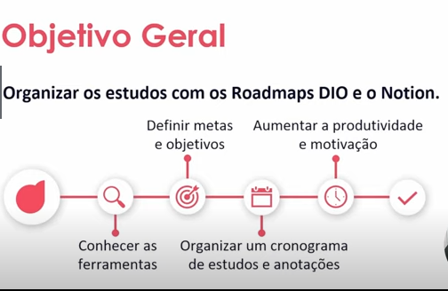

# Organizando seus Estudos com os Roadmaps DIO e o Notion

## **Introdução**

O objetivo geral desse curso é organizar os estudos com os Roadmaps DIO e o Notion.

Abaixo o roadmap do curso:

Percurso:

- Visão geral do curso e ferramentas
- Construindo o caderno de estudos
- Dicas e materiais de apoio

## **Conhecendo os Roadmaps DIO**

Para acessar um roadmap personalizado do que fazer podemos acessar [este site](https://digitalinnovationone.github.io/roadmaps/) para responder as perguntas e fazer com que a IA sugira um roadmap adaptado ou selecionar o roadmap sugerido de acordo com os seus interesses.
