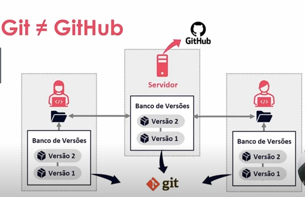

# Versionamento de Código com Git e GitHub

## Sumário

- [Versionamento de Código com Git e GitHub](#versionamento-de-código-com-git-e-github)
  - [Sumário](#sumário)
  - [O que é Versionamento de Código](#o-que-é-versionamento-de-código)
    - [Tipos de Sistemas de Controle de Versão](#tipos-de-sistemas-de-controle-de-versão)
  - [O que é Git](#o-que-é-git)
  - [O que é GitHub](#o-que-é-github)
  - [Configurando o Git](#configurando-o-git)
    - [Configurando o nome e email do usuário atual](#configurando-o-nome-e-email-do-usuário-atual)
    - [Configurando branch padrão](#configurando-branch-padrão)
  - [Autenticação via Token](#autenticação-via-token)
  - [Autenticação via Chave SSH](#autenticação-via-chave-ssh)
  - [Criando e Clonando Repositórios](#criando-e-clonando-repositórios)
    - [Lista de comandos](#lista-de-comandos)
  - [Salvando alterações no repositório local](#salvando-alterações-no-repositório-local)
    - [Comandos git add e git commit](#comandos-git-add-e-git-commit)
    - [Arquivo .gitignore](#arquivo-gitignore)
    - [Arquivo .gitkeep](#arquivo-gitkeep)
  - [Desfazendo Alterações no Repositório Local](#desfazendo-alterações-no-repositório-local)
    - [Desativar repositório .git](#desativar-repositório-git)
    - [Comando `git restore`](#comando-git-restore)
    - [Comando `git commit --amend`](#comando-git-commit---amend)
    - [Comando `git reset`](#comando-git-reset)
  - [Trabalhando com branches - Criando, mesclando, deletando e tratando conflitos](#trabalhando-com-branches---criando-mesclando-deletando-e-tratando-conflitos)
    - [Comando `git checkout`](#comando-git-checkout)
    - [Comando `git branch -v`](#comando-git-branch--v)
    - [Comando `git branch -d`](#comando-git-branch--d)
    - [Comando `git merge`](#comando-git-merge)
    - [Tratamento de conflitos](#tratamento-de-conflitos)
  - [Trabalhando com Branches - Comando úteis no dia a dia](#trabalhando-com-branches---comando-úteis-no-dia-a-dia)
    - [Comando `git fetch`](#comando-git-fetch)
    - [Clonando apenas branch específica do repositório remoto](#clonando-apenas-branch-específica-do-repositório-remoto)
    - [Comando `git stash`](#comando-git-stash)
  - [Links úteis e materiais de apoio](#links-úteis-e-materiais-de-apoio)

## O que é Versionamento de Código

---

O versionamento de código nasceu para revolver vários problemas que surgem no trabalho em equipe ao criar um código.

Com sistemas de versionamento de código **podemos controlar quem realiza cada as alterações**, além de poupar trabalho na hora de recuperar códigos antigos e realizar alterações.

### Tipos de Sistemas de Controle de Versão

---

Existem 2 tipos principais de sistemas de controle de versão, que são:

- **VCS Centralizado (CVCS)**
    - São sistemas que permitem edição de código apenas no servidor, o que pode acarretar problemas no caso de quedas de energia ou falha na sincronização caso não exista um sistema de backup.
    - Exemplos de software: **CVS, Subversion**

- **VCS Distribuido (DVCS)**
    - Para contornar os problemas dos CVCS surgiram os programas distribuídos, que criam uma cópia local na máquina de cada usuário, o que permite edição mesmo quando o servidor original estiver fora do ar
    - Cada clone é um backup, que permite um fluxo de trabalho mais flexível
    - Exemplos de software: **Git, Mercurial**

## O que é Git

---

- Git está ligado ao projeto do kernel do Linux, onde começaram a utilizar o **BitKeeper**, um **DVCS proprietário.**
- Por cota do Linux ser de código aberto, acabou que o **Linus Torvalds**, criador do Linux, **desenvolveu uma ferramenta própria para o projeto**.

## O que é GitHub

---

Apesar do nome parecido, o GitHub é uma **plataforma de hospedagem de código para controle de versão com Git, e colaboração.**

Algumas características:

- Possui uma comunidade muito ativa.
- Utilizado mundialmente;
- Possui o Octocat como mascote;

A diferença do Git e GitHub fica clara com o organograma abaixo:

O Git funciona como gerenciador do repositório localmente, já o GitHub hospeda esse repositório funcionando como o servidor.

## Configurando o Git

---

Para visualizar algumas opções do Git podemos utilizar o comando `git config` no terminal. Desta forma vamos visualizar a seguinte tela:

Por enquanto é importante saber que:

- `--global` → Se refere às configurações globais **do usuário atual** que está utilizando o sistema
- `--system` → Se refere às configurações gerais do sistema, abrigando **todos os usuários do sistema.**

### Configurando o nome e email do usuário atual

---

Inicialmente precisamos configurar o **nome** e **email** do Git dentro do `--global.`

Por exemplo, para configurar o nome como Marlon Prado e email como <marlonprado04@gmail.com>:

Essas informações servem para identificar o usuário no momento em que ele salvar os commits de código.

> **Obs: Caso elas sejam alteradas, estas informações só vão aparecer nos commits criados a partir do momento da alteração**
>

### Configurando branch padrão

---

Para consultar qual o branch principal podemos usar o comando `git config init.defaultBranch`, conforme abaixo:

Para atribuir um novo nome à branch padrão podemos setar o atributo `--global` e adicionar ao fim do comando o nome da branch, conforme abaixo:

Para mais informações de configuração do Git acessar:

[Git - git-config Documentation](https://git-scm.com/docs/git-config)

## Autenticação via Token

---

Por questões de segurança o GitHub não permite que usuários clonem e acessem repositórios apenas informando o usuário e senha através do Git.

Dessa forma é necessário configurar um Token único de acesso sempre que formos configurar uma nova máquina ou projeto localmente.

Para testarmos isso, podemos seguir os passos abaixo:

1. Criar um repositório privado no GitHub
2. Tentar clonar o repositório via comando `git clone <url_do_repositorio>` dentro do terminal Git
3. Informar usuário e senha do Git (conforme será solicitado)

Os passos acima resultarão em erro, sendo necessário **ir nas configurações do GitHub para criar um Token.** Após criado o Token com as devidas permissões, podemos tentar repetir os passos 2 e 3, mas ao invés de digitar a senha no passo 3, digitamos o Token criado.

<aside>
💡 Observação

Esse Token precisa ser **configurado** para que o Git **não solicite toda vez** que tentarmos acessar ou modificar os repositórios do GitHub

</aside>

Para configurar o Token podemos utilizar o seguinte comando:

- `git config --global credential.helper cache` → Caso desejemos que o Token seja armazenado **no cache do usuário atual**
- `git config --gobal credential.helper store` → Caso desejemos que o Token seja armazenado de forma **permanente nas configurações do usuário**

Dessa forma, na próxima vez que o Token for utilizado para acessar ou modificar um repositório da conta, o Git irá armazená-lo localmente.

Para mais informações acessar o site abaixo:

[Git - Credential Storage](https://git-scm.com/book/en/v2/Git-Tools-Credential-Storage)

## Autenticação via Chave SSH

---

Uma outra opção para configurar o acesso ao GitHub é por meio de chaves SSH.

Para configurar desta forma basta seguir os passos fornecidos pelo GitHub no link abaixo:

[Conectar-se ao GitHub com o SSH - GitHub Docs](https://docs.github.com/pt/authentication/connecting-to-github-with-ssh)

## Criando e Clonando Repositórios

---

Para criar um repositório local novo podemos usar o comando `git init` dentro de uma pasta.

Ao utilizar este comando será criada uma pasta oculta chamada `.git` que contém todas as informações e configurações do repositório.

Dentro dessa pasta há o arquivo chamado `config` que armazena algumas configurações como a URL de origem do repositório no GitHub.

Abaixo um exemplo de um repositório novo criado localmente:

Abaixo um repositório clonado:

### Lista de comandos

---

Abaixo a lista com alguns comandos possíveis de se usar para controlar o `git clone`:

- `git clone <url_do_repositório> --branch <nome_da_branch> --single-branch` → Comando para clonar apenas uma branch de um repositório
- `git clone <url_do_repositorio> <nome_da_pasta>` → Comando para clonar um repositório com um nome de pasta específica

## Salvando alterações no repositório local

---

Agora que sabemos criar e clonar repositórios, podemos aprender a salvar as modificações no repositório local.

Para iniciar podemos utilizar o comando `git status` que serve para listar o status da árvore de trabalho ou da área de preparação.

Como podemos ver, o comando retorna que é necessário usar `git add` para adicionar arquivos da pasta:

Ao usar o comando `touch` que é próprio do terminal para criar um arquivo [README.md](http://README.md), o comando `git status` retorna que este **arquivo criado não está sendo monitorado,** ou seja, é necessário adicioná-lo ao commit com o comando `git add <nome_do_arquivo>` :

Antes de continuar é necessário entender um pouco sobre markdown. Para isso, podemos acessar os sites abaixo:

[Sintaxe básica de gravação e formatação no GitHub - GitHub Docs](https://docs.github.com/pt/get-started/writing-on-github/getting-started-with-writing-and-formatting-on-github/basic-writing-and-formatting-syntax)

Abaixo um site para editar markdown online:

[readme.so](https://readme.so/pt)

### Comandos git add e git commit

Após criar alguns arquivos dentro da pasta, podemos utilizar os comandos `git add .`  para adicionar todos os arquivos e pastas existentes e depois o comando `git commit -m "commit inicial` para adicionar um commit com a descrição “commit inicial”.

Após, se utilizarmos o comando git status o retorno será de que não há arquivos a serem commitados.

> Note que ao adicionar pastas sem arquivos dentro, o git status não reconhece. É necessário que haja arquivos dentro das pastas se desejarmos que eles sejam adicionados.
>

Abaixo uma exemplo com os comandos acima:

### Arquivo .gitignore

---

Outro ponto é que se desejarmos que determinado arquivo ou pasta não seja trackeado pelo Git, podemos adicionar o caminho no arquivo `.gitignore`. Dessa forma o Git irá ignorar os arquivos anotados.

Abaixo um exemplo:

### Arquivo .gitkeep

---

Para contornar o problema de pastas vazias que o Git não reconhece, há uma convenção de se criar um arquivo chamado `.gitkeep` dentro de diretórios vazios para que o Git possa incluir o diretório no commit.

Abaixo um exemplo:

## Desfazendo Alterações no Repositório Local

---

Ao trabalhar com versionamento de código podemos cometer alguns erros que desejamos corrigir.

Abaixo algumas situações em que possamos querer desfazer possíveis erros:

### Desativar repositório .git

Para **desativar o git de uma pasta que não deveria ser repositório** basta deletar a pasta `.git` que é criada:

### Comando `git restore`

Para **restaurar alterações indesejadas em alguns arquivos ou pastas,** podemos usar o comando `git restore <caminho_do_arquivo_ou_pasta>.` Esse comando restaura todas as informações dos arquivos passados para a versão mais recente commitada. **Tomar cuidado para não apagar tudo.**

### Comando `git commit --amend`

Para **alterar o a mensagem do último commit realizado**, podemeos usar o comando `git commit --amend -m <nova_mensagem_do_commit>` ou também podemos apenas usar o comando `git commit --amend` , desta **segunda forma o Git irá abrir o documento no editor de texto do terminal para que possa ser editado.**

Abaixo um exemplo

### Comando `git reset`

Para **restaurar os arquivos / resetar os arquivos submetidos anteriormente** usamos o comando `git reset` que tem como opções de parâmetros `--soft` , `--mixed` e  `--hard` que servem para:

- `--soft`: Restaura um commit passado **adicionando as diferenças no staging area** do commit;
- `--mixed`: Restaura um commit passado **sem adicionar as diferenças no stagin area**. *Esse é o comportamento padrão do git reset quando não passamos um parâmetro;*
- `--hard`: Restaura um commit anterior **removendo todas as diferenças** sumetidas em commits posteriores.

Outro uso do comando é remover um arquivo ou pasta da submissão de commit usando `git reset <caminho_do_arquivo>`

## Trabalhando com branches - Criando, mesclando, deletando e tratando conflitos

---

Branch’s são ramos que permitem divergir o código em commits separados.

### Comando `git checkout`

---

Para criar uma branch nova e já entrar nela usamos o comando `git checkout -b <nome_da_branch>`

Dessa forma, será criada uma ramificação a partir do commit atual.

Se desejarmos trocar de branch podemos usar o comando `git checkout <nome_da_branch>`, sem o parâmetro `-b`.

### Comando `git branch -v`

---

Podemos listar o último commit realizado em cada branch usando o comando `git branch -v`

### Comando `git branch -d`

---

Para deletar as informações de uma branch podemos usar o comando `git branch -d <nome_da_branch>`.

### Comando `git merge`

---

Se desejarmos unificar as informações de uma branch com outra, podemos usar o comando `git merge <nome_da_branch>`, mas para isso precisamos dentro da branch que desejamos mesclar.

Ex: estar dentro da branch `main` e usar o comando `git merge exemplo` para trazer as mudanças do `exemplo` para `main` .

### Tratamento de conflitos

---

Supondo que existam alterações no repositório local e remoto no mesmo arquivo, simultânemente.

Ao tentar baixar as informações do repositório remoto o git irá informar que existe um conflito.

Dessa forma é necessário decidir se mantemos as informações do local ou do individual.

## Trabalhando com Branches - Comando úteis no dia a dia

---

Existem comandos que facilitam nosso trabalho com branches no dia a dia. Abaixo alguns deles.

### Comando `git fetch`

---

Caso a gente deseje **apenas baixar as alterações do repositório remoto sem mesclá-las** com o repositório local podemos usar o comando `git fetch <apelido_repositorio_remoto> <branch_local>`.

Por exemplo: `git fetch origin main`

Após, podemos visualizar as diferenças com o comando `git diff main origin/main`. Dessa forma aparecem as mudanças commitadas no repositório remoto que não estão no local.

Para finalizar, podemos usar o `git merge origin/main` para incluir as mudanças da origem na branch main local.

### Clonando apenas branch específica do repositório remoto

---

Em casos específicos podemos querer clonar apenas uma branch específica de um repositório remoto.

Para fazer esse clone usamos o comando `git clone <url_do_repositorio> --branch <nome_da_branch> --single-branch`

Por exemplo → `git clone <url> --branch teste --single-branch`

### Comando `git stash`

---

Podemos usar o comando `git stash` para **arquivar modificações e evitar que elas sejam passadas para uma nova branch** criada.

Por exemplo, se estamos em uma branch e deletamos determinado arquivo, mas ao criar uma branch desejamos que esse arquivo não seja deletado.

Para isso, podemos usar o comando `git stash` antes de criar a nova branch e depois usar o `git stash list` para listar as modificações arquivadas.

Depois disso podemos criar uma nova branch que as alterações realizadas atualmente não serão passadas para ela. Ao voltar para a branch com as modificações arquivadas devemos usar um dos dois comandos baixo para restaurar as mudanças:

- `git stash pop`→ Recupera as a alterações arquivadas e descarta elas;
- `git stash apply` → Recupera as alterações arquivadas e mantém elas arquivadas.

Para saber mais:

[Git - git-branch Documentation](https://git-scm.com/docs/git-branch)

## Links úteis e materiais de apoio

---

Repositório no GitHub com anotações do curso:

[https://github.com/elidianaandrade/dio-curso-git-github](https://github.com/elidianaandrade/dio-curso-git-github)

[https://github.com/marlonprado04/DIO/tree/main/BOOTCAMP_desenvolvimento_java_com_cloud_aws/02_git_e_github](https://github.com/marlonprado04/DIO/tree/main/BOOTCAMP_desenvolvimento_java_com_cloud_aws/02_git_e_github)
