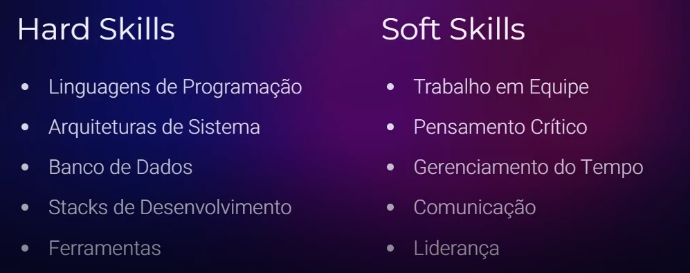

# Desafios de Projetos: Crie um portfólio vencedor

Repositório no GitHub: <https://github.com/marlonprado04/BOOTCAMP_fullstack_java_e_angular/blob/main/03_CURSO_desafios_de_projeto/README.md>
Link da página no Notion (para README): Desafios de Projetos: Crie um portfólio vencedor (<https://www.notion.so/Desafios-de-Projetos-Crie-um-portf-lio-vencedor-332f49fd5b6a454d97cdd52cb72c2bd4?pvs=21>)
Plano de estudos DB: Bootcamp: Desenvolvimento Java com Cloud AWS (<https://www.notion.so/Bootcamp-Desenvolvimento-Java-com-Cloud-AWS-7ac387a420444682ba759ad118772eb2?pvs=21>), Bootcamp: Santander 2023 - Fullstack Java+Angular (<https://www.notion.so/Bootcamp-Santander-2023-Fullstack-Java-Angular-c34a45b6c201403db3aeac2a04333dce?pvs=21>), Bootcamp: Backend com Kotlin  (<https://www.notion.so/Bootcamp-Backend-com-Kotlin-bb7bbc8a2a3443ed9470a119aa6e2d30?pvs=21>), Bootcamp: Santander 2024 - Backend com Java (<https://www.notion.so/Bootcamp-Santander-2024-Backend-com-Java-733bd5de3ee040e59bd292dd87061d5a?pvs=21>), Bootcamp Deal - Spring Boot e Angular (17+) (<https://www.notion.so/Bootcamp-Deal-Spring-Boot-e-Angular-17-038455ec3ce847cd9be9f7f8050852bd?pvs=21>)
Status: Concluído
Data: 08/08/2023

## Sumário

- [Desafios de Projetos: Crie um portfólio vencedor](#desafios-de-projetos-crie-um-portfólio-vencedor)
  - [Sumário](#sumário)
  - [PBL, Portfólio, Competências e Empregabilidade](#pbl-portfólio-competências-e-empregabilidade)
    - [Quais as principais vantagens dessa metodologia?](#quais-as-principais-vantagens-dessa-metodologia)
    - [Desenvolva suas Habilidades](#desenvolva-suas-habilidades)
  - [A importância dos Desafios de Projeto na prática](#a-importância-dos-desafios-de-projeto-na-prática)

## PBL, Portfólio, Competências e Empregabilidade

---

A Aprendizagem Baseada em Projetos, ou Project Based Learning (PBL) se apoia na ideia de aprender a partir de problemas reais e específicos.

Com essa metodologia conseguimos **criar portfólios** que comprovam nossas competências técnicas e interpessoais, já que dependendo do projeto precisamos trocar informações com experts de determinadas áreas.

### Quais as principais vantagens dessa metodologia?

- **Portfólio** → Cada projeto concluído reforça as **habilidades**, promove o **networking** e dá **destaque** ao portfólio profissional;
- **Destaque** → Ao finalizar quaisquer projetos nós ganhamos a **certificação de competência**, o que nos destaca no mercado de trabalho;
- **Oportunidades** → Através da **Talent Match** da DIO conseguimos acesso às melhores oportunidades de emprego, pois a plataforma nos conecta com os empregadores.

### Desenvolva suas Habilidades

Para evoluir profissionalmente é importante desenvolver não só as hard skills, mas também as soft skills.

Muitas empresas buscam desenvolver as hard skills de seus funcionários, porém as soft skills nem tanto e cada vez mais as Soft Skills vem sendo fator determinante de destaque na carreira.

## A importância dos Desafios de Projeto na prática

---

Como a intenção final dos desafios de projeto é contribuir com o destaque do portfólio, todos eles possuem uma estrutura pensada para destacar as habilidades técnicas.

A interface dos desafios de projetos é composta de:

- Alguns vídeos para contextualizar o desafio
- Uma aula textual para contextualizar o desafio → traz informações técnicas importantes para concluir o desafio
- Um pedido de desafio para ser feito pelo aluno

**Sempre será necessário criar um repositório no GitHub ou Gitlab para concluir os desafios.**

Abaixo um print de uma tela de exemplo:

Após criar o fork e trabalhar encima do projeto a gente precisa **passar a URL do repositório no GitHub para concluir o desafio.**

Colocar uma descrição sobre o projeto também, por exemplo:

> Contribuição no projeto Open Source onde criei um arquivo README para apresentar o meu perfil do GitHub.
