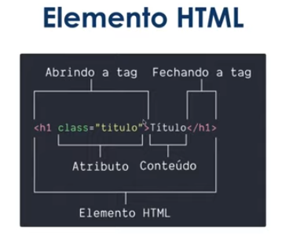

# Introdução a Criação de Websistes com HTML5 e CSS3

Minha trilha de aprendizagem está sendo elaborada no Notion em pode ser acessada através dos links abaixo.

Plano de estudos DB: Santander Bootcamp 2023 - Fullstack Java+Angular (<https://www.notion.so/Santander-Bootcamp-2023-Fullstack-Java-Angular-c34a45b6c201403db3aeac2a04333dce?pvs=21>)
Institução ou plataforma: <https://www.notion.so/8dbfd5bea50f4b5394216ad351035a1d>

## Índice

- [Introdução a Criação de Websistes com HTML5 e CSS3](#introdução-a-criação-de-websistes-com-html5-e-css3)
  - [Índice](#índice)
  - [Antes de começar](#antes-de-começar)
  - [Estrutura básica do HTML](#estrutura-básica-do-html)
  - [Semântica](#semântica)
  - [Tags para textos](#tags-para-textos)
  - [Tags para links](#tags-para-links)
  - [Exercício prático](#exercício-prático)
  - [Tag img](#tag-img)
  - [Tags li, ul e ol](#tags-li-ul-e-ol)
  - [Introdução ao CSS3](#introdução-ao-css3)
    - [ID x Classe](#id-x-classe)
  - [Conceitos básicos do CSS](#conceitos-básicos-do-css)
  - [Estilizando elementos](#estilizando-elementos)
    - [Adicionando espaço ao `padding` e ao `margin`](#adicionando-espaço-ao-padding-e-ao-margin)
    - [Background](#background)
    - [Border](#border)
    - [Border-radius](#border-radius)
  - [Estilizando textos](#estilizando-textos)
    - [Font-family](#font-family)
    - [Font-size](#font-size)
    - [Font-style](#font-style)
    - [Font-weight](#font-weight)
    - [Text-transform](#text-transform)
    - [Text-decoration](#text-decoration)
    - [Exercício prático](#exercício-prático-1)
  - [Estilizando listas](#estilizando-listas)
    - [List-style-type](#list-style-type)
    - [List-style-image](#list-style-image)
    - [Exercício prático](#exercício-prático-2)
  - [Propriedades de dimensões e alinhamento](#propriedades-de-dimensões-e-alinhamento)
    - [Exercício prático](#exercício-prático-3)

## Antes de começar

- [x]  Criar pasta referente ao curso
- [x]  Adicionar link da pasta nos atributos do curso

## Estrutura básica do HTML

Os objetivos do curso são:

- Entender a história e estrutura básica do HTML;
- Entender o que é semântica e a importância dela;
- Conhecer os principais elementos HTML

Os requisitos são:

- Editor de texto (pode ser VSCode)
- Navegador de internet (Chrome, Firefox, etc)

O HTML foi criado em 1991 e desde lá surgiram 5 versões, a última lançada foi em 2014.

O elemento HTML é composto de:



A estrutura básica do HTML é:


Sendo que o `<!DOCTYPE html>` não faz parte do HTML, mas sim da informação passada ao navegador para ele interpretar o documento corretamente.

Detalhes:

- A tag `<html>` é onde comporta todo o código HTML.
- A tag `<head>` é o cabeçalho do HTML, onde contém informações relevantes para a execução do código
- A tag `<meta>` possui algumas funcionalidades, como definir a codificação de caracteres do HTML
- A tag `<title>` contém o título que aparece no navegador
- A tag `<body>` é onde contém todo o corpo do HTML

Inicialmente vamos criar uma estrutura básica do HTML no VSCode.

O código inicial é o seguinte:

```html
<!DOCTYPE html>
<html>
    <head>
        <meta charset="utf-8">
        <title>Site do Marlon</title>
    </head>

    <body>
        Exemplo de texto no corpo do HTML.
    </body>
</html>
```

[Material de apoio - HTML](https://www.notion.so/Material-de-apoio-HTML-fb47c5c996f04cbe9b812768cc89bec2?pvs=21)

## Semântica

Durante muito tempo o elemento padrão no HTML era `<div>`, o que atrapalhava muito pois era necessário dar sentido às tags de outra forma, através de classes.

Na versão 5 do HTML foram criados alguns elementos semânticos, como por exemplo:

- **section**: Representa uma seção genérica de conteúdo, **como uma lista de artigos**
- **header**: Representa o cabeçalho da página ou de parte da página como a section;
- **article**: Representa um conteúdo relevante do site, **como o artigo de um blog**
- **aside**: Representa um conteúdo relacionado ao conteúdo principal da página, **por exemplo a biografia do autor**
- **footer**: Representa o rodapé da página ou de uma parte da página como a section.
- **h1 até h6:** Representa os títulos da página, cujo a única regra é que **só pode haver um h1 por página**

O próximo passo prático é ajustar o código, ficando assim:

```html
<!DOCTYPE html>
<html>

<head>
    <meta charset="utf-8">
    <title>Site do Marlon</title>
</head>

<body>
    <header>
        <h1>Exemplo de h1.</h1>
    </header>
    <section>
        <header>
            <h2>Seção de Posts</h2>
        </header>
        <article>
            <header>
                <h3>Post 1</h3>
            </header>
        </article>
    </section>
    <footer>Meus contatos: </footer>

</body>

</html>
```

## Tags para textos

Existem diversas tags que comportam textos, como os `<h1>` até `<h6>`.

Mas para textos mais longos podemos usar a  tag `<p>`

## Tags para links

Outro elemento é a tag `<a>` (ancora) que serve para ancoragem de links. A tag suporta diversos atributos, mas os principais que vamos dar foco são o `href` e o `target` .

Ambos funcionam para:

- **href:** Hiperlink para uma página no site, um site externo, etc. Também pode apontar para email ou telefone, mas nesse caso é necessário informar um prefixo como `mailto` e `tel`
- **target:** Serve para indicar como o link será aberto, mas no momento vamos usar apenas o valor `_blank` que informa para o link ser aberto em uma nova aba.

Abaixo exemplos:


## Exercício prático

Para colocar em prática vamos adicionar um texto fictício e um link em nosso post.

Para o texto vamos pegar alguma informação de um gerador de lorem ipsum online.

O código final ficaria assim com as tag a e p:

```html
<!DOCTYPE html>
<html>

<head>
    <meta charset="utf-8">
    <title>Site do Marlon</title>
</head>

<body>
    <header>
        <h1>Exemplo de h1.</h1>
    </header>
    <section>
        <header>
            <h2>Seção de Posts</h2>
        </header>
        <article>
            <header>
                <h3>Post 1</h3>
            </header>
            <p>
                Lorem ipsum dolor sit amet, <a href="https://www.linkedin.com/in/marlonprado04"
                    target="_blank">adipiscing elit</a>, sed do eiusmod tempor incididunt ut labore et dolore magna
                aliqua. Ut enim ad
                minim veniam, quis nostrud exercitation ullamco laboris nisi ut aliquip ex ea commodo consequat. Duis
                aute irure dolor in reprehenderit in voluptate velit esse cillum dolore eu fugiat nulla pariatur.
                Excepteur sint occaecat cupidatat non proident, sunt in culpa qui officia deserunt mollit anim id est
                laborum.
            </p>
        </article>
    </section>
    <footer>
        <header>Meus contatos: </header>
        <p>
            Email: <a href="mailto:marlonprado04@gmail.com" target="_blank">marlonprado04@gmail.com</a>
        </p>
        <p>
            Telefone: <a href="tel:5551982609193">(51) 98260-9193</a>
        </p>
    </footer>

</body>

</html>
```

## Tag img

A tag `` serve para colocar imagens na web. Esta tag é do tipo que não possui fechamento.

A tag possui apenas 2 atributos próprios, sendo o `src` (source) e o `alt` (alternative):

- src: armazena o caminho da imagem, podendo ser um caminho local ou da web
- alt: Escrita alternativa para o caso da imagem não funcionar, melhorando a acessibilidade

Uma dica útil é utilizar o site [https://tinypng.com/](https://tinypng.com/) para remover algumas informações desnecessárias da imagem, deixando ela mais otimizada para uso em sites online.

Adicionando essa tag o código ficaria:

```jsx
<!DOCTYPE html>
<html>

<head>
    <meta charset="utf-8">
    <title>Site do Marlon</title>
</head>

<body>
    <header>
        
        <h1>Exemplo de h1.</h1>
    </header>
    <section>
        <header>
            <h2>Seção de Posts</h2>
        </header>
        <article>
            <header>
                <h3>Post 1</h3>
            </header>
            <p>
                Lorem ipsum dolor sit amet, <a href="https://www.linkedin.com/in/marlonprado04" target="_blank" rel="noopener" >adipiscing elit</a>, sed do eiusmod tempor incididunt ut labore et dolore magna
                aliqua. Ut enim ad
                minim veniam, quis nostrud exercitation ullamco laboris nisi ut aliquip ex ea commodo consequat. Duis
                aute irure dolor in reprehenderit in voluptate velit esse cillum dolore eu fugiat nulla pariatur.
                Excepteur sint occaecat cupidatat non proident, sunt in culpa qui officia deserunt mollit anim id est
                laborum.
            </p>
        </article>
    </section>
    <footer>
        <header>Meus contatos: </header>
        <p>
            Email: <a href="mailto:marlonprado04@gmail.com" target="_blank">marlonprado04@gmail.com</a>
        </p>
        <p>
            Telefone: <a href="tel:5551982609193">(51) 98260-9193</a>
        </p>
    </footer>

</body>

</html>
```

## Tags li, ul e ol

Listas servem para agrupar coleções de itens, por exemplo, uma lista de ingredientes ou contatos.

O elemento `ul` representa uma lista em que a ordem dos itens não é importante.

O elemento `ol` representa uma lista em que a ordem dos itens importa, então eles são listados com números, letras ou algarismos romanos para representar a ordem.

O elemento `li` representa um item da lista.

Aplicando os conceitos aprendidos, o código fica:

```jsx
<!DOCTYPE html>
<html>

<head>
    <meta charset="utf-8">
    <title>Site do Marlon</title>
</head>

<body>
    <header>
        
        <h1>Exemplo de h1.</h1>
    </header>
    <section>
        <header>
            <h2>Seção de Posts</h2>
        </header>
        <article>
            <header>
                <h3>Post 1</h3>
            </header>
            <p>
                Lorem ipsum dolor sit amet, <a href="https://www.linkedin.com/in/marlonprado04" target="_blank"
                    rel="noopener">adipiscing elit</a>, sed do eiusmod tempor incididunt ut labore et dolore magna
                aliqua. Ut enim ad
                minim veniam, quis nostrud exercitation ullamco laboris nisi ut aliquip ex ea commodo consequat. Duis
                aute irure dolor in reprehenderit in voluptate velit esse cillum dolore eu fugiat nulla pariatur.
                Excepteur sint occaecat cupidatat non proident, sunt in culpa qui officia deserunt mollit anim id est
                laborum.
            </p>
        </article>
    </section>
    <footer>
        <header>Meus contatos: </header>
        <ul>
            <li>
                Email: <a href="mailto:marlonprado04@gmail.com" target="_blank">marlonprado04@gmail.com</a>
            </li>

            <li>
                Telefone: <a href="tel:5551982609193">(51) 98260-9193</a>
            </li>

            <li>
                LinkedIn: <a href="https://www.linkedin.com/in/marlonprado04" target="_blank"
                    rel="noopener">@marlonprado04</a>
            </li>
        </ul>

    </footer>

</body>

</html>
```

## Introdução ao CSS3

Os principais pontos deste curso serão:

- Entender o que são seletores em CSS
- Entender os conceitos básicos de CSS
- Conhecer os principais seletores de CSS

Requisitos:

- Editor de texto
- Navegador de internet
- Ter estudado o curso de introdução ao HTML5


Uma regra CSS é formada por:

- Um seletor ou grupo de seletores: são as tags HTML ou alguma informação que se referencia a elas
- Dentro das chaves são colocadas as regras: podemos mudar cor, fonte, layout dos itens HTML

### ID x Classe

ID e Classe servem para diferenciar os elementos HTML, permitindo maior controle sobre as edições a seu respeito.

A principal diferença entre o ID e Classe é que ao declarar no HTML:

- `id` é declarado com a palavra `id` dentro dos atributos da tag
- `classe` é declara com a palavra `class` dentro dos atributos da tag

Exemplo:


Já no CSS a diferença se dá na hora de chamar os conteúdos, onde:

- Classe é precedido por um `.`
- Id é precedido por um `#`

Exemplo:


Outra diferença é que a `classe` **pode ser usada quantas vezes forem necessárias** mas o `id` **só pode ser usado uma vez.**

Para adicionar o conteúdo do CSS vinculado ao HTML, precisamos adicionar na tag `meta` um link para o arquivo `css`

Usando o conteúdo aprendido, o código ficaria da seguinte forma:

- HTML

    ```jsx
    <!DOCTYPE html>
    <html>
    
    <head>
        <meta charset="utf-8">
        <title>Site do Marlon</title>
        <link rel="stylesheet" href="style.css">
    </head>
    
    <body>
        <header>
            
            <h1 id="title">Exemplo de h1.</h1>
        </header>
        <section>
            <header>
                <h2 class="subtitle">Seção de Posts</h2>
            </header>
            <article>
                <header>
                    <h3 class="post_title">Post 1</h3>
                </header>
                <p>
                    Lorem ipsum dolor sit amet, <a href="https://www.linkedin.com/in/marlonprado04" target="_blank"
                        rel="noopener">adipiscing elit</a>, sed do eiusmod tempor incididunt ut labore et dolore magna
                    aliqua. Ut enim ad
                    minim veniam, quis nostrud exercitation ullamco laboris nisi ut aliquip ex ea commodo consequat. Duis
                    aute irure dolor in reprehenderit in voluptate velit esse cillum dolore eu fugiat nulla pariatur.
                    Excepteur sint occaecat cupidatat non proident, sunt in culpa qui officia deserunt mollit anim id est
                    laborum.
                </p>
            </article>
        </section>
        <footer>
            <header>Meus contatos: </header>
            <ul>
                <li>
                    Email: <a href="mailto:marlonprado04@gmail.com" target="_blank">marlonprado04@gmail.com</a>
                </li>
    
                <li>
                    Telefone: <a href="tel:5551982609193">(51) 98260-9193</a>
                </li>
    
                <li>
                    LinkedIn: <a href="https://www.linkedin.com/in/marlonprado04" target="_blank"
                        rel="noopener">@marlonprado04</a>
                </li>
            </ul>
    
        </footer>
    
    </body>
    
    </html>
    ```

- CSS

    ```jsx
    #title, .subtitle, .post_title{
        color: purple;
    }
    
    .post_title{
        font-size: 16px;
        font-style: italic;
    }
    ```

## Conceitos básicos do CSS

Quando estamos fazendo o layout de um site, o navegador representa cada tag HTML como uma caixa retangular que é chamada de `box model` .

O box model possui 4 áreas, sendo a `margin`, `border`, `padding`, `conteudo`.


Para enxergar o box model vamos adicionar bordas e cores de fundo aos elementos.

Abaixo o código ajustado:

- HTML

    ```html
    <!DOCTYPE html>
    <html>
    
    <head>
        <meta charset="utf-8">
        <title>Site do Marlon</title>
        <link rel="stylesheet" href="style.css">
    </head>
    
    <body>
        <header>
            
            <h1 id="title">Exemplo de h1.</h1>
        </header>
        <section>
            <header>
                <h2 class="subtitle">Seção de Posts</h2>
            </header>
            <article class="post">
                <header>
                    <h3 class="post_title">Post 1</h3>
                </header>
                <p>
                    Lorem ipsum dolor sit amet, <a href="https://www.linkedin.com/in/marlonprado04" target="_blank"
                        rel="noopener">adipiscing elit</a>, sed do eiusmod tempor incididunt ut labore et dolore magna
                    aliqua. Ut enim ad
                    minim veniam, quis nostrud exercitation ullamco laboris nisi ut aliquip ex ea commodo consequat. Duis
                    aute irure dolor in reprehenderit in voluptate velit esse cillum dolore eu fugiat nulla pariatur.
                    Excepteur sint occaecat cupidatat non proident, sunt in culpa qui officia deserunt mollit anim id est
                    laborum.
                </p>
            </article>
        </section>
        <footer>
            <header>Meus contatos: </header>
            <ul>
                <li>
                    Email: <a href="mailto:marlonprado04@gmail.com" target="_blank">marlonprado04@gmail.com</a>
                </li>
    
                <li>
                    Telefone: <a href="tel:5551982609193">(51) 98260-9193</a>
                </li>
    
                <li>
                    LinkedIn: <a href="https://www.linkedin.com/in/marlonprado04" target="_blank"
                        rel="noopener">@marlonprado04</a>
                </li>
            </ul>
    
        </footer>
    
    </body>
    
    </html>
    ```

- CSS

    ```css
    body{
        background-color: gray;
    }
    
    #title, .subtitle, .post_title{
        color: purple;
    }
    
    .post_title{
        font-size: 16px;
        font-style: italic;
    }
    
    .post{
        background-color: white;
        padding: 10px;
        border: 3px solid black;
        margin: 10px;
    }
    ```

- Resultado

    

[Material de apoio - CSS](https://www.notion.so/Material-de-apoio-CSS-4b9f3191dff2403da8cc2f19bcb07f8a?pvs=21)

## Estilizando elementos

Para estilizar os elementos podemos adicionar valores para diversas propriedades dos elementos.

### Adicionando espaço ao `padding` e ao `margin`

Podemos fazer isso de 3 formas, onde:

- Podemos colocar 1 valor que será aplicado para todos os lados do elemento
- Podemos colocar 2 valores, sendo o primeiro para o eixo Y (cima e baixo) e o segundo para o eixo X (lado esquerdo e direito)
- Podemos colocar 4 valores para especificar todos os pontos onde eles seguem a ordem de topo, direita, baixo, esquerda

Abaixo um exemplo:


Outra forma é especificarmos as propriedades para cada lado, mas **esta forma é mais comum quando 3 lados compartilham da propriedade e apenas um se diferencia**:


### Background

Para o background podemos mudar a cor, atribuir uma imagem entre outras coisas, conforme abaixo:


Inicialmente vamos apenas mudar a cor de fundo. Existem algumas formas de fazer isso, como:


### Border

A borda possui 3 propriedade sprincipais, sendo a **largura, a cor e o estilo.**


Com essas alterações a borda ficaria da seguinte forma:


Para separar as estilizações para cada lado individualmente, seguimos a estrutura de largura, estilo e cor, conforme abaixo:


Se não quisermos usar a propriedade **border**, podemos usar a **propriedade** específica para **cada atributo:**


Podemos especificar ainda mais definindo o lado e a propriedade:


### Border-radius

Outra propriedade é o **border-radius** que se refere ao arredondamento da borda, que pode ser definido em **pixels ou porcentagem**


Agora podemos deixar o site mais bonito com as informações apresentadas:

- HTML

    ```html
    <!DOCTYPE html>
    <html>
    
    <head>
        <meta charset="utf-8">
        <title>Site do Marlon</title>
        <link rel="stylesheet" href="style.css">
    </head>
    
    <body>
        <header>
            <h1 id="title">Exemplo de h1.</h1>
        </header>
        <section>
            <header>
                <h2 class="subtitle">Seção de Posts</h2>
            </header>
            <article class="post">
                <header>
                    
                    <h3 class="post_title">Post 1</h3>
                </header>
                <p class="post_content">
                    Lorem ipsum dolor sit amet, <a href="https://www.linkedin.com/in/marlonprado04" target="_blank"
                        rel="noopener">adipiscing elit</a>, sed do eiusmod tempor incididunt ut labore et dolore magna
                    aliqua. Ut enim ad
                    minim veniam, quis nostrud exercitation ullamco laboris nisi ut aliquip ex ea commodo consequat. Duis
                    aute irure dolor in reprehenderit in voluptate velit esse cillum dolore eu fugiat nulla pariatur.
                    Excepteur sint occaecat cupidatat non proident, sunt in culpa qui officia deserunt mollit anim id est
                    laborum.
                </p>
            </article>
        </section>
        <footer>
            <header>Meus contatos: </header>
            <ul>
                <li>
                    Email: <a href="mailto:marlonprado04@gmail.com" target="_blank">marlonprado04@gmail.com</a>
                </li>
    
                <li>
                    Telefone: <a href="tel:5551982609193">(51) 98260-9193</a>
                </li>
    
                <li>
                    LinkedIn: <a href="https://www.linkedin.com/in/marlonprado04" target="_blank"
                        rel="noopener">@marlonprado04</a>
                </li>
            </ul>
    
        </footer>
    
    </body>
    
    </html>
    ```

- CSS

    ```css
    body{
        background-color: #f7f7f7;
    }
    
    #title, .subtitle, .post_title{
        color: purple;
    }
    
    .post_title{
        font-size: 16px;
        font-style: italic;
        margin:0;
        margin-bottom: 15px;
    }
    
    .post{
        background-color: white;
        padding: 15px;
        border: 3px solid black;
        margin-bottom: 15px;
        border-top-left-radius: 20px;
        border-bottom-left-radius: 20px;
    
    }
    
    .post_content{
        margin: 0;
        margin-bottom: 15px;
    }
    
    .post_image{
        margin-bottom: 15px;
    }
    ```

## Estilizando textos

### Font-family

Altera a fonte do texto, podendo ser uma fonte baixada localmente ou pega da internet.


### Font-size

Altera o tamanho do texto. Podemos usar várias unidades de medidas.


### Font-style

Altera o estilo do texto.


### Font-weight

Altera o peso do texto. Serve para fontes mais complexas. Em fontes mais simples o comum é o normal e o bold.


### Text-transform

Altera a fonte entre maiúscula e minúscula. O valor **uppercase** deixa em caixa alta, o **lowercase** deixa em caixa baixa e o **capitalize** deixa com todas as primeiras letras maiúscula.


### Text-decoration

Serve para dar destaque ao texto, pois coloca algumas linhas.

O valor **underline** coloca uma linha abaixo, o valor **overline** coloca uma linha acima, o valor **line-through** coloca uma linha cortando a palavra.


### Exercício prático

Fazendo algumas alterações, o código fica da seguinte forma:

- CSS

    ```css
    body{
        background-color: #f7f7f7;
        font-family: Verdana;
    }
    
    #title, .subtitle, .post_title{
        color: purple;
    }
    
    #title{
        font-size: 44px;
        text-transform: uppercase;
    }
    
    .post_title{
        font-size: 16px;
        font-style: italic;
        margin:0;
        margin-bottom: 15px;
    }
    
    a{
        text-decoration: line-through;
        color: #505050;
    }
    
    .post{
        background-color: white;
        padding: 15px;
        border: 3px solid black;
        margin-bottom: 15px;
        border-top-left-radius: 20px;
        border-bottom-left-radius: 20px;
    
    }
    
    .post_content{
        margin: 0;
        margin-bottom: 15px;
        text-transform: capitalize;
    }
    
    .post_image{
        margin-bottom: 15px;
    }
    ```

## Estilizando listas

### List-style-type

Serve para mudar o símbolo das listas. o parâmetro **square** indica que listas ordenadas terão o quadrado como simbolo, o **upper-roman** usará algarismos romanos maiúsculos para listas ordenadas e o **“\1F44D”** coloca um emoji como ícone.


### List-style-image

Podemos atribuir uma imagem ao ícone.


### Exercício prático

Após os estudos, o código ajustado ficaria dessa forma:

- HTML

    ```html
    <!DOCTYPE html>
    <html>
    
    <head>
        <meta charset="utf-8">
        <title>Site do Marlon</title>
        <link rel="stylesheet" href="style.css">
    </head>
    
    <body>
        <header>
            <h1 id="title">Exemplo de h1.</h1>
        </header>
        <section>
            <header>
                <h2 class="subtitle">Seção de Posts</h2>
            </header>
            <article class="post">
                <header>
                    
                    <h3 class="post_title">Post 1</h3>
                </header>
                <p class="post_content">
                    Lorem ipsum dolor sit amet, <a href="https://www.linkedin.com/in/marlonprado04" target="_blank"
                        rel="noopener">adipiscing elit</a>, sed do eiusmod tempor incididunt ut labore et dolore magna
                    aliqua. Ut enim ad
                    minim veniam, quis nostrud exercitation ullamco laboris nisi ut aliquip ex ea commodo consequat. Duis
                    aute irure dolor in reprehenderit in voluptate velit esse cillum dolore eu fugiat nulla pariatur.
                    Excepteur sint occaecat cupidatat non proident, sunt in culpa qui officia deserunt mollit anim id est
                    laborum.
                </p>
            </article>
        </section>
        <footer>
            <header>Meus contatos: </header>
            <ul class="contact_list">
                <li>
                    Email: <a href="mailto:marlonprado04@gmail.com" target="_blank">marlonprado04@gmail.com</a>
                </li>
    
                <li>
                    Telefone: <a href="tel:5551982609193">(51) 98260-9193</a>
                </li>
    
                <li>
                    LinkedIn: <a href="https://www.linkedin.com/in/marlonprado04" target="_blank"
                        rel="noopener">@marlonprado04</a>
                </li>
            </ul>
    
        </footer>
    
    </body>
    
    </html>
    ```

- CSS

    ```css
    body{
        background-color: #f7f7f7;
        font-family: Verdana;
    }
    
    #title, .subtitle, .post_title{
        color: purple;
    }
    
    #title{
        font-size: 44px;
        text-transform: uppercase;
    }
    
    .post_title{
        font-size: 16px;
        font-style: italic;
        margin:0;
        margin-bottom: 15px;
    }
    
    a{
        text-decoration: line-through;
        color: #505050;
    }
    
    .post{
        background-color: white;
        padding: 15px;
        border: 3px solid black;
        margin-bottom: 15px;
        border-top-left-radius: 20px;
        border-bottom-left-radius: 20px;
    
    }
    
    .post_content{
        margin: 0;
        margin-bottom: 15px;
        text-transform: capitalize;
    }
    
    .post_image{
        margin-bottom: 15px;
    }
    
    .contact_list{
        list-style-type: none;
        padding: 0;
        padding-left: 15px;
    }
    
    .contact_list li a{
        color: blue;
        text-decoration: none;
    }
    ```

## Propriedades de dimensões e alinhamento

Dimensão e alinhamento são coisas importantes no layout. Para trabalhar com isso, podemos usar alguns atributos como:

- **Width**: serve para a **largura**;
- **Height**: serve para a **altura**;
- **Max-width**: serve para o **máximo de largura** que um elemento pode ter
- **Max-height**: o **máximo de altura** que um elemento pode ter
- **Margin**: serve para colocar o **espaçamento entre elementos**, possui o valor **auto** para alinhar automaticamente
- **Text align**: para alinhar o texto de acordo com a posição, podemos usar **center, left, right, justify.**

### Exercício prático

O código CSS com os ajustes feitos fica:

- CSS

    ```css
    body{
        background-color: #f7f7f7;
        font-family: Verdana;
        margin: auto;
        max-width: 900px;
    }
    
    #title, .subtitle, .post_title{
        color: purple;
    }
    
    #title{
        font-size: 44px;
        text-transform: uppercase;
    }
    
    .post_title{
        font-size: 16px;
        font-style: italic;
        margin:0;
        margin-bottom: 15px;
    }
    
    a{
        text-decoration: line-through;
        color: #505050;
    }
    
    .post{
        background-color: white;
        padding: 15px;
        border: 3px solid black;
        margin-bottom: 15px;
        border-radius: 30px 0px 0px 30px;
    
    }
    
    .post_content{
        margin: 0;
        margin-bottom: 15px;
        text-transform: capitalize;
        text-align: justify;
    }
    
    .post_image{
        margin-bottom: 15px;
        width: 100%;
    }
    
    .contact_list{
        list-style-type: none;
        padding: 0;
        padding-left: 15px;
    }
    
    .contact_list li a{
        color: blue;
        text-decoration: none;
    }
    ```
