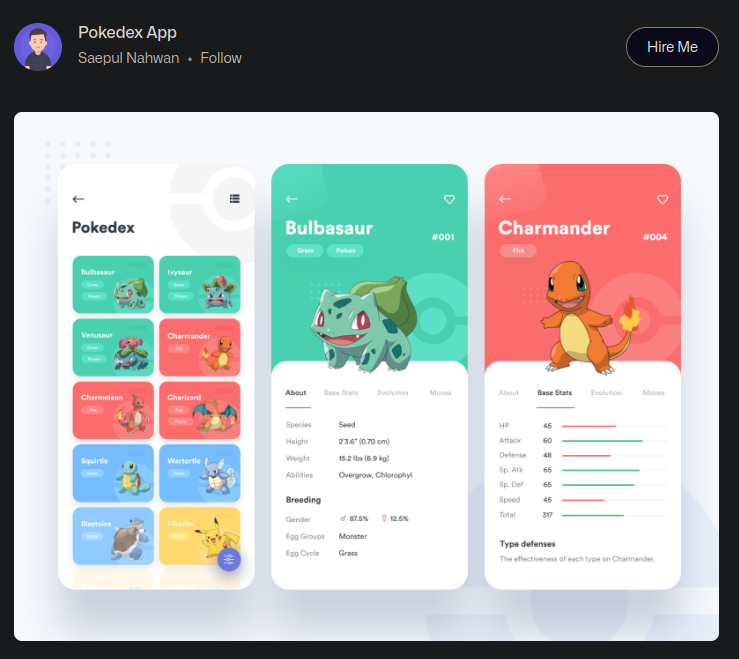

# Introdução ao Desenvolvimento Web com JavaScript

## Índice

- [Introdução ao Desenvolvimento Web com JavaScript](#introdução-ao-desenvolvimento-web-com-javascript)
  - [Índice](#índice)
  - [Antes de começar](#antes-de-começar)
  - [Introdução](#introdução)
  - [Configuração do ambiente](#configuração-do-ambiente)
  - [Protocolo cliente servidor](#protocolo-cliente-servidor)
  - [Introdução ao HTML](#introdução-ao-html)
  - [Introdução ao CSS](#introdução-ao-css)
  - [Introdução ao JavaScript voltado para web](#introdução-ao-javascript-voltado-para-web)
  - [Links e materiais de referência](#links-e-materiais-de-referência)

## Antes de começar

- [x]  Criar pasta referente ao curso
- [x]  Adicionar link da pasta nos atributos do curso
- [x]  Adicionar arquivos e links adicionais ao repositório (pdf, pptx, etc)

## Introdução

A ideia do curso é criar um site como uma pokedex usando os conhecimentos adquiridos anteriormente no curso de introdução ao JavaScript.

Vamos usar como base o design elaborado e apresentado no site Dribbble, que pode ser acessado através [deste link](https://dribbble.com/shots/6540871-Pokedex-App).



__Este site é particularmente útil quando desejamos buscar inspiração para desenvolver algum layout web__

A ideia do curso é apenas se basear no design apresentado no site, pois vamos consumir uma api pública para desenvolver nosso código. Isto é, podem ter informações diferentes das apresentadas no layout.

## Configuração do ambiente

Requisitos para dar início ao curso:

- Ter o nodejs instalado
- Ter o npm instalado (vem junto com o node: Node Package Manager)
- Ter a biblioteca http-server instalada via npm e globalmente
  - Usar comando: `npm install -g http-server`

Apesar do foco do curso não ser este, vamos aprender um pouco sobre o comportamento de sites HTML e etc.

Inicialmente precisamos de um arquivo `index.html` e ativar o `http-server` via terminal do VSCode.

Ao usar o comando `http-server` ele lista alguns ips que podem ser acessados via celular ou mesmo computador, desde que esteja na mesma rede local.


## Protocolo cliente servidor

Para dar andamento precisamos entender o protocolo HTTP, que é um dos protocolos `cliente-servidor`

Os protocolos funcionam sempre com os clientes fazendo uma `solicitação` para o servidor e o `servidor` fará o processamento e fornecerá os dados necessários para os clientes.

Sempre que realizamos uma comunicação HTTP vamos ter a informação do `ip` e da `porta` de abertura. Por exemplo: [`http://127.0.0.1:8080/`](http://127.0.0.1:8080/)

## Introdução ao HTML

O HTML é uma linguagem de marcação que funciona de forma parecida com o Word.

No caso do HTML existem tags que ajudam a dar sentido semântico ao conteúdo apresentado.

## Introdução ao CSS

Se o HTML dá a estrutura do texto, o que o CSS faz?

O CSS serve para dar estilo ao HTML criado, para deixar o layout mais apresentável.

## Introdução ao JavaScript voltado para web

O JavaScript é o que dá o comportamento ao HTML e CSS.

Ele deixa o site mais dinâmico, permitindo que o site mude de acordo com interações.

Abaixo um código HTML com script JS:

```html
<!DOCTYPE html>
<html lang="pt-br">

<head>
    <meta charset="UTF-8" />
    <meta name="viewport" content="width=device-width, initial-scale=1.0" />
    <title>Pokedex</title>
</head>

<body>
    <h1>Teste de título</h1>
    <p>Meu primeiro texto</p>
    <button type="button" id="btn"> Meu botão</button>
    <script>
        const botao = document.getElementById("btn")
        botao.addEventListener("click", function(){
            console.log("Cliquei no botão!");
        } )
    </script>
</body>

</html>
```

## Links e materiais de referência

O código que será trabalhado nos próximos cursos pode ser acessado neste repositório: [https://github.com/digitalinnovationone/js-developer-pokedex](https://github.com/digitalinnovationone/js-developer-pokedex)

Para se aprofundar mais aos conteúdos relacionados a desenvolvimento web: [https://developer.mozilla.org/pt-BR/docs/Learn/Getting_started_with_the_web](https://developer.mozilla.org/pt-BR/docs/Learn/Getting_started_with_the_web)
