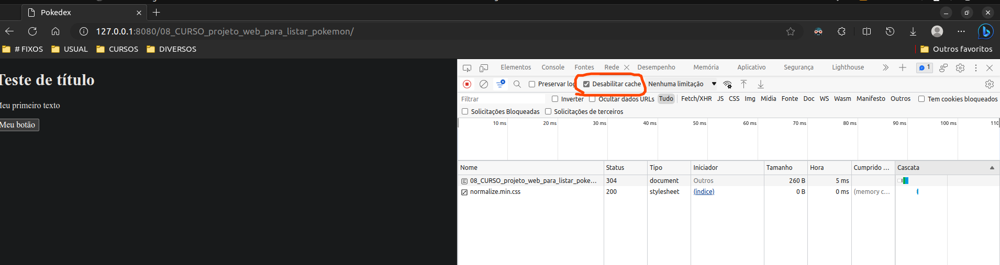

# Criando um Projeto com HTML/CSS para Listagem de Pokémon

## Índice

- [Criando um Projeto com HTML/CSS para Listagem de Pokémon](#criando-um-projeto-com-htmlcss-para-listagem-de-pokémon)
  - [Índice](#índice)
  - [Antes de começar](#antes-de-começar)
  - [Adicionando normalize CSS no projeto](#adicionando-normalize-css-no-projeto)
  - [Organizando o projeto](#organizando-o-projeto)
  - [Adicionando a font Roboto no projeto](#adicionando-a-font-roboto-no-projeto)
  - [Estilização inicial](#estilização-inicial)
  - [Estilização da listagem de Pokémon](#estilização-da-listagem-de-pokémon)
  - [Adicionando a imagem do Pokemón](#adicionando-a-imagem-do-pokemón)
  - [Adicionando os tipos dos Pokémon e finalizando o layout da imagem](#adicionando-os-tipos-dos-pokémon-e-finalizando-o-layout-da-imagem)
  - [Tornando o nosso layout responsivo](#tornando-o-nosso-layout-responsivo)
  - [Separando os estilos](#separando-os-estilos)
  - [Links e conteúdos adicionais](#links-e-conteúdos-adicionais)

## Antes de começar

- [x]  Criar pasta referente ao curso
- [x]  Adicionar link da pasta nos atributos do curso
- [x]  Adicionar arquivos e links adicionais ao repositório (pdf, pptx, etc)

## Adicionando normalize CSS no projeto

Existe um problema comum no desenvolvimento de sites que ocorre pela diferença de tratamento que cada browse dá para os arquivos CSS.

Sendo assim, uma boa prática colocar um `normalize` que **basicamente é um CSS que padroniza o estilo inicial.**

Ele serve para padronizar as distâncias dos elementos e a distribuição dos mesmos. Sendo assim, o CSS que editarmos vai partir deste normalize.

Existem diversos normalize, mas neste curso vamos usar o [deste link](https://cdnjs.com/libraries/normalize).

Para adicionar um normalize no HTML nos colocamos ele na tag `head`:

```html
<!DOCTYPE html>
<html lang="en">

<head>
    <meta charset="UTF-8">
    <meta name="viewport" content="width=device-width, initial-scale=1.0">
    <title>Document</title>
    <link rel="stylesheet" href="https://cdnjs.cloudflare.com/ajax/libs/normalize/8.0.1/normalize.min.css"
        integrity="sha512-NhSC1YmyruXifcj/KFRWoC561YpHpc5Jtzgvbuzx5VozKpWvQ+4nXhPdFgmx8xqexRcpAglTj9sIBWINXa8x5w=="
        crossorigin="anonymous" referrerpolicy="no-referrer" />
</head>

<body>

</body>

</html>
```

Uma dica importante é desativar o cache do navegador na hora de desenvolver para web, pois assim o navegador não armazena as informações já alteradas nos arquivos (gerando conflito).

Para isso podemos ir na aba de `rede` dentro das ferramentas de desenvolvedor e desativar a opção:



## Organizando o projeto

Uma coisa muito importante para quem for desenvolver um software é manter a organização.

Para organizar o código vamos seguir a seguinte estrutura de arquivos:


Sendo necessário após a criação dos arquivos fazer o link do `global.css` e `main.js` dentro do `index.html` .

## Adicionando a font Roboto no projeto

Assim como usamos o CDN para o normalize, podemos utilizar o CDN para tentar adicionar uma fonte que seja parecida com o projeto base que estamos tentando adaptar.

Para usar a fonte roboto (que é a mesma do android) podemos acessar o google fontes neste link [https://fonts.google.com/](https://fonts.google.com/)

No nosso projeto vamos usar 4 versões da fonte roboto, sendo elas:


Com essas adições, nosso código HTML e CSS ficará da seguinte forma:

- HTML

    ```html
    <!DOCTYPE html>
    <html lang="pt-br">
    
    <head>
        <meta charset="UTF-8" />
        <meta name="viewport" content="width=device-width, initial-scale=1.0" />
        <title>Pokedex</title>
        <!DOCTYPE html>
        <html lang="en">
    
        <head>
            <meta name="viewport" content="width=device-width, initial-scale=1.0">
            <title>Pokedex</title>
            <!-- Normalize -->
            <link rel="stylesheet" href="https://cdnjs.cloudflare.com/ajax/libs/normalize/8.0.1/normalize.min.css"
                integrity="sha512-NhSC1YmyruXifcj/KFRWoC561YpHpc5Jtzgvbuzx5VozKpWvQ+4nXhPdFgmx8xqexRcpAglTj9sIBWINXa8x5w=="
                crossorigin="anonymous" referrerpolicy="no-referrer" />
    
            <!-- Font Roboto -->
            <link rel="preconnect" href="https://fonts.googleapis.com">
            <link rel="preconnect" href="https://fonts.gstatic.com" crossorigin>
            <link href="https://fonts.googleapis.com/css2?family=Roboto:wght@100;300;500;700&display=swap" rel="stylesheet">
    
            <!-- Nosso CSS -->
            <link rel="stylesheet" href="assets/css/global.css">
        </head>
    
    <body>
    
    </body>
    
    </html>
    </head>
    
    <body>
        <h1>Teste de título</h1>
        <p>Meu primeiro texto</p>
        <button type="button" id="btn"> Meu botão</button>
    
        <!-- Nosso JS -->
        <script src="assets/javascript/main.js"></script>
    </body>
    
    </html>
    ```

- CSS

    ```css
    *{
        font-family: 'Roboto', sans-serif;
    }
    ```

## Estilização inicial

Uma dica é seguir a técnica de `mobile first` para poupar tempo de código.

Quando iniciamos o layout para mobile e depois estendemos para desktop, temos muito menos reescrita.

Para estilização inicial nós podemos criar uma `section` e adicionar um título e uma  `ordened list`  nessa section. Com isso, podemos adicionar um padding de `1rem` (medida relativa) dentro da section, para que o conteúdo seja melhor distribuído e adaptado de acordo com a tela e configuração de cada dispositivo.

Abaixo o código HTML e CSS:

- HTML

    ```html
    <!DOCTYPE html>
    <html lang="pt-br">
    
    <head>
        <meta charset="UTF-8" />
        <meta name="viewport" content="width=device-width, initial-scale=1.0" />
        <title>Pokedex</title>
        <!DOCTYPE html>
        <html lang="en">
    
        <head>
            <meta name="viewport" content="width=device-width, initial-scale=1.0">
            <title>Pokedex</title>
            <!-- Normalize -->
            <link rel="stylesheet" href="https://cdnjs.cloudflare.com/ajax/libs/normalize/8.0.1/normalize.min.css"
                integrity="sha512-NhSC1YmyruXifcj/KFRWoC561YpHpc5Jtzgvbuzx5VozKpWvQ+4nXhPdFgmx8xqexRcpAglTj9sIBWINXa8x5w=="
                crossorigin="anonymous" referrerpolicy="no-referrer" />
    
            <!-- Font Roboto -->
            <link rel="preconnect" href="https://fonts.googleapis.com">
            <link rel="preconnect" href="https://fonts.gstatic.com" crossorigin>
            <link href="https://fonts.googleapis.com/css2?family=Roboto:wght@100;300;500;700&display=swap" rel="stylesheet">
    
            <!-- Nosso CSS -->
            <link rel="stylesheet" href="assets/css/global.css">
        </head>
    
    <body>
    
    </body>
    
    </html>
    </head>
    
    <body>
    
        <section class="content">
            <h1>Pokedex</h1>
            <ol>
                <li>
                    Bulbasaur
                </li>
                <li>
                    Ivysaur
                </li>
                <li>
                    Venusaur
                </li>
            </ol>
        </section>
        <!-- Nosso JS -->
        <script src="assets/javascript/main.js"></script>
    </body>
    
    </html>
    ```

- CSS

    ```css
    *{
        font-family: 'Roboto', sans-serif;
    }
    
    .content{
        padding: 1rem;
    }
    
    h1{
        margin: 0;
    }
    ```

## Estilização da listagem de Pokémon

Para a estilização adicionamos mais pokemons na lista de exemplo e manipulamos um pouco mais as propriedades da lista e elementos dentro do CSS.

- HTML

    ```html
    <!DOCTYPE html>
    <html lang="pt-br">
    
    <head>
        <meta charset="UTF-8" />
        <meta name="viewport" content="width=device-width, initial-scale=1.0" />
        <title>Pokedex</title>
        <!DOCTYPE html>
        <html lang="en">
    
        <head>
            <meta name="viewport" content="width=device-width, initial-scale=1.0">
            <title>Pokedex</title>
            <!-- Normalize -->
            <link rel="stylesheet" href="https://cdnjs.cloudflare.com/ajax/libs/normalize/8.0.1/normalize.min.css"
                integrity="sha512-NhSC1YmyruXifcj/KFRWoC561YpHpc5Jtzgvbuzx5VozKpWvQ+4nXhPdFgmx8xqexRcpAglTj9sIBWINXa8x5w=="
                crossorigin="anonymous" referrerpolicy="no-referrer" />
    
            <!-- Font Roboto -->
            <link rel="preconnect" href="https://fonts.googleapis.com">
            <link rel="preconnect" href="https://fonts.gstatic.com" crossorigin>
            <link href="https://fonts.googleapis.com/css2?family=Roboto:wght@100;300;500;700&display=swap" rel="stylesheet">
    
            <!-- Nosso CSS -->
            <link rel="stylesheet" href="assets/css/global.css">
        </head>
    
    <body>
    
    </body>
    
    </html>
    </head>
    
    <body>
    
        <section class="content">
            <h1>Pokedex</h1>
            <ol class="pokemons">
                <li>
                    Bulbasaur
                </li>
                <li>
                    Ivysaur
                </li>
                <li>
                    Venusaur
                </li>
                <li>
                    Charmander
                </li>
                <li>
                    Charmeleon
                </li>
                <li>
                    Charizard
                </li>
            </ol>
        </section>
        <!-- Nosso JS -->
        <script src="assets/javascript/main.js"></script>
    </body>
    
    </html>
    ```

- CSS

    ```css
    * {
        font-family: 'Roboto', sans-serif;
    }
    
    .content {
        padding: 1rem;
    }
    
    h1 {
        margin: 0;
    }
    
    ol.pokemons {
        list-style: none;
        margin: 0;
        padding: 0;
        display: grid;
        grid-template-columns: 1fr 1fr;
    }
    
    ol.pokemons li {
        margin: 0.5rem;
        padding: 2rem 1rem;
        background-color: #14a06f;
        color:white;
        border-radius: 1rem;
        height: 100px;
    }
    ```

## Adicionando a imagem do Pokemón

Para adicionar a imagem do Pokemón nós consultamos a api disponibilizada em busca das sprites [neste link.](https://pokeapi.co/docs/v2#pokemon)

A que escolhi fazer uso foi a `official-artwork`.

Exemplo de link utilizado: [https://raw.githubusercontent.com/PokeAPI/sprites/master/sprites/pokemon/other/official-artwork/1.png](https://raw.githubusercontent.com/PokeAPI/sprites/master/sprites/pokemon/other/official-artwork/1.png)

## Adicionando os tipos dos Pokémon e finalizando o layout da imagem

Para adicionar os tipos de pokemon e finalizar o layout padrão nós precisamos criar classes individuais para cada tag que faremos uso dentro do pokemon.

A URL utilizada para acessar os tipos e montar o layout foi a seguinte: [https://pokeapi.co/api/v2/type/12/](https://pokeapi.co/api/v2/type/12/)

Um detalhe é que foram adicionadas diversas propriedades dentro do CSS para que o site ficasse parecido com o layout que estamos imitando.

Abaixo os códigos HTML e CSS com as modificações feitas:

- HTML

    ```html
    <!DOCTYPE html>
    <html lang="pt-br">
    
    <head>
        <meta charset="UTF-8" />
        <meta name="viewport" content="width=device-width, initial-scale=1.0" />
        <title>Pokedex</title>
        <!DOCTYPE html>
        <html lang="en">
    
        <head>
            <meta name="viewport" content="width=device-width, initial-scale=1.0">
            <title>Pokedex</title>
            <!-- Normalize -->
            <link rel="stylesheet" href="https://cdnjs.cloudflare.com/ajax/libs/normalize/8.0.1/normalize.min.css"
                integrity="sha512-NhSC1YmyruXifcj/KFRWoC561YpHpc5Jtzgvbuzx5VozKpWvQ+4nXhPdFgmx8xqexRcpAglTj9sIBWINXa8x5w=="
                crossorigin="anonymous" referrerpolicy="no-referrer" />
    
            <!-- Font Roboto -->
            <link rel="preconnect" href="https://fonts.googleapis.com">
            <link rel="preconnect" href="https://fonts.gstatic.com" crossorigin>
            <link href="https://fonts.googleapis.com/css2?family=Roboto:wght@100;300;500;700&display=swap" rel="stylesheet">
    
            <!-- Nosso CSS -->
            <link rel="stylesheet" href="assets/css/global.css">
        </head>
    
    <body>
    
    </body>
    
    </html>
    </head>
    
    <body>
    
        <section class="content">
            <h1>Pokedex</h1>
            <ol class="pokemons">
                <li class="pokemon">
                    <span class="number">#001</span>
                    <span class="name">Bulbasaur</span>
    
                    <div class="detail">
                        <ol class="types">
                            <li class="type">grass</li>
                            <li class="type">poison</li>
                        </ol>
    
                        
                    </div>
    
                </li>
    
            </ol>
        </section>
        <!-- Nosso JS -->
        <script src="assets/javascript/main.js"></script>
    </body>
    
    </html>
    ```

- CSS

    ```css
    * {
        font-family: 'Roboto', sans-serif;
        box-sizing: border-box; /* Considera a borda como tamanho total */
    }
    
    .content {
        padding: 1rem;
    }
    
    h1 {
        margin: 0;
    }
    
    .pokemons {
        list-style: none;
        margin: 0;
        padding: 0;
        display: grid;
        grid-template-columns: 1fr 1fr;
    }
    
    .pokemon {
        margin: 0.5rem;
        padding: 2rem 1rem;
        background-color: #49d0b0;
        color:#fff;
        border-radius: 1rem;
        display: flex;
        flex-direction: column;
    }
    
    .pokemon .name{
        color: #fff;
        margin: .25rem 0rem;
    }
    
    .pokemon .number{
        color: #000;
        opacity: 0.3;
        text-align: right;
        font-size: .625rem;
    }
    
    .pokemon .detail .types{
        padding: 0;
        margin: 0;
        list-style: none;
    }
    
    .pokemon .detail .types .type{
        background-color: #61e1ca;
        color: #fff;
        padding: .25rem .5rem;
        border-radius: 1rem;
        font-size: .625rem;
        margin: .25rem 0;
    
    }
    
    .pokemon .detail{
        display: flex;
        flex-direction: row;
        align-items: center;
        justify-content: space-between;
    
    }
    .pokemon .detail img{
        border-style: none;
        max-width: 100%;
        height: 70px;
        align-self: flex-end;
    }
    ```

## Tornando o nosso layout responsivo

Como nós utilizamos o princípio `mobile first` , onde desenvolvemos inicialmente o layout para mobile, agora precisamos ajustar para que o site fique responsivo para uso em desktops.

Para isso vamos utilizar `media query` que é um conjunto de CSS que é aplicado de acordo com o tamanho da tela.

Um macete é sempre criar o layout para a tela menor e ir aumentando com o media query.

No exemplo abaixo estamos modificando apenas o layout com o número de pokemons aparecendo em tela:

```css
/* Feito com 1 coluna (1 fração), por padrão*/
.pokemons {
    list-style: none;
    margin: 0;
    padding: 0;
    display: grid;
    grid-template-columns: 1fr; /* Uma coluna, para telas pequenas (até 380px)*/
}

/* Feito com 2 colunas, quando a tela chegar a 380px */
@media screen and (min-width: 380px) {

    .pokemons{
        grid-template-columns: 1fr 1fr; /* Modificando apenas o número de colunas, o resto fica igual (herda do pai) */
    }
}

/* Feito com 3 colunas, quando a tela chegar a 576px */
@media screen and (min-width: 576px) {

    .pokemons{
        grid-template-columns: 1fr 1fr 1fr; /* Modificando apenas o número de colunas, o resto fica igual (herda do pai) */
    }
}

/* Feito com 4 colunas, quando a tela chegar a 992px */
@media screen and (min-width: 992px) {

    .pokemons{
        grid-template-columns: 1fr 1fr 1fr 1fr; /* Modificando apenas o número de colunas, o resto fica igual (herda do pai) */
    }
}
```

Ao fim da aula o código completo ficou:

- HTML

    ```html
    <!DOCTYPE html>
    <html lang="pt-br">
    
    <head>
        <meta charset="UTF-8" />
        <meta name="viewport" content="width=device-width, initial-scale=1.0" />
        <title>Pokedex</title>
        <!DOCTYPE html>
        <html lang="en">
    
        <head>
            <meta name="viewport" content="width=device-width, initial-scale=1.0">
            <title>Pokedex</title>
            <!-- Normalize -->
            <link rel="stylesheet" href="https://cdnjs.cloudflare.com/ajax/libs/normalize/8.0.1/normalize.min.css"
                integrity="sha512-NhSC1YmyruXifcj/KFRWoC561YpHpc5Jtzgvbuzx5VozKpWvQ+4nXhPdFgmx8xqexRcpAglTj9sIBWINXa8x5w=="
                crossorigin="anonymous" referrerpolicy="no-referrer" />
    
            <!-- Font Roboto -->
            <link rel="preconnect" href="https://fonts.googleapis.com">
            <link rel="preconnect" href="https://fonts.gstatic.com" crossorigin>
            <link href="https://fonts.googleapis.com/css2?family=Roboto:wght@100;300;500;700&display=swap" rel="stylesheet">
    
            <!-- Nosso CSS -->
            <link rel="stylesheet" href="assets/css/global.css">
        </head>
    
    <body>
    
    </body>
    
    </html>
    </head>
    
    <body>
    
        <section class="content">
            <h1>Pokedex</h1>
            <ol class="pokemons">
                <li class="pokemon">
                    <span class="number">#001</span>
                    <span class="name">Bulbasaur</span>
    
                    <div class="detail">
                        <ol class="types">
                            <li class="type">grass</li>
                            <li class="type">poison</li>
                        </ol>
    
                        
                    </div>
    
                </li>
    
            </ol>
        </section>
        <!-- Nosso JS -->
        <script src="assets/javascript/main.js"></script>
    </body>
    
    </html>
    ```

- CSS

    ```css
    * {
        font-family: 'Roboto', sans-serif;
        box-sizing: border-box;
        /* Considera a borda como tamanho total */
    }
    
    body{
        background-color: #f6f8fc;
    }
    
    .content {
        height: 100vh;
        width: 100vw;
        padding: 1rem;
        background-color: #fff;
    }
    
    @media screen and (min-width: 992px) {
    
        .content{
            max-width: 992px;
            height: auto ;
            margin: 1rem auto;
            border-radius: 1rem;
        }
    }
    
    h1 {
        margin: 0;
    }
    
    /* Feito com 1 coluna, por padrão*/
    .pokemons {
        list-style: none;
        margin: 0;
        padding: 0;
        display: grid;
        grid-template-columns: 1fr; /* Uma coluna, para telas pequenas (até 380px)*/
    }
    
    /* Feito com 2 colunas, quando a tela chegar a 380px */
    @media screen and (min-width: 380px) {
    
        .pokemons{
            grid-template-columns: 1fr 1fr; /* Modificando apenas o número de colunas, o resto fica igual (herda do pai) */
        }
    }
    
    /* Feito com 3 colunas, quando a tela chegar a 576px */
    @media screen and (min-width: 576px) {
    
        .pokemons{
            grid-template-columns: 1fr 1fr 1fr; /* Modificando apenas o número de colunas, o resto fica igual (herda do pai) */
        }
    }
    
    /* Feito com 4 colunas, quando a tela chegar a 992px */
    @media screen and (min-width: 992px) {
    
        .pokemons{
            grid-template-columns: 1fr 1fr 1fr 1fr; /* Modificando apenas o número de colunas, o resto fica igual (herda do pai) */
        }
    }
    
    .pokemon {
        margin: 0.5rem;
        padding: 2rem 1rem;
        background-color: #49d0b0;
        color: #fff;
        border-radius: 1rem;
        display: flex;
        flex-direction: column;
    }
    
    .pokemon .name {
        color: #fff;
        margin: .25rem 0rem;
    }
    
    .pokemon .number {
        color: #000;
        opacity: 0.3;
        text-align: right;
        font-size: .625rem;
    }
    
    .pokemon .detail .types {
        padding: 0;
        margin: 0;
        list-style: none;
    }
    
    .pokemon .detail .types .type {
        background-color: #61e1ca;
        color: #fff;
        padding: .25rem .5rem;
        border-radius: 1rem;
        font-size: .625rem;
        margin: .25rem 0;
    
    }
    
    .pokemon .detail {
        display: flex;
        flex-direction: row;
        align-items: center;
        justify-content: space-between;
    
    }
    
    .pokemon .detail img {
        border-style: none;
        max-width: 100%;
        height: 70px;
        align-self: flex-end;
    }
    ```

## Separando os estilos

Para deixar o código mais bem estruturado podemos separar o CSS em dois arquivos, um `global` e outro para armazenar os estilos referentes à `pokedex`

Em cada arquivo podemos colocar o `media query` ao final, assim deixamos o código mais enxuto e bem organizado, facilitando refatorações futuras.

Abaixo os códigos ajustados:

- HTML

    ```html
    <!DOCTYPE html>
    <html lang="pt-br">
    
    <head>
        <meta charset="UTF-8" />
        <meta name="viewport" content="width=device-width, initial-scale=1.0" />
        <title>Pokedex</title>
        <!DOCTYPE html>
        <html lang="en">
    
        <head>
            <meta name="viewport" content="width=device-width, initial-scale=1.0">
            <title>Pokedex</title>
            <!-- Normalize -->
            <link rel="stylesheet" href="https://cdnjs.cloudflare.com/ajax/libs/normalize/8.0.1/normalize.min.css"
                integrity="sha512-NhSC1YmyruXifcj/KFRWoC561YpHpc5Jtzgvbuzx5VozKpWvQ+4nXhPdFgmx8xqexRcpAglTj9sIBWINXa8x5w=="
                crossorigin="anonymous" referrerpolicy="no-referrer" />
    
            <!-- Font Roboto -->
            <link rel="preconnect" href="https://fonts.googleapis.com">
            <link rel="preconnect" href="https://fonts.gstatic.com" crossorigin>
            <link href="https://fonts.googleapis.com/css2?family=Roboto:wght@100;300;500;700&display=swap" rel="stylesheet">
    
            <!-- Nosso CSS -->
            <link rel="stylesheet" href="assets/css/global.css">
            <link rel="stylesheet" href="assets/css/pokedex.css">
        </head>
    
    <body>
    
    </body>
    
    </html>
    </head>
    
    <body>
    
        <section class="content">
            <h1>Pokedex</h1>
            <ol class="pokemons">
                <li class="pokemon">
                    <span class="number">#001</span>
                    <span class="name">Bulbasaur</span>
    
                    <div class="detail">
                        <ol class="types">
                            <li class="type">grass</li>
                            <li class="type">poison</li>
                        </ol>
    
                        
                    </div>
    
                </li>
    
            </ol>
        </section>
        <!-- Nosso JS -->
        <script src="assets/javascript/main.js"></script>
    </body>
    
    </html>
    ```

- CSS (global)

    ```css
    * {
        font-family: 'Roboto', sans-serif;
        box-sizing: border-box;
        /* Considera a borda como tamanho total */
    }
    
    body {
        background-color: #f6f8fc;
    }
    
    .content {
        height: 100vh;
        width: 100vw;
        padding: 1rem;
        background-color: #fff;
    }
    
    h1 {
        margin: 0;
    }
    
    @media screen and (min-width: 992px) {
    
        .content {
            max-width: 992px;
            height: auto;
            margin: 1rem auto;
            border-radius: 1rem;
        }
    }
    ```

- CSS (pokedex)

    ```css
    /* Feito com 1 coluna, por padrão*/
    .pokemons {
        list-style: none;
        margin: 0;
        padding: 0;
        display: grid;
        grid-template-columns: 1fr;
        /* Uma coluna, para telas pequenas (até 380px)*/
    }
    
    .pokemon {
        margin: 0.5rem;
        padding: 2rem 1rem;
        background-color: #49d0b0;
        color: #fff;
        border-radius: 1rem;
        display: flex;
        flex-direction: column;
    }
    
    .pokemon .name {
        color: #fff;
        margin: .25rem 0rem;
    }
    
    .pokemon .number {
        color: #000;
        opacity: 0.3;
        text-align: right;
        font-size: .625rem;
    }
    
    .pokemon .detail .types {
        padding: 0;
        margin: 0;
        list-style: none;
    }
    
    .pokemon .detail .types .type {
        background-color: #61e1ca;
        color: #fff;
        padding: .25rem .5rem;
        border-radius: 1rem;
        font-size: .625rem;
        margin: .25rem 0;
    
    }
    
    .pokemon .detail {
        display: flex;
        flex-direction: row;
        align-items: center;
        justify-content: space-between;
    
    }
    
    .pokemon .detail img {
        border-style: none;
        max-width: 100%;
        height: 70px;
        align-self: flex-end;
    }
    
    /* Feito com 2 colunas, quando a tela chegar a 380px */
    @media screen and (min-width: 380px) {
    
        .pokemons {
            grid-template-columns: 1fr 1fr;
            /* Modificando apenas o número de colunas, o resto fica igual (herda do pai) */
        }
    }
    
    /* Feito com 3 colunas, quando a tela chegar a 576px */
    @media screen and (min-width: 576px) {
    
        .pokemons {
            grid-template-columns: 1fr 1fr 1fr;
            /* Modificando apenas o número de colunas, o resto fica igual (herda do pai) */
        }
    }
    
    /* Feito com 4 colunas, quando a tela chegar a 992px */
    @media screen and (min-width: 992px) {
    
        .pokemons {
            grid-template-columns: 1fr 1fr 1fr 1fr;
            /* Modificando apenas o número de colunas, o resto fica igual (herda do pai) */
        }
    }
    ```

## Links e conteúdos adicionais

O código criado no curso pelo professor está disponível neste repositório GitHub: [https://github.com/digitalinnovationone/js-developer-pokedex](https://github.com/digitalinnovationone/js-developer-pokedex)
