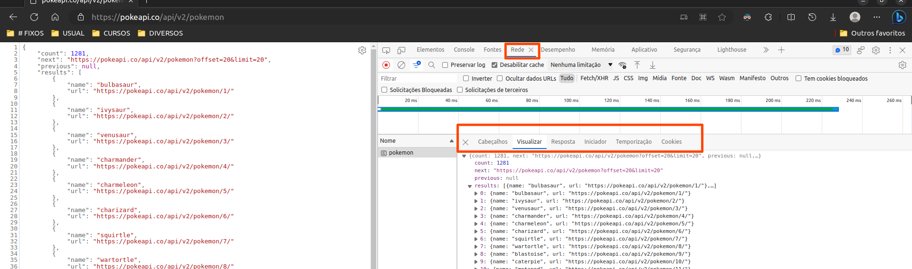

# Dominando o Protocolo HTTP e Integrando a PokeAPI

## Índice

- [Dominando o Protocolo HTTP e Integrando a PokeAPI](#dominando-o-protocolo-http-e-integrando-a-pokeapi)
  - [Índice](#índice)
  - [Antes de começar](#antes-de-começar)
  - [Introdução a APIs](#introdução-a-apis)
  - [Como funcionam as requisições](#como-funcionam-as-requisições)
  - [URL Path e Method](#url-path-e-method)
    - [Tipo de solicitação](#tipo-de-solicitação)
  - [Path Params e Query String](#path-params-e-query-string)
  - [Headers](#headers)
    - [Request Headers](#request-headers)
    - [Response Headers](#response-headers)
  - [Primeira requisição](#primeira-requisição)
  - [Manipulando o resultado da requisição através de uma Promise](#manipulando-o-resultado-da-requisição-através-de-uma-promise)
  - [Transformando nossa lista de Pokémon em uma lista de HTML](#transformando-nossa-lista-de-pokémon-em-uma-lista-de-html)
  - [Separando o consumo da API da manipulação de HTML](#separando-o-consumo-da-api-da-manipulação-de-html)
  - [Utilizando a função Map para diminuir a verbosidade do nosso código](#utilizando-a-função-map-para-diminuir-a-verbosidade-do-nosso-código)
  - [Revisando o nosso código e entendendo os próximos passos](#revisando-o-nosso-código-e-entendendo-os-próximos-passos)
  - [Manipulando múltiplas requisições em paralelo](#manipulando-múltiplas-requisições-em-paralelo)
  - [Convertendo o modelo do PokeApi para nosso modelo](#convertendo-o-modelo-do-pokeapi-para-nosso-modelo)
  - [Adicionando os tipos de pokemon dinâmicamente](#adicionando-os-tipos-de-pokemon-dinâmicamente)
  - [Adicionando o botão de paginação](#adicionando-o-botão-de-paginação)
  - [Criando mecanismo de paginação](#criando-mecanismo-de-paginação)
  - [Criando mecanismo para limitar na primeira geração de pokemon](#criando-mecanismo-para-limitar-na-primeira-geração-de-pokemon)

## Antes de começar

- [x]  Criar pasta referente ao curso
- [x]  Adicionar link da pasta nos atributos do curso
- [x]  Adicionar arquivos e links adicionais ao repositório (pdf, pptx, etc)

## Introdução a APIs

Uma API não deixa de ser um servidor que serve para nos dar dados.

Para quem trabalha com programação em geral é importante conhecer o protocolo http, pois eventualmente tudo vai passar por ele na web, apesar de existirem outros protocolos de comunicação e troca de mensagem.

## Como funcionam as requisições

Nós conseguimos visualizar a comunicação **cliente servidor** dentro do browser usando as ferramentas de desenvolvimento e indo na aba de network.

Nesta aba podemos visualizar a comunicação com a troca de de dados dentro de outras abas:



## URL Path e Method

Para montar uma requisição de HTTP nós precisamos do `path` que é a `URL` e serve como o `ip e porta` da requisição.

A URL é composta pelo IP e o Path para acesso da API.

Nós não precisamos decorar o IP das URLs pois o DNS converte o domínio do site em um IP.


No exemplo da imagem acima, o domínio `[https://pokeapi.co](https://pokeapi.co)` é substituído pelo IP do site pelo DNS, por exemplo, poderia ser o `[http://127.0.0.1:3000](http://127.0.0.1:3000)` se fosse um endereço local.

O restante da URL, composta por `api/v2/pokemon` basicamente é o Path que direciona a requisição para fornecer as informações necessárias. Neste caso, estamos consultando a API na versão 2 e solicitando a lista de pokemons existentes.


### Tipo de solicitação

Outro ponto é o tipo de solicitação feita. Em geral, quando consultamos uma URL na barra de pesquisa do navegador o método de requisição costuma ser `GET`


Mas além da `GET` existem outros métodos, por exemplo:

- POST
- PUT
- DELET
- PATCH

Cada tipo significa uma coisa diferente para o servidor.

O `GET` faz a busca de informações, `DELETE` solicita a remoção e assim por diante.

> Em toda requisição para um recurso o método indica a operação que desejamos fazer.
>

## Path Params e Query String

Para transferência de dados via API existem algumas áreas de transferências que podemos utilizar.

**A primeira de transferência de dados que temos é o Path** onde informamos a ID do pokemon para consulta:

Por exemplo:

- [https://pokeapi.co/api/v2/pokemon/1](https://pokeapi.co/api/v2/pokemon/1) → retorna informações do bulbasaur
- [https://pokeapi.co/api/v2/pokemon/2](https://pokeapi.co/api/v2/pokemon/2) → retorna informações do ivysaur

**A segunda área de transferência de dados é a Query String** que utilizamos para filtrar informações, por exemplo, pokemons que sejam do tipo `grass` ou pokemons que começam com a letra `i`.

A sintaxe de Query String é utilizar um `?` ao fim do Path e utilizar uma `chave`e `valor` para identificar a solicitação e concatenamos utilizando um `&`

Por exemplo, aqui estamos atribuindo um limite de 2 pokemons para consulta:

[https://pokeapi.co/api/v2/pokemon?offset=2&limit=2](https://pokeapi.co/api/v2/pokemon?offset=2&limit=2)

Onde offset = indica quantos pokemons eles devem pular, ou seja, os 2 primeiros

Limit = número limite de pokemons pra trazer na página

## Headers

Outro campo importante da requisição de APIs são os headers.


Os headers são metadados que servem de apoio para descrever as informações que estão sendo trabalhadas com a API.

### Request Headers

Neste caso, o próprio browser configura algumas coisas na requisição, por exemplo, os tipos de dados aceitos no cabeçalho de requisição:


Neste exemplo, o navegador também configura a prioridade do tipo de arquivo, indicado pelo `q-0.x`

Em outras palavras, ele está definindo a prioridade de `0.9` para as primeiras informações e prioridade `0.8` para as demais e etc.

Outro tipo de informação passada no header é o tipo de autenticação.

### Response Headers

Já no caso do cabeçalho de resposta do servidor, temos a informação do tipo de arquivo sendo fornecido servidor:


## Primeira requisição

Para iniciar nosso consumo de API vamos utilizar o site da PokeAPI.

Inicialmente vamos utilizar o consumo básico de listagem de pokemon, sem parâmetros passados para a API consumindo a lista de 10 em 10.

Por exemplo: [https://pokeapi.co/api/v2/pokemon?offset=0&limit=10](https://pokeapi.co/api/v2/pokemon?offset=0&limit=10)

Para fazer uma requisição de API via JavaScript existem diversas formas, mas no nosso caso vamos usar o **fetch api** que é uma **biblioteca integrada do JavaScript nos browsers mais modernos**, dessa forma não precisamos instalar nada para fazer o consumo da API.

O site para consulta de um exemplo pode ser consultado [neste link](https://developer.mozilla.org/en-US/docs/Web/API/Fetch_API/Using_Fetch).

Um ponto importante do fetch é que ele funciona de forma **assínscrona.** Ao executar esta função, o resultado da consulta será gerado após a requisição do servidor ser concluída.

Para ilustrar, podemos pegar este código como exemplo:

```jsx
const offset = 0;
const limit = 10;
const url = `https://pokeapi.co/api/v2/pokemon?offset=${offset}&limit=${limit}`;

// Fetch nos retorna uma promise
// Que é a promessa de um resultado assincrono de uma busca na API
// Fetch usa o método then para trabalhar com o resultado da consulta, que recebe uma função callback
fetch(url).then(function (response){
    console.log(response);
});

const x = 10 + 10;
console.log(x);
```

No código acima, o resultado da soma de 10 + 10 sai antes no console do que a consulta do fetch, como pode ser visto abaixo:


Isso se dá ao fato do fetch ser assíncrono.

> Importante destacar que esta resposta só será gerada se a consulta com a API for um sucesso sendo que as vezes ela não é.
>

## Manipulando o resultado da requisição através de uma Promise

A interface de funcionamento de uma fetch é baseada no `try / catch / finally` , onde podemos passar uma função para trabalhar com a requisição de acordo com o status dela, podendo ser bem sucedido ou mal sucedido.

No código abaixo o fetch tentará realizar a requisição, se for **bem sucedida** passará pelo `then`, se for **mal sucedida** passará pelo `catch` e **independente do resultado** ele irá passar pelo `finally` para informar que a requisição foi concluída:

```jsx
const offset = 0;
const limit = 10;
const url = `https://pokeapi.co/api/v2/pokemon?offset=${offset}&limit=${limit}`;

// Fetch nos retorna uma promise
// Que é a promessa de um resultado assincrono de uma busca na API
fetch(url)
    // then serve para trabalhar com uma consulta bem sucedida com a api
    .then(function (response) {
        console.log(response);
    })
    //catch serve para trabalhar com uma consulta mal sucedida com a api
    .catch(function (erro){ //
        console.log(erro);
    })
    // finally serve para trabalhar com a consulta independente do sucesso dela ou não
    .finally(function(){
        console.log("Requisição concluída!")
    })
```

Por padrão, o `fetch` retorna uma `string`. Para podermos trabalhar com ela no formato de `json` . Para isso, podemos usar o `.json` ao fim do response gerado pelo fetch e ao fazer isso também recebemos como resposta uma `promise` , neste caso de `any`, ou seja, um objeto qualquer.

Como a conversão nos retorna uma promise da mesma forma que o fetch, podemos seguir a estrutura de `then / catch / finally` da mesma forma.

Sendo assim, nosso código atualizado convertendo a resposta da API em json ficaria da seguinte forma:

```jsx
const offset = 0;
const limit = 10;
const url = `https://pokeapi.co/api/v2/pokemon?offset=${offset}&limit=${limit}`;

// Fetch nos retorna uma promise
// Que é a promessa de um resultado assincrono de uma busca na API
fetch(url)
    // then serve para trabalhar com uma consulta bem sucedida com a api
    .then(function (response) {
        // Convertendo a resposta em json, que retorna uma promise onde podemos usar o padrão then / catch / finnaly
        response.json().then(function (respondeBody){
            console.log(respondeBody);
        });
    })
    //catch serve para trabalhar com uma consulta mal sucedida com a api
    .catch(function (erro){ //
        console.log(erro);
    })
    // finally serve para trabalhar com a consulta independente do sucesso dela ou não
    .finally(function(){
        console.log("Requisição concluída!")
    })
```

Porém, o código acima possui um grande problema que é a declaração de function dentro de function, dessa forma o código fica muito complexo de ser interpretado e dificulta a refatoração.

Para resolver isso, podemos usar o conceito de `return` de function para encadear o `.then` de forma seguida. Assim, além de deixar o código mais legível, nos poupa o trabalho de criar um `catch` encadeado dentro do segundo then, pois da forma abaixo o catch serve para ambas as promises:

```jsx
const offset = 0;
const limit = 10;
const url = `https://pokeapi.co/api/v2/pokemon?offset=${offset}&limit=${limit}`;

// Fetch nos retorna uma promise
// Que é a promessa de um resultado assincrono de uma busca na API
fetch(url)
    // then serve para trabalhar com uma consulta bem sucedida com a api
    .then(function (response) {
        // Convertendo a resposta em json, que retorna uma promise onde podemos usar o padrão then / catch / finnaly
        return response.json()
    })

    // Trabalhando com o retorno da função acima (promise da conversão)
    .then(function (jsonbody){
        console.log(jsonbody);
    })

    //catch serve para trabalhar com uma consulta mal sucedida com a api
    .catch(function (erro){ //
        console.log(erro);
    })
    
    // finally serve para trabalhar com a consulta independente do sucesso dela ou não
    .finally(function(){
        console.log("Requisição concluída!")
    })
```

Nesta aula o que foi aprendido foi:

- Encadeamento de then de forma rebuscada, para evitar muito código;

O código final fica da seguinte forma:

```jsx
const offset = 0;
const limit = 10;
const url = `https://pokeapi.co/api/v2/pokemon?offset=${offset}&limit=${limit}`;

// Fetch nos retorna uma promise
// Que é a promessa de um resultado assincrono de uma busca na API
fetch(url)
    // then serve para trabalhar com uma consulta bem sucedida com a api
    .then((response) => response.json())

    // Trabalhando com o retorno da função acima (que é um promise da conversão, já que pode não funcionar)
    .then((jsonbody) => console.log(jsonbody))

    //catch serve para trabalhar com a consulta mal sucedida
    .catch((erro) => console.log(erro))
```

## Transformando nossa lista de Pokémon em uma lista de HTML

Para extrair somente a lista de pokemons do retorno da api, precisamos fazer um tratamento da promise, mas antes devemos entender qual é o item que precisamos extrair, neste caso, podemos adicionar uma linha de `debugger` no nosso código JS para que o navegador adicione um `breakpoint` na hora de executar o código.

Com essa pausa, podemos verificar e trabalhar com os valores durante a execução do código. Ao fazer isso, verificamos que no retorno da API há o `results` que é a lista de pokemons com nome e url de detalhes, é isto que queremos pegar.

Com essa informação podemos adaptar o código para extrair apenas a lista de pokemon e trabalhar com ela:

```jsx
const offset = 0;
const limit = 10;
const url = `https://pokeapi.co/api/v2/pokemon?offset=${offset}&limit=${limit}`;

// Primeiro fetch, que retorna uma promise
fetch(url)
  // Pega o resultado da promise e converte em json
  .then((response) => response.json())
  // Pega o json e extrai apenas o requests (lista de pokemons)
  .then((jsonBody) => jsonBody.results)
  //Pega a lista de pokemon e retorna no console
  .then((pokemonList) => {
    debugger;
    console.log(pokemonList);
  })
  // Retorna erro caso promise dê errado
  .catch((erro) => console.log(erro));
```

O resultado no breakepoint é:


Até o momento o que foi feito em aula:

- Trabalhamos com o arquivo HTML no JavaScript;
- Fizemos a requisição HTTP da API
- Com o resultado da requisição, convertemos a lista de pokemons em li do html;
- Para cada pokemon concatenamos o pokemon no HTML.

- O código até o momento:

    ```jsx
    const offset = 0;
    const limit = 10;
    const url = `https://pokeapi.co/api/v2/pokemon?offset=${offset}&limit=${limit}`;
    const pokemonList = document.getElementById("pokemonList");
    console.log(pokemonList);
    
    // Função para converter resultado de API para lista do HTML
    function convertPokemonToLi (pokemon){
        return `<li class="pokemon">
                    <span class="number">#001</span>
                    <span class="name">${pokemon}</span>
    
                    <div class="detail">
                        <ol class="types">
                            <li class="type">grass</li>
                            <li class="type">poison</li>
                        </ol>
    
                        
                    </div>
    
                </li>`
    }
    
    // Primeiro fetch, que retorna uma promise
    fetch(url)
      // Pega o resultado da promise e converte em json
      .then((response) => response.json())
      // Pega o json e extrai apenas o requests (lista de pokemons)
      .then((jsonBody) => jsonBody.results)
      //Pega a lista de pokemon e retorna no console
      .then((pokemons) => {
        // Pega cada pokemon e chama a função para converter em lista 
        for (let i = 0; i < pokemons.length; i++) {
            const pokemon = pokemons[i];
            pokemonList.innerHTML += convertPokemonToLi(pokemon.name);
        }
      })
      // Retorna erro caso promise dê errado
      .catch((erro) => console.log(erro));
    ```

## Separando o consumo da API da manipulação de HTML

Por boas práticas e para melhorar a legibilidade do código, vamos separar o código de manipulação do HTML do código de manipulação da API

Para isso, criar um novo arquivo chamado `poke_api.js`

Após isso, fazemos alguns ajustes para deixar o código mais separado, no caso, os arquivos ficarão assim:

- HTML (adicionando poke_api.js na interpretação do HTML)

    ```html
    <!DOCTYPE html>
    <html lang="pt-br">
    
    <head>
        <meta charset="UTF-8" />
        <meta name="viewport" content="width=device-width, initial-scale=1.0" />
        <title>Pokedex</title>
        <!DOCTYPE html>
        <html lang="en">
    
        <head>
            <meta name="viewport" content="width=device-width, initial-scale=1.0">
            <title>Pokedex</title>
            <!-- Normalize -->
            <link rel="stylesheet" href="https://cdnjs.cloudflare.com/ajax/libs/normalize/8.0.1/normalize.min.css"
                integrity="sha512-NhSC1YmyruXifcj/KFRWoC561YpHpc5Jtzgvbuzx5VozKpWvQ+4nXhPdFgmx8xqexRcpAglTj9sIBWINXa8x5w=="
                crossorigin="anonymous" referrerpolicy="no-referrer" />
    
            <!-- Font Roboto -->
            <link rel="preconnect" href="https://fonts.googleapis.com">
            <link rel="preconnect" href="https://fonts.gstatic.com" crossorigin>
            <link href="https://fonts.googleapis.com/css2?family=Roboto:wght@100;300;500;700&display=swap" rel="stylesheet">
    
            <!-- Nosso CSS -->
            <link rel="stylesheet" href="assets/css/global.css">
            <link rel="stylesheet" href="assets/css/pokedex.css">
        </head>
    
    <body>
    
    </body>
    
    </html>
    </head>
    
    <body>
    
        <section class="content">
            <h1>Pokedex</h1>
            <ol id="pokemonList" class="pokemons">
                <li class="pokemon">
                    <span class="number">#001</span>
                    <span class="name">Bulbasaur</span>
    
                    <div class="detail">
                        <ol class="types">
                            <li class="type">grass</li>
                            <li class="type">poison</li>
                        </ol>
    
                        
                    </div>
    
                </li>
    
            </ol>
        </section>
        <!-- Nosso JS -->
        <script src="assets/javascript/poke_api.js"></script>
        <script src="assets/javascript/main.js"></script>
    </body>
    
    </html>
    ```

- poke_api.js (criando objeto para métodos com api e adicionando metodo get)

    ```jsx
    // Declarando objeto para armazenar funções
    const pokeApi = {};
    
    // Atribuindo função getPokemons ao objeto, com valores offset e limit em default
    pokeApi.getPokemons = (offset = 0, limit = 10) => {
      // URL da requisição
      const url = `https://pokeapi.co/api/v2/pokemon?offset=${offset}&limit=${limit}`;
    
      // Retornando lista de pokemons tratada
      return (
        fetch(url)
          // Pega o resultado da promise e converte em json
          .then((response) => response.json())
          // Pega o json e extrai apenas o requests (lista de pokemons)
          .then((jsonBody) => jsonBody.results)
          // Printando erro caso haja
          .catch((error) => console.log(error))
      );
    };
    ```

- main.js (ajustando para trabalhar com poke_api.js e modificando adição do HTML para evitar que a página renderize toda vez no loop)

    ```jsx
    const pokemonList = document.getElementById("pokemonList");
    console.log(pokemonList);
    
    // Função para converter resultado de API para lista do HTML
    function convertPokemonToLi(pokemon) {
      return `<li class="pokemon">
                    <span class="number">#001</span>
                    <span class="name">${pokemon}</span>
    
                    <div class="detail">
                        <ol class="types">
                            <li class="type">grass</li>
                            <li class="type">poison</li>
                        </ol>
    
                        
                    </div>
    
                </li>`;
    }
    
    // Chamando requisição de API e listando pokemon no browse
    pokeApi
      .getPokemons()
      .then((pokemons) => {
        // Cria lista para armazenar pokemons
        const listItems = [];
    
        // Pega cada pokemon e chama a função para converter em lista
        for (let i = 0; i < pokemons.length; i++) {
          const pokemon = pokemons[i];
          // Adiciona pokemon formatado em HTML na lista
          listItems.push(convertPokemonToLi(pokemon.name));
        }
    
        // Printa no console lista de pokemons
        console.log(listItems);
      })
      // Retorna erro caso promise dê errado
      .catch((erro) => console.log(erro));
    ```

## Utilizando a função Map para diminuir a verbosidade do nosso código

Podemos diminuir a verbosidade do código utilizando a função map do javascript, conforme código abaixo:

```jsx
const pokemonList = document.getElementById("pokemonList");

// Função para converter resultado de API para lista do HTML
function convertPokemonToLi(pokemon) {
  return `<li class="pokemon">
                <span class="number">#001</span>
                <span class="name">${pokemon.name}</span>

                <div class="detail">
                    <ol class="types">
                        <li class="type">grass</li>
                        <li class="type">poison</li>
                    </ol>

                    
                </div>

            </li>`;
}

// Chamando requisição de API e listando pokemon no browse
pokeApi
  .getPokemons()
  .then((pokemons) => {
    // Primeiro mapeia todos os pokemons e os converte em li de HTML via MAP e convertPokemonToLi
    // Depois unifica tudo em uma string sem separador via JOIN
    // Depois incrementa lista convertida em string no html via innerHTML
    pokemonList.innerHTML = pokemons.map(convertPokemonToLi).join("");
  })
  // Retorna erro caso promise dê errado
  .catch((erro) => console.log(erro));
```

## Revisando o nosso código e entendendo os próximos passos

Nessa aula apenas revisamos o que foi aprendido, passando pelos tópicos de:

- Criamos um acesso à api
- Acessamos ela e manipulamos a promise para comtemplar uma lista
- Com a lista em mãos mapeamos ela e convertemos em outro tipo
- Com essa conversão, nós juntamos a lista concatenando sem separador
- Depois substituimos o html anterior por essa lista criada que terá o html modificado

Abaixo o código:

```jsx
const pokemonList = document.getElementById("pokemonList");

// Função para converter resultado de API para lista do HTML
function convertPokemonToLi(pokemon) {
  return `<li class="pokemon">
                <span class="number">#001</span>
                <span class="name">${pokemon.name}</span>

                <div class="detail">
                    <ol class="types">
                        <li class="type">grass</li>
                        <li class="type">poison</li>
                    </ol>

                    
                </div>

            </li>`;
}

// Chamando requisição de API e listando pokemon no browse
pokeApi
  .getPokemons()
  .then((pokemons) => {
    // Primeiro mapeia todos os pokemons e os converte em li de HTML via MAP e convertPokemonToLi
    // Depois unifica tudo em uma string sem separador via JOIN
    // Depois incrementa lista convertida em string no html via innerHTML
    const newHtml = pokemons.map(convertPokemonToLi).join("");
    pokemonList.innerHTML = newHtml; 
  })
  // Retorna erro caso promise dê errado
  .catch((erro) => console.log(erro));
```

Durante a aula também vimos que será necessário fazer uma requisição de um array de pokemons, para isso usamos o método `Promise.all` que é nativo do Javascript, onde passamos um array de url para realizar a requisição e após podemos usar os resultados.

Abaixo o código complementar:

- poke_api.js

    ```jsx
    // Declarando objeto para armazenar funções
    const pokeApi = {};
    
    // Atribuindo função getPokemons ao objeto, com valores offset e limit em default
    pokeApi.getPokemons = (offset = 0, limit = 10) => {
      // URL da requisição
      const url = `https://pokeapi.co/api/v2/pokemon?offset=${offset}&limit=${limit}`;
    
      // Retornando lista de pokemons tratada
      return (
        fetch(url)
          // Pega o resultado da promise e converte em json
          .then((response) => response.json())
          // Pega o json e extrai apenas o requests (lista de pokemons)
          .then((jsonBody) => jsonBody.results)
          // Printando erro caso haja
          .catch((error) => console.log(error))
      );
    };
    
    Promise.all([
      fetch('https://pokeapi.co/api/v2/pokemon/1'),
      fetch('https://pokeapi.co/api/v2/pokemon/2'),
      fetch('https://pokeapi.co/api/v2/pokemon/3'),
      fetch('https://pokeapi.co/api/v2/pokemon/4'),
    ]).then((results) => {
      console.log(results);
    })
    ```

## Manipulando múltiplas requisições em paralelo

Nessa aula nós refatoramos o código para diminuir a verbosidade enquanto mapeamos os pokemons atrás da lista de detalhes:

- poke_api.js

    ```jsx
    // Declarando objeto para armazenar funções
    const pokeApi = {};
    
    // Atribuindo função para pegar os detalhes a partir da URL
    pokeApi.getPokemonDetails = (pokemon) => {
      return fetch(pokemon.url).then((response) => response.json());
    };
    
    // Atribuindo função getPokemons ao objeto, com valores offset e limit em default
    pokeApi.getPokemons = (offset = 0, limit = 5) => {
      // URL da requisição
      const url = `https://pokeapi.co/api/v2/pokemon?offset=${offset}&limit=${limit}`;
    
      // Retornando lista de pokemons tratada
      return (
        fetch(url)
          // Pega o resultado da promise e converte em json
          .then((response) => response.json())
          // Pega o json e extrai apenas o requests (lista de pokemons)
          .then((jsonBody) => jsonBody.results)
          // Mapeia a lista de pokemons e pega as URL através do getPokemonDetails
          .then((pokemons) => pokemons.map(pokeApi.getPokemonDetails))
          // Transforma a de urls em promises
          .then((detailRequests) => Promise.all(detailRequests))
          // Retorna a lista de detalhes de pokemons
          .then((pokemonsDetails) => pokemonsDetails)
          // Printando erro caso haja
          .catch((error) => console.log(error))
      );
    };
    ```

Com a requisição de detalhes do pokemon feita, nós modificamos o `main.js` para que o HTML convertido suportasse a mudança de tipos e de imagem do pokemon:

- main.js

    ```jsx
    const pokemonList = document.getElementById("pokemonList");
    
    // Função para converter tipos em lista
    function convertPokemonsTypesToLi(pokemonTypes) {
      return pokemonTypes.map((typeSlot) => `<li class="type">${typeSlot.type.name}</li>`);
    }
    
    // Função para converter resultado de API para lista do HTML
    function convertPokemonToLi(pokemon) {
      return `<li class="pokemon">
                    <span class="number">#${pokemon.order}</span>
                    <span class="name">${pokemon.name}</span>
    
                    <div class="detail">
                        <ol class="types">
                            ${convertPokemonsTypesToLi(pokemon.types).join("")}
                        </ol>
    
                        
                    </div>
    
                </li>`;
    }
    
    // Chamando requisição de API e listando pokemon no browse
    pokeApi
      .getPokemons()
      .then((pokemons) => {
        // Primeiro mapeia todos os pokemons e os converte em li de HTML via MAP e convertPokemonToLi
        // Depois unifica tudo em uma string sem separador via JOIN
        // Depois incrementa lista convertida em string no html via innerHTML
        const newHtml = pokemons.map(convertPokemonToLi).join("");
        pokemonList.innerHTML = newHtml;
      })
      // Retorna erro caso promise dê errado
      .catch((erro) => console.log(erro));
    ```

## Convertendo o modelo do PokeApi para nosso modelo

Como a API foi composta para todo tipo de consulta e trabalho, ao acessar os seus dados temos muita informação, o que a deixa complexa demais.

Pensando nisso, podemos criar nosso modelo de API com base nas informações da API original, assim simplificando as informações para termos acesso a somente o que precisarmos.

Para isso, temos que criar um novo arquivo chamado `pokemon_model.js` onde vamos adicionar a classe com as informações necessárias:

- pokemon_model.js

    ```jsx
    class Pokemon { 
        number; // Numero do Pokemon
        name; // Nome do pokemon
        type; // Tipo principal, para mudar cor de fundo
        types = []; // Lista de tipos
        photo; // Foto do pokemon
    }
    ```

Para poder trabalhar com esse modelo, vamos precisar incluir no HTML o script, vamos mudar o `main.js` e também a `poke_api.js`.

No HTML basta incluir a linha abaixo:

```html
<script src="assets/javascript/pokemon_model.js"></script>
```

No `poke_api.js` vamos incluir uma função para tratar os detalhes extraídos da API e converter eles em nosso modelo. Além disso, é necessário incluir essa função nova dentro da função `getPokemonDetails` . Abaixo o código modificado:

- poke_api.js

    ```jsx
    // Declarando objeto para armazenar funções
    const pokeApi = {};
    
    // Função para converter dados da API para nosso modelo
    function convertPokeApiDetailToPokemon(pokeDetail) {
      const pokemon = new Pokemon();
      pokemon.number = pokeDetail.order;
      pokemon.name = pokeDetail.name;
    
      // Converte lista de tipos em variável local
      const types = pokeDetail.types.map((typeSlot) => typeSlot.type.name);
      // Desconstroi lista e atribui primeiro valor (indice 0)
      const [type] = types;
    
      pokemon.types = types;
      pokemon.type = type;
      pokemon.photo = pokeDetail.sprites.other.dream_world.front_default;
    
      return pokemon;
    }
    
    // Atribuindo função para pegar os detalhes a partir da URL
    pokeApi.getPokemonDetails = (pokemon) => {
      return fetch(pokemon.url)
        .then((response) =>
        response.json()
        .then((pokemon) => {
          return convertPokeApiDetailToPokemon(pokemon);
        })
      );
    };
    
    // Atribuindo função getPokemons ao objeto, com valores offset e limit em default
    pokeApi.getPokemons = (offset = 0, limit = 5) => {
      // URL da requisição
      const url = `https://pokeapi.co/api/v2/pokemon?offset=${offset}&limit=${limit}`;
    
      // Retornando lista de pokemons tratada
      return (
        fetch(url)
          // Pega o resultado da promise e converte em json
          .then((response) => response.json())
          // Pega o json e extrai apenas o requests (lista de pokemons)
          .then((jsonBody) => jsonBody.results)
          // Mapeia a lista de pokemons e pega as URL através do getPokemonDetails
          .then((pokemons) => pokemons.map(pokeApi.getPokemonDetails))
          // Transforma a de urls em promises
          .then((detailRequests) => Promise.all(detailRequests))
          // Retorna a lista de detalhes de pokemons
          .then((pokemonsDetails) => pokemonsDetails)
          // Printando erro caso haja
          .catch((error) => console.log(error))
      );
    };
    ```

Com esse tratamento feito, precisamos mudar o main, removendo a função criada para incrementar os tipos e também modificando o acesso às informações, onde antes passamos a estrutura completa da API para acessar as informações, agora passamos apenas o caminho do modelo criado:

- main.js

    ```jsx
    const pokemonList = document.getElementById("pokemonList");
    
    // Função para converter resultado de API para lista do HTML
    function convertPokemonToLi(pokemon) {
      return `<li class="pokemon ${pokemon.type}">
                    <span class="number">#${pokemon.number}</span>
                    <span class="name">${pokemon.name}</span>
    
                    <div class="detail">
                        <ol class="types">
                            ${pokemon.types.map((type) => `<li class="type"> ${type}.</li>`).join("")}
                        </ol>
    
                        
                    </div>
    
                </li>`;
    }
    
    // Chamando requisição de API e listando pokemon no browse
    pokeApi
      .getPokemons()
      .then((pokemons = []) => {
        // Primeiro mapeia todos os pokemons e os converte em li de HTML via MAP e convertPokemonToLi
        // Depois unifica tudo em uma string sem separador via JOIN
        // Depois incrementa lista convertida em string no html via innerHTML
        const newHtml = pokemons.map(convertPokemonToLi).join("");
        pokemonList.innerHTML = newHtml;
      })
      // Retorna erro caso promise dê errado
      .catch((erro) => console.log(erro));
    ```

Com isso, o código fica mais enxuto e escalável de acordo com a necessidade.

## Adicionando os tipos de pokemon dinâmicamente

Nesta aula nós adicionamos classes dinâmicas às tags HTML. Nessas classes colocamos o tipo do pokemon para que o CSS interprete cada tipo e modifique a cor dinâmicamente.

Além disso, mudamos o CSS para capitalizar o nome do pokemon e também par adar um brilho nas tags de tipos, usamos as propriedades `text-transform` e `filter` para fazer essas mudanças, respectivamente.

Abaixo as alterações realizadas:

- main.js

    ```jsx
    const pokemonList = document.getElementById("pokemonList");
    
    // Função para converter resultado de API para lista do HTML
    function convertPokemonToLi(pokemon) {
      return `<li class="pokemon ${pokemon.type}">
                    <span class="number">#${pokemon.number}</span>
                    <span class="name">${pokemon.name}</span>
    
                    <div class="detail">
                        <ol class="types">
                            ${pokemon.types.map((type) => `<li class="type ${type}"> ${type}</li>`).join("")}
                        </ol>
    
                        
                    </div>
    
                </li>`;
    }
    
    // Chamando requisição de API e listando pokemon no browse
    pokeApi
      .getPokemons()
      .then((pokemons = []) => {
        // Primeiro mapeia todos os pokemons e os converte em li de HTML via MAP e convertPokemonToLi
        // Depois unifica tudo em uma string sem separador via JOIN
        // Depois incrementa lista convertida em string no html via innerHTML
        const newHtml = pokemons.map(convertPokemonToLi).join("");
        pokemonList.innerHTML = newHtml;
      })
      // Retorna erro caso promise dê errado
      .catch((erro) => console.log(erro));
    ```

- pokedex.css

    ```css
    .normal{
        background-color:#A8A77A;
    }
    .fire{
        background-color:#EE8130;
    }
    .water{
        background-color:#6390F0;
    }
    .electric{
        background-color:#F7D02C;
    }
    .grass{
        background-color:#7AC74C;
    }
    .ice{
        background-color:#96D9D6;
    }
    .fighting{
        background-color:#C22E28;
    }
    .poison{
        background-color:#A33EA1;
    }
    .ground{
        background-color:#E2BF65;
    }
    .flying{
        background-color:#A98FF3;
    }
    .psychic{
        background-color:#F95587;
    }
    .bug{
        background-color:#A6B91A;
    }
    .rock{
        background-color:#B6A136;
    }
    .ghost{
        background-color:#735797;
    }
    .dragon{
        background-color:#6F35FC;
    }
    .dark{
        background-color:#705746;
    }
    .steel{
        background-color:#B7B7CE;
    }
    .fairy{
        background-color:#D685AD;
    }
    
    /* Feito com 1 coluna, por padrão*/
    .pokemons {
        list-style: none;
        margin: 0;
        padding: 0;
        display: grid;
        grid-template-columns: 1fr;
        /* Uma coluna, para telas pequenas (até 380px)*/
    }
    
    .pokemon {
        margin: 0.5rem;
        padding: 2rem 1rem;
        color: #fff;
        border-radius: 1rem;
        display: flex;
        flex-direction: column;
    }
    
    .pokemon .name {
        color: #fff;
        margin: .25rem 0rem;
        text-transform: capitalize;
    }
    
    .pokemon .number {
        color: #000;
        opacity: 0.3;
        text-align: right;
        font-size: .625rem;
    }
    
    .pokemon .detail .types {
        padding: 0;
        margin: 0;
        list-style: none;
    }
    
    .pokemon .detail .types .type {
        color: #fff;
        padding: .25rem .5rem;
        border-radius: 1rem;
        font-size: .625rem;
        margin: .25rem 0;
        filter: brightness(1.1); 
        text-align: center;
    }
    
    .pokemon .detail {
        display: flex;
        flex-direction: row;
        align-items: center;
        justify-content: space-between;
    
    }
    
    .pokemon .detail img {
        border-style: none;
        max-width: 100%;
        height: 70px;
        align-self: flex-end;
    }
    
    /* Feito com 2 colunas, quando a tela chegar a 380px */
    @media screen and (min-width: 380px) {
    
        .pokemons {
            grid-template-columns: 1fr 1fr;
            /* Modificando apenas o número de colunas, o resto fica igual (herda do pai) */
        }
    }
    
    /* Feito com 3 colunas, quando a tela chegar a 576px */
    @media screen and (min-width: 576px) {
    
        .pokemons {
            grid-template-columns: 1fr 1fr 1fr;
            /* Modificando apenas o número de colunas, o resto fica igual (herda do pai) */
        }
    }
    
    /* Feito com 4 colunas, quando a tela chegar a 992px */
    @media screen and (min-width: 992px) {
    
        .pokemons {
            grid-template-columns: 1fr 1fr 1fr 1fr;
            /* Modificando apenas o número de colunas, o resto fica igual (herda do pai) */
        }
    }
    ```

## Adicionando o botão de paginação

Nessa aula modificamos apenas o HTML e o CSS para adicionar um botão ao fim do site onde servirá de paginação, carregando mais pokemons da lista.

O código HTML e CSS:

- HTML

    ```html
    <!DOCTYPE html>
    <html lang="pt-br">
    
    <head>
        <meta charset="UTF-8" />
        <meta name="viewport" content="width=device-width, initial-scale=1.0" />
        <title>Pokedex</title>
        <!DOCTYPE html>
        <html lang="en">
    
        <head>
            <meta name="viewport" content="width=device-width, initial-scale=1.0">
            <title>Pokedex</title>
            <!-- Normalize -->
            <link rel="stylesheet" href="https://cdnjs.cloudflare.com/ajax/libs/normalize/8.0.1/normalize.min.css"
                integrity="sha512-NhSC1YmyruXifcj/KFRWoC561YpHpc5Jtzgvbuzx5VozKpWvQ+4nXhPdFgmx8xqexRcpAglTj9sIBWINXa8x5w=="
                crossorigin="anonymous" referrerpolicy="no-referrer" />
    
            <!-- Font Roboto -->
            <link rel="preconnect" href="https://fonts.googleapis.com">
            <link rel="preconnect" href="https://fonts.gstatic.com" crossorigin>
            <link href="https://fonts.googleapis.com/css2?family=Roboto:wght@100;300;500;700&display=swap" rel="stylesheet">
    
            <!-- Nosso CSS -->
            <link rel="stylesheet" href="assets/css/global.css">
            <link rel="stylesheet" href="assets/css/pokedex.css">
        </head>
    
    <body>
    
    </body>
    
    </html>
    </head>
    
    <body>
    
        <section class="content">
            <h1>Pokedex</h1>
            <ol id="pokemonList" class="pokemons">
                <li class="pokemon">
                    <span class="number">#001</span>
                    <span class="name">Bulbasaur</span>
    
                    <div class="detail">
                        <ol class="types">
                            <li class="type">grass</li>
                            <li class="type">poison</li>
                        </ol>
    
                        
                    </div>
    
                </li>
            </ol>
    
            <div class="pagination">
                <button type="button" id="loadMoreButton">Load More</button>
            </div>
    
        </section>
        <!-- Nosso JS -->
        <script src="assets/javascript/poke_api.js"></script>
        <script src="assets/javascript/main.js"></script>
        <script src="assets/javascript/pokemon_model.js"></script>
    </body>
    
    </html>
    ```

- CSS

    ```css
    .normal{
        background-color:#A8A77A;
    }
    .fire{
        background-color:#EE8130;
    }
    .water{
        background-color:#6390F0;
    }
    .electric{
        background-color:#F7D02C;
    }
    .grass{
        background-color:#7AC74C;
    }
    .ice{
        background-color:#96D9D6;
    }
    .fighting{
        background-color:#C22E28;
    }
    .poison{
        background-color:#A33EA1;
    }
    .ground{
        background-color:#E2BF65;
    }
    .flying{
        background-color:#A98FF3;
    }
    .psychic{
        background-color:#F95587;
    }
    .bug{
        background-color:#A6B91A;
    }
    .rock{
        background-color:#B6A136;
    }
    .ghost{
        background-color:#735797;
    }
    .dragon{
        background-color:#6F35FC;
    }
    .dark{
        background-color:#705746;
    }
    .steel{
        background-color:#B7B7CE;
    }
    .fairy{
        background-color:#D685AD;
    }
    
    /* Feito com 1 coluna, por padrão*/
    .pokemons {
        list-style: none;
        margin: 0;
        padding: 0;
        display: grid;
        grid-template-columns: 1fr;
        /* Uma coluna, para telas pequenas (até 380px)*/
    }
    
    .pokemon {
        margin: 0.5rem;
        padding: 2rem 1rem;
        color: #fff;
        border-radius: 1rem;
        display: flex;
        flex-direction: column;
    }
    
    .pokemon .name {
        color: #fff;
        margin: .25rem 0rem;
        text-transform: capitalize;
    }
    
    .pokemon .number {
        color: #000;
        opacity: 0.3;
        text-align: right;
        font-size: .625rem;
    }
    
    .pokemon .detail .types {
        padding: 0;
        margin: 0;
        list-style: none;
    }
    
    .pokemon .detail .types .type {
        color: #fff;
        padding: .25rem .5rem;
        border-radius: 1rem;
        font-size: .625rem;
        margin: .25rem 0;
        filter: brightness(1.1); 
        text-align: center;
    }
    
    .pokemon .detail {
        display: flex;
        flex-direction: row;
        align-items: center;
        justify-content: space-between;
    
    }
    
    .pokemon .detail img {
        border-style: none;
        max-width: 100%;
        height: 70px;
        align-self: flex-end;
    }
    
    .pagination{
        display: flex;
        flex-direction: row;
        justify-content: center;
        align-items: center;
        width: 100%;
        padding: 1rem;
    }
    
    .pagination button{
        color: #fff;
        font-size: .625rem;
        margin: .25rem 0;
        padding: .25rem .5rem;
        background-color: #6c79db;
        border: none;
        border-radius: 1rem;  
    }
    
    /* Feito com 2 colunas, quando a tela chegar a 380px */
    @media screen and (min-width: 380px) {
    
        .pokemons {
            grid-template-columns: 1fr 1fr;
            /* Modificando apenas o número de colunas, o resto fica igual (herda do pai) */
        }
    }
    
    /* Feito com 3 colunas, quando a tela chegar a 576px */
    @media screen and (min-width: 576px) {
    
        .pokemons {
            grid-template-columns: 1fr 1fr 1fr;
            /* Modificando apenas o número de colunas, o resto fica igual (herda do pai) */
        }
    }
    
    /* Feito com 4 colunas, quando a tela chegar a 992px */
    @media screen and (min-width: 992px) {
    
        .pokemons {
            grid-template-columns: 1fr 1fr 1fr 1fr;
            /* Modificando apenas o número de colunas, o resto fica igual (herda do pai) */
        }
    }
    ```

## Criando mecanismo de paginação

Nessa aula modificamos o `main.js` para que ao clicar no botão criado anteriormente ele incremente o HTML com novos pokemons.

Dessa forma, foi necessário criar uma função para monitorar o clique no botão e também refatoramos as funções anteriores para deixar o código mais enxuto.

Sendo assim, o código foi modificado para:

- index.html

    ```html
    <!DOCTYPE html>
    <html lang="pt-br">
    
    <head>
        <meta charset="UTF-8" />
        <meta name="viewport" content="width=device-width, initial-scale=1.0" />
        <title>Pokedex</title>
        <!DOCTYPE html>
        <html lang="en">
    
        <head>
            <meta name="viewport" content="width=device-width, initial-scale=1.0">
            <title>Pokedex</title>
            <!-- Normalize -->
            <link rel="stylesheet" href="https://cdnjs.cloudflare.com/ajax/libs/normalize/8.0.1/normalize.min.css"
                integrity="sha512-NhSC1YmyruXifcj/KFRWoC561YpHpc5Jtzgvbuzx5VozKpWvQ+4nXhPdFgmx8xqexRcpAglTj9sIBWINXa8x5w=="
                crossorigin="anonymous" referrerpolicy="no-referrer" />
    
            <!-- Font Roboto -->
            <link rel="preconnect" href="https://fonts.googleapis.com">
            <link rel="preconnect" href="https://fonts.gstatic.com" crossorigin>
            <link href="https://fonts.googleapis.com/css2?family=Roboto:wght@100;300;500;700&display=swap" rel="stylesheet">
    
            <!-- Nosso CSS -->
            <link rel="stylesheet" href="assets/css/global.css">
            <link rel="stylesheet" href="assets/css/pokedex.css">
        </head>
    
    <body>
    
    </body>
    
    </html>
    </head>
    
    <body>
    
        <section class="content">
            <h1>Pokedex</h1>
            <ol id="pokemonList" class="pokemons">
               <!-- Pokemons here -->
            </ol>
    
            <div class="pagination">
                <button type="button" id="loadMoreButton">Load More</button>
            </div>
    
        </section>
        <!-- Nosso JS -->
        <script src="assets/javascript/poke_api.js"></script>
        <script src="assets/javascript/main.js"></script>
        <script src="assets/javascript/pokemon_model.js"></script>
    </body>
    
    </html>
    ```

- main.js

    ```jsx
    const pokemonList = document.getElementById("pokemonList");
    const loadMoreButton = document.getElementById("loadMoreButton");
    const limit = 5;
    let offset = 0;
    
    function loadMoreItems(offset, limit) {
      // Chamando requisição de API e listando pokemon no browse
      pokeApi
        .getPokemons(offset, limit)
        .then((pokemons = []) => {
          // Primeiro mapeia todos os pokemons e os converte em li de HTML via MAP e convertPokemonToLi
          // Depois unifica tudo em uma string sem separador via JOIN
          // Depois incrementa lista convertida em string no html via innerHTML
          const newHtml = pokemons
            .map((pokemon) => {
              return `<li class="pokemon ${pokemon.type}">
                    <span class="number">#${pokemon.number}</span>
                    <span class="name">${pokemon.name}</span>
    
                    <div class="detail">
                        <ol class="types">
                            ${pokemon.types
                              .map(
                                (type) => `<li class="type ${type}"> ${type}</li>`
                              )
                              .join("")}
                        </ol>
    
                        
                    </div>
    
                </li>`;
            })
            .join("");
          pokemonList.innerHTML += newHtml;
        })
        // Retorna erro caso promise dê errado
        .catch((erro) => console.log(erro));
    }
    
    loadMoreItems(offset, limit);
    
    loadMoreButton.addEventListener("click", () => {
      offset += limit;
      loadMoreItems(offset, limit);
    });
    ```

Na próxima aula vamos limitar o carregamento de novos pokemons para apenas a primeira geração.

## Criando mecanismo para limitar na primeira geração de pokemon

Nessa aula criamos a lógica para limitar a paginação à primeira geração do pokemon.

Para isso, definimos uma variável de limite máximo e também definimos variáveis de escopo local dentro do método de paginação onde verifica o número de elementos na próxima tela e, caso o número seja igual ou maior que o limite máximo estabelecido, o site carrega apenas o limite máximo e apaga o botão de load more.

Abaixo o código modificado:

- main.js

    ```jsx
    const pokemonList = document.getElementById("pokemonList");
    const loadMoreButton = document.getElementById("loadMoreButton");
    const limit = 5;
    let offset = 0;
    let maxRecord = 151;
    
    function loadMoreItems(offset, limit) {
      // Chamando requisição de API e listando pokemon no browse
      pokeApi
        .getPokemons(offset, limit)
        .then((pokemons = []) => {
          // Primeiro mapeia todos os pokemons e os converte em li de HTML via MAP e convertPokemonToLi
          // Depois unifica tudo em uma string sem separador via JOIN
          // Depois incrementa lista convertida em string no html via innerHTML
          const newHtml = pokemons
            .map((pokemon) => {
              return `<li class="pokemon ${pokemon.type}">
                    <span class="number">#${pokemon.number}</span>
                    <span class="name">${pokemon.name}</span>
    
                    <div class="detail">
                        <ol class="types">
                            ${pokemon.types
                              .map(
                                (type) => `<li class="type ${type}"> ${type}</li>`
                              )
                              .join("")}
                        </ol>
    
                        
                    </div>
    
                </li>`;
            })
            .join("");
          pokemonList.innerHTML += newHtml;
        })
        // Retorna erro caso promise dê errado
        .catch((erro) => console.log(erro));
    }
    
    // Carrega primeiros pokemons na tela
    loadMoreItems(offset, limit);
    
    // Ao clicar carrega mais pokemons de acordo com o limite estabelecido
    loadMoreButton.addEventListener("click", () => {
      // Atribui ao numero de novos elementos o valor somado ao limite atual
      offset += limit;
    
      // Armazena o número de itens da próxima página
      const qtdRecordsWithNextPage = offset + limit;
    
      // Verifica se a próxima página passa do limite estabelecido
      if (qtdRecordsWithNextPage >= maxRecord) {
        // Se passar, cria novo limite com a diferença do limite estabelecido e
        // o número de elementos atual
        const newLimit = maxRecord - offset;
    
        // Carrega mais itens de acordo com o novo limite
        loadMoreItems(offset, newLimit);
    
        // Remove botão da tela
        loadMoreButton.parentElement.removeChild(loadMoreButton);
      } else {
        // Se não passar, carrega mais itens de acordo com os valores calculados
        loadMoreItems(offset, limit);
      }
    });
    ```
