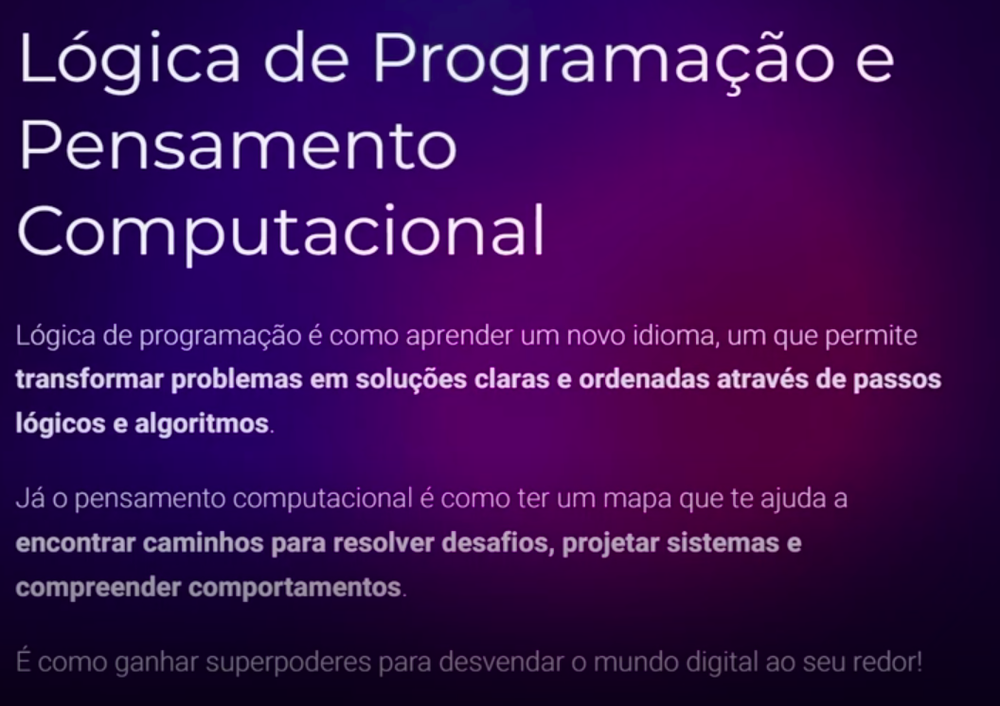

# Desafios de Código: Aperfeiçoe Sua Lógica e Pensamento Computacional

## Índice

- [Desafios de Código: Aperfeiçoe Sua Lógica e Pensamento Computacional](#desafios-de-código-aperfeiçoe-sua-lógica-e-pensamento-computacional)
  - [Índice](#índice)
  - [Antes de começar](#antes-de-começar)
  - [PBL, Lógica e Pensamento Computacional](#pbl-lógica-e-pensamento-computacional)
    - [Por que aprender assim?](#por-que-aprender-assim)
  - [A linguagem é só um detalhe… Como resolver desafios de código](#a-linguagem-é-só-um-detalhe-como-resolver-desafios-de-código)

## Antes de começar

- [x]  Criar pasta referente ao curso
- [x]  Adicionar link da pasta nos atributos do curso
- [x]  Adicionar arquivos e links adicionais ao repositório (pdf, pptx, etc)

## PBL, Lógica e Pensamento Computacional

PBL (Problem Based Learning) é uma metodologia que fornece problemas reais para potencializar estudos, colocando eles na prática.

Essa abordagem é representada pelos desafios de código da DIO.

A lógica de programação e pensamento computacional sempre vão fazer parte dos desafios propostos.

Essa lógica e forma de pensamento vão servir para resolver os problemas. Os desafios propostos pela DIO vão nos ajudar a desenvolver isso.

### Por que aprender assim?

Os motivos para aprender assim são:

## A linguagem é só um detalhe… Como resolver desafios de código

Nessa aula o professor pontua que a linguagem é só um detalhe e propoe resolvermos 5 desafios de código em 5 linguagens diferentes.

Durante a aula ele vai apresentar que tudo que precisamos é ter a lógica de programação bem desenvolvida.

Os desafios são compostos por:

- Uma apresentação escrita onde possui a explicação do desafio, um exemplo de entrada e exemplo de saída.
- Durante o desafio de código vão ter testes padrões fornecidos pela plataforma da DIO. Alguns dos testes são visiveis e outros não, ou seja, ao escrever o código precisamos considerar variáveis diversas como no mundo real
- Dentro do código de exemplo vão ter comentários complementares para explicar a estrutura do código, funções e etc;
- Dentro do código vão ter alguns TODO’s comentados que são as tarefas necessárias que o aluno deve desenvolver
- Durante a criação do código há um botão chamado “executar testes” que pode ser acionado para testar o código. Ao executar ele, não perdemos corações no caso do teste dar errado. Só clicar em entregar o desafio ao final do desafio concluído
