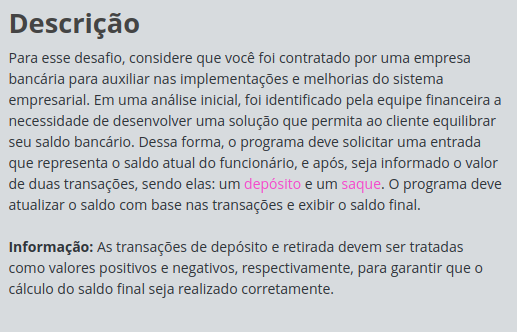

# Desafio Full Stack - JavaScript: Equilibrando o Saldo

## Índice

- [Desafio Full Stack - JavaScript: Equilibrando o Saldo](#desafio-full-stack---javascript-equilibrando-o-saldo)
  - [Índice](#índice)
  - [Antes de começar](#antes-de-começar)
  - [Detalhes do desafio](#detalhes-do-desafio)
  - [Código Base](#código-base)
  - [Código desenvolvido](#código-desenvolvido)

## Antes de começar

- [x]  Criar pasta referente ao curso
- [x]  Adicionar link da pasta nos atributos do curso
- [x]  Adicionar arquivos e links adicionais ao repositório (pdf, pptx, etc)

## Detalhes do desafio




## Código Base

```jsx
//Desafios JavaScript na DIO têm funções "gets" e "print" acessíveis globalmente:
//- "gets" : lê UMA linha com dado(s) de entrada (inputs) do usuário;
//- "print": imprime um texto de saída (output), pulando linha.

const saldoAtual = parseFloat(gets());
const valorDeposito = parseFloat(gets());
const valorRetirada = parseFloat(gets());

//TODO: Calcular o saldo atualizado de acordo com a descrição deste desafio.

//TODO: Imprimir o a saída de conforme a tabela de exemplos (uma casa decimal).
```

## Código desenvolvido

```jsx
//Desafios JavaScript na DIO têm funções "gets" e "print" acessíveis globalmente:
//- "gets" : lê UMA linha com dado(s) de entrada (inputs) do usuário;
//- "print": imprime um texto de saída (output), pulando linha.

const saldoAtual = parseFloat(gets());
const valorDeposito = parseFloat(gets());
const valorRetirada = parseFloat(gets());

//TODO: Calcular o saldo atualizado de acordo com a descrição deste desafio.

const saldoAtualizado = saldoAtual + valorDeposito - valorRetirada;

//TODO: Imprimir o a saída de conforme a tabela de exemplos (uma casa decimal).

print(`Saldo atualizado na conta: ${saldoAtualizado.toFixed(1)}`);
```
