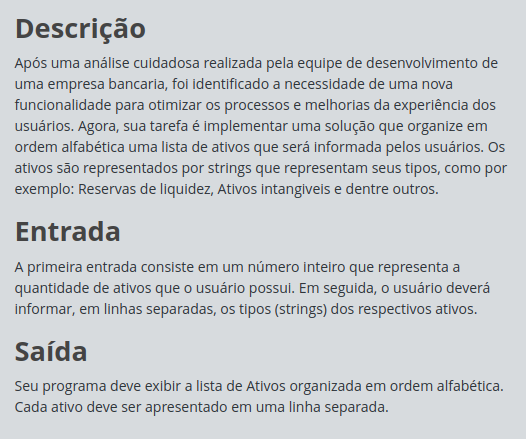

# Desafios Full Stack - JavaScript: Organizando Seus Ativos

## Índice

- [Desafios Full Stack - JavaScript: Organizando Seus Ativos](#desafios-full-stack---javascript-organizando-seus-ativos)
  - [Índice](#índice)
  - [Antes de começar](#antes-de-começar)
  - [Detalhes do desafio (print)](#detalhes-do-desafio-print)
  - [Código base](#código-base)
  - [Código desenvolvido](#código-desenvolvido)

## Antes de começar

- [x]  Criar pasta referente ao curso
- [x]  Adicionar link da pasta nos atributos do curso
- [x]  Adicionar arquivos e links adicionais ao repositório (pdf, pptx, etc)

## Detalhes do desafio (print)




## Código base

```jsx
//Desafios JavaScript na DIO têm funções "gets" e "print" acessíveis globalmente:
//- "gets" : lê UMA linha com dado(s) de entrada (inputs) do usuário;
//- "print": imprime um texto de saída (output), pulando linha.const ativos = [];

// Entrada da quantidade de ativos
const quantidadeAtivos = parseInt(gets());

//Entrada dos tipos de ativos
const ativos = [ ];
for (let i = 0; i < quantidadeAtivos; i++) {
  const codigoAtivo = gets();
  ativos.push(codigoAtivo);
}

//TODO: Ordenar os ativos em ordem alfabética.

//TODO: Imprimir a lista de ativos ordenada, conforme a tabela de exemplos.
```

## Código desenvolvido

```jsx
//Desafios JavaScript na DIO têm funções "gets" e "print" acessíveis globalmente:
//- "gets" : lê UMA linha com dado(s) de entrada (inputs) do usuário;
//- "print": imprime um texto de saída (output), pulando linha.const ativos = [];

// Entrada da quantidade de ativos
const quantidadeAtivos = parseInt(gets());

//Entrada dos tipos de ativos
const ativos = [ ];
for (let i = 0; i < quantidadeAtivos; i++) {
  const codigoAtivo = gets();
  ativos.push(codigoAtivo);
}

//TODO: Ordenar os ativos em ordem alfabética.

ativos.sort();

//TODO: Imprimir a lista de ativos ordenada, conforme a tabela de exemplos.

ativos.forEach((ativo) => print(ativo));
```
