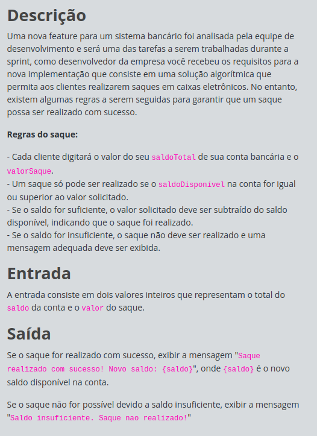

# Desafio Full Stack - JavaScript: Condicionalmente Rico

## Índice

- [Desafio Full Stack - JavaScript: Condicionalmente Rico](#desafio-full-stack---javascript-condicionalmente-rico)
  - [Índice](#índice)
  - [Antes de começar](#antes-de-começar)
  - [Detalhes do desafio (print)](#detalhes-do-desafio-print)
  - [Código base](#código-base)
  - [Código desenvolvido](#código-desenvolvido)

## Antes de começar

- [x]  Criar pasta referente ao curso
- [x]  Adicionar link da pasta nos atributos do curso
- [x]  Adicionar arquivos e links adicionais ao repositório (pdf, pptx, etc)

## Detalhes do desafio (print)




## Código base

```jsx
//Desafios JavaScript na DIO têm funções "gets" e "print" acessíveis globalmente:
//- "gets" : lê UMA linha com dado(s) de entrada (inputs) do usuário;
//- "print": imprime um texto de saída (output), pulando linha.

// Entrada de dados
let saldoTotal = parseInt(gets());
let valorSaque = parseInt(gets());

//TODO: Criar as condições necessárias para impressão da saída, vide tabela de exemplos.
```

## Código desenvolvido

```jsx
//Desafios JavaScript na DIO têm funções "gets" e "print" acessíveis globalmente:
//- "gets" : lê UMA linha com dado(s) de entrada (inputs) do usuário;
//- "print": imprime um texto de saída (output), pulando linha.

// Entrada de dados
let saldoTotal = parseInt(gets());
let valorSaque = parseInt(gets());

//TODO: Criar as condições necessárias para impressão da saída, vide tabela de exemplos.

if (valorSaque <= saldoTotal){
  let novoSaldo = saldoTotal - valorSaque;
  print(`Saque realizado com sucesso. Novo saldo: ${novoSaldo}`);
}else{
  print(`Saldo insuficiente. Saque nao realizado!`);
}
```
