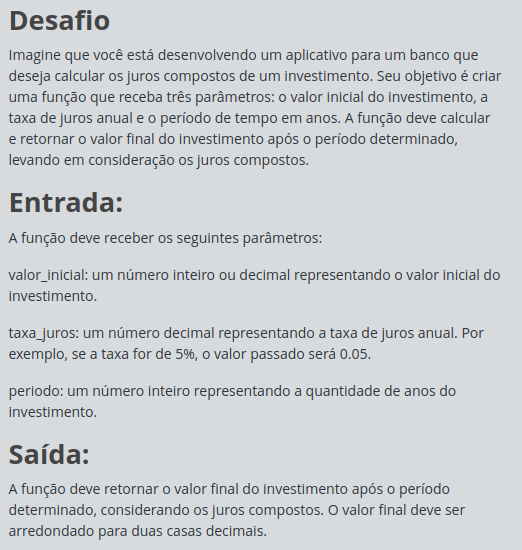

# Desafios Full Stack - JavaScript: Juros Compostos

## Índice

- [Desafios Full Stack - JavaScript: Juros Compostos](#desafios-full-stack---javascript-juros-compostos)
  - [Índice](#índice)
  - [Antes de começar](#antes-de-começar)
  - [Detalhes do desafio (print)](#detalhes-do-desafio-print)
  - [Código base](#código-base)
  - [Código desenvolvido](#código-desenvolvido)

## Antes de começar

- [x]  Criar pasta referente ao curso
- [x]  Adicionar link da pasta nos atributos do curso
- [x]  Adicionar arquivos e links adicionais ao repositório (pdf, pptx, etc)

## Detalhes do desafio (print)




## Código base

```jsx
//Desafios JavaScript na DIO têm funções "gets" e "print" acessíveis globalmente:
//- "gets" : lê UMA linha com dado(s) de entrada (inputs) do usuário;
//- "print": imprime um texto de saída (output), pulando linha.

const valorInicial = parseFloat(gets());
const taxaJuros = parseFloat(gets());
const periodo = parseInt(gets());

let valorFinal = valorInicial;

//TODO: Iterar, baseado no período em anos, para calculo do valorFinal com os juros.

print('Valor final do investimento: R$', valorFinal.toFixed(2));
```

## Código desenvolvido

```jsx
//Desafios JavaScript na DIO têm funções "gets" e "print" acessíveis globalmente:
//- "gets" : lê UMA linha com dado(s) de entrada (inputs) do usuário;
//- "print": imprime um texto de saída (output), pulando linha.

const valorInicial = parseFloat(gets());
const taxaJuros = parseFloat(gets());
const periodo = parseInt(gets());

let valorFinal = valorInicial;

//TODO: Iterar, baseado no período em anos, para calculo do valorFinal com os juros.

for (let i = 1; i <= periodo; i++){
  valorFinal = valorFinal + valorFinal * taxaJuros;
}

print('Valor final do investimento: R$', valorFinal.toFixed(2));
```
