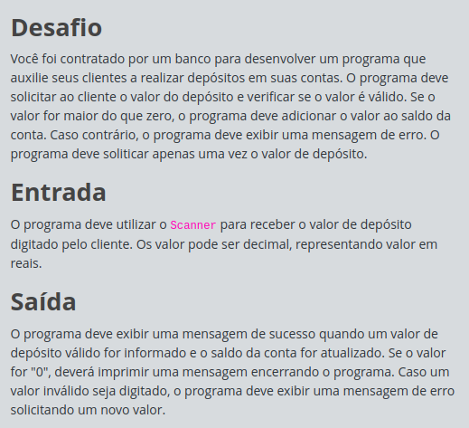

# Desafios Full Stack - JavaScript: O Grande Deposito

## Índice

- [Desafios Full Stack - JavaScript: O Grande Deposito](#desafios-full-stack---javascript-o-grande-deposito)
  - [Índice](#índice)
  - [Antes de começar](#antes-de-começar)
  - [Detalhes do desafio (print)](#detalhes-do-desafio-print)
  - [Código base](#código-base)
  - [Código desenvolvido](#código-desenvolvido)

## Antes de começar

- [x]  Criar pasta referente ao curso
- [x]  Adicionar link da pasta nos atributos do curso
- [x]  Adicionar arquivos e links adicionais ao repositório (pdf, pptx, etc)

## Detalhes do desafio (print)




## Código base

```jsx
//Desafios JavaScript na DIO têm funções "gets" e "print" acessíveis globalmente:
//- "gets" : lê UMA linha com dado(s) de entrada (inputs) do usuário;
//- "print": imprime um texto de saída (output), pulando linha.

const valor = parseFloat(gets());

if (valor > 0) {
  //TODO: Imprimir a mensagem de sucesso, formatando o saldo atual (vide Exemplos).
} else if (valor < 0) {
  //TODO: Imprimir a mensagem de valor inválido.
} else {
  //TODO: Imprimir a mensagem de encerrar o programa.
}
```

## Código desenvolvido

```jsx
//Desafios JavaScript na DIO têm funções "gets" e "print" acessíveis globalmente:
//- "gets" : lê UMA linha com dado(s) de entrada (inputs) do usuário;
//- "print": imprime um texto de saída (output), pulando linha.

const valor = parseFloat(gets());

if (valor > 0) {
  //TODO: Imprimir a mensagem de sucesso, formatando o saldo atual (vide Exemplos).
  
  const saldoAtual = valor;
  print("Deposito realizado com sucesso!")
  print(`Saldo atual: R$ ${saldoAtual.toFixed(2)}`)
  
} else if (valor < 0) {
  //TODO: Imprimir a mensagem de valor inválido.
  
  print("Valor invalido! Digite um valor maior que zero.")

  
} else {
  //TODO: Imprimir a mensagem de encerrar o programa.
  
  print("Encerrando o programa...")
}
```
