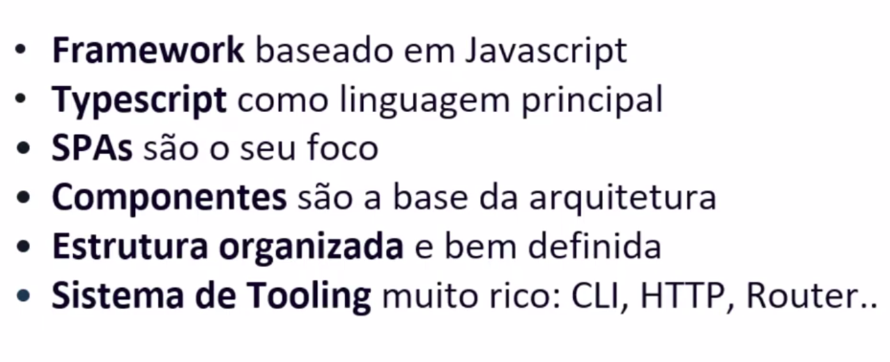

# Introdução ao Ecossistema Angular

## Índice

- [Introdução ao Ecossistema Angular](#introdução-ao-ecossistema-angular)
  - [Índice](#índice)
  - [Antes de começar](#antes-de-começar)
  - [Bem vindo ao mundo Angular](#bem-vindo-ao-mundo-angular)
  - [Pré-requisitos Angular](#pré-requisitos-angular)
  - [AngularJS vs Angular](#angularjs-vs-angular)
  - [Angular no mercado de frameworks](#angular-no-mercado-de-frameworks)
  - [Mortal Kombat capitulo final Angular vs React edition](#mortal-kombat-capitulo-final-angular-vs-react-edition)
  - [As estratégias Angular comparada a outras ferramentas](#as-estratégias-angular-comparada-a-outras-ferramentas)
  - [As 4 camadas de uma Web APP](#as-4-camadas-de-uma-web-app)
  - [Camada 1 - Components](#camada-1---components)
  - [Camada 2 - Gerenciamento de estados](#camada-2---gerenciamento-de-estados)
  - [Camada 3 - Roteamento](#camada-3---roteamento)
  - [Camada 4 - Renderização](#camada-4---renderização)
  - [Entendimento geral das camadas](#entendimento-geral-das-camadas)
  - [Conhecendo o Angular io](#conhecendo-o-angular-io)
  - [Entendendo um código Angular](#entendendo-um-código-angular)
  - [Links, documentos e referências](#links-documentos-e-referências)

## Antes de começar

- [x]  Criar pasta referente ao curso
- [x]  Adicionar link da pasta nos atributos do curso
- [x]  Adicionar arquivos e links adicionais ao repositório (pdf, pptx, etc)

## Bem vindo ao mundo Angular

Antes de começar, precisamos saber alguns detalhes sobre o Angular.

Ele atualmente é mantido pelo Google.

Abaixo outros detalhes do Angular:

O Angular tem como foco os **SPA (Single Pages Aplications)**, ou seja, voltado para aplicações de apenas 1 página. Isso faz com que o sistema seja construído de forma modular, onde todo ele estará em uma página e dependendo da rota do usuário são distribuídas informações de acordo.

SPAs servem para otimizar a página e ajudam no reaproveitamento de código.

**Components**: tudo em Angular são baseados em components, o que traz a vantagem de toda a lógica do código ficar isolada de acordo com necessidade.

**Estrutura organizada**: toda a estrutura do Angular já vem organizada, o que poupa tempo na hora de decidir como estruturar o código.

O **sistema de Tooling** do Angular é muito ríco, ou seja, ele vem com vários módulos e ferramentas que automatizam diversas tarefas úteis.

## Pré-requisitos Angular

Para poder trabalhar com Angular precisamos ter conhecimentos em:

- HTML e CSS: o suficiente para se sentir confortável em criar os sites apenas com HTML e CSS
- NODE e NPM: servirão para transcrever o TS em JS
- JAVASCRIPT e TYPESCRIPT: ter noções para poder trabalhar com ele.

## AngularJS vs Angular

AngularJS e Angular são completamente diferentes.

A diferença começa em 2010, quando Google lançou seu framework para permitir que os códigos fossem mais fáceis de editar em JavaScript, o AngularJS.

A partir da versão 2.0 do Angular ele passou a se tornar algo completamente diferente.

O Angular atualmente é criado em TypeScript para ser usado com TS e possui algumas diferenças cruciais em relação à versão feita para JS.

Por conta da criação do Angular para TypeScript, uma parte dos desenvolvedores ficaram insatisfeitos e buscaram criar suas versões de Angular. Com isso nasceu o React e algumas outras alternativas.

A versão mais moderna é a Angular feita para uso em TypeScript.

## Angular no mercado de frameworks

Atualmente existem diversos frameworks com a mesma finalidade de criar SPAs.

Algumas delas são:

- Angular
- Vue
- React
- Aurelia

A única coisa que você precisa saber é que todos eles fazem a exata mesma coisa, mas alguns destaques vão para o fato de React possuir uma curva de aprendizagem bem mais fácil enquanto o Vue.js possui menos estruturação de pastas e poupa tempo de organização.

A principal mensagem é: as estratégias são diferentes, mas os conhecimentos podem ser aproveitados de um para outro. Então aprender Angular pode ajudar a desenvolver em outros frameworks.

## Mortal Kombat capitulo final Angular vs React edition

Vamos ao embate que todos adoram: Angular vs React tal qual Subzero vs Scorpion em Mortal Kombat.

Nessa aula vemos as particularidades de cada um:

- **Mercado**: atualmente o React possui mais mercado que o Angular, por conta disso estão todos migrando para o React e em breve Angular vai ter um déficit de profissionais.
- **Curva de aprendizado**: o React tem uma curva de aprendizado mais curta
- **Biblioteca vs Framework**: React está mais para uma biblioteca e o Angular para um framework. Frameworks são um setup completo. Frameworks permitem uma melhor escalabilidade de código. O React acaba sendo melhor para projetos menores e o Angular para projetos escaláveis.
- **Ferramentas**: o React vem com poucas ferramentas, então com o tempo você precisa adicionar novas bibliotecas para aumentar a complexidade com a necessidade, o que com o tempo pode deixar o projeto complexo. Por outro lado isso pode ser positivo.
- **Imposição de TypeScript**: o React permite o uso do JS ao invés de TS, mas acontece que a maioria das vagas de React exigem uso de TS. Na prática, se torna sem sentido usar o JS como linguagem por conta do mercado.
- **Mobile**: o React permite levar muitos dos conhecimentos para o React Native no mobile enquanto o Angular não possui nada que possibilite isso.

## As estratégias Angular comparada a outras ferramentas

Outras diferenças:

## As 4 camadas de uma Web APP

Uma Web App possui as 4 camadas que podem ser aplicadas a qualquer uma das bibliotecas e frameworks apresentados anteriormente:

- **Components**: são os blocos de código HTML e CSS que reaproveitamos
- **Gerenciamento de estados**: os valores de cada propriedade. Ex: se botão está aceso ou apagado
- **Roteamento**: quando usuário acessa URL, quais componentes devem ser demonstrados?
- **Renderização**: fica responsável por mostrar na tela o que foi programado

## Camada 1 - Components

Um component é um elemento visual, customizavel e reutilizavel.

## Camada 2 - Gerenciamento de estados

Os `states` são responsáveis por garantir que os components estão sendo renderizados de forma correta para o usuário, de forma que ao acessar determinada URL ou informação apenas os componentes relacionados à ela apareçam.

Por exemplo: imagine uma loja online. É possível atualizar as informações do carrinho de acordo com o número de cliques em determinado elemento na loja, que adiciona sempre que clicar.

Um outro exemplo de uso é se você precisa deixar um determinado elemento de outra cor caso ele esteja indisponível:

Nesse caso, ao mudar o texto de `disponível` para `indisponível` a imagem e botão precisam ficar cinzas. Dessa forma, seria necessário adicionar um `if`

Se houvessem vários elementos, isso seria muito trabalhoso.

O gerenciamento de estados permite que os elementos se comuniquem para automatizar e poupar tempo.

Existem diversas ferramentas que servem para o gerenciamento de estado e todos os frameworks e bibliotecas utilizem alguma delas, por exemplo:

- Flux
- Redux
- Context api
- Recoil
- Storeon
- Vuex
- Ngrx
- Ngxs

## Camada 3 - Roteamento

Essa camada é responsável por gerenciar a forma de navegação do app:

Isso permite que os elementos sejam renderizados ao acessar determinada URL e em SPA só existe uma página que é gerenciada de pelas rotas.

Existem algumas bibliotecas que permitem isso:

- History API
- React-Router
- Vue-Router
- Angular RoutingModule

## Camada 4 - Renderização

Essa camada é responsável por decidir como acessar e entregar para o browser o componente pronto para que seja desenhado na janela:

Por conta disso, ela é a última camada de interação entre o código e o navegador.

Existem 3 tipos de estratégias de renderização, sendo elas:

- **100% server**: estratégia normal onde o servidor faz o gerenciamento e entrega do HTML pronto
- **Parte server e parte client**:  o servidor entrega o HTML mas existem coisas que serão montadas dinâmicamente do lado do cliente
- **100% client**: tudo é renderizado do lado do cliente, montado dinâmicamente

Tanto o Angular quanto o React se baseiam na estratégia do **100% client**. Não existe melhor ou pior, mas por se tratar de 100% client, o React e Angular acabam perdendo o SEO que faz o rastreamento de páginas.

## Entendimento geral das camadas

As bibliotecas e frameworks vêm para poupar tempo para gerenciar essas 4 camadas.

É possível fazer o gerenciamento das 4 camadas com JS puro, mas isso acaba gastando muito tempo e energia.

Precisamos nos preocupar apenas com as 4 camadas na hora de usar os frameworks. Então se surgirem novas ferramentas com propósito de criação de web apps, sabemos que só precisamos nos preocupar em como gerenciar as 4 camadas nessa nova ferramenta.

## Conhecendo o Angular io

Para acessar o site do Angular devemos usar o Angular.io, pois é a versão mais atualizada.

## Entendendo um código Angular

A estrutura de um projeto Angular é:

- Existe uma pasta chamada `src` que contém todos os arquivos de código fonte o `source` .
- Fora dessa pasta todos os arquivos são arquivos de configuração.
- Dentro de src existe o index, style e os arquivos TS principais
- Dentro da subpasta `app` existem os components e arquivos necessários para execução deles

## Links, documentos e referências

Apresentação em PPTX: [Angular Intro.pptx](./assets/for_readme/Angular_Intro.pptx)
