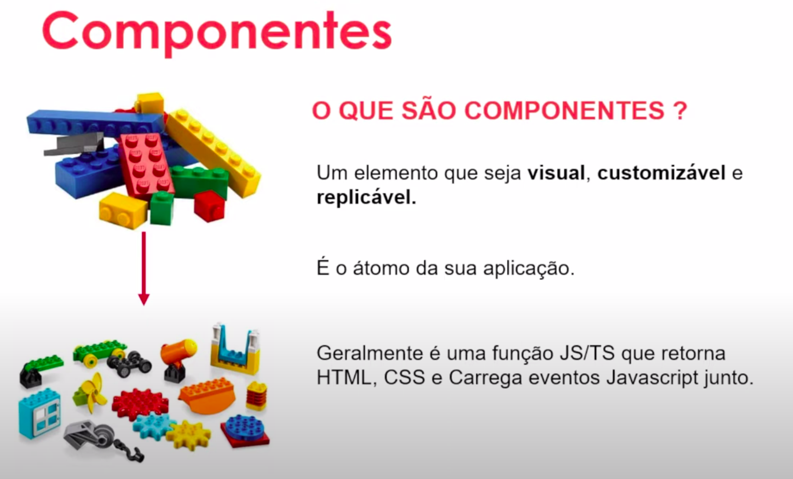

# Trabalhando com Componentes Angular

## Índice

- [Trabalhando com Componentes Angular](#trabalhando-com-componentes-angular)
  - [Índice](#índice)
  - [Antes de começar](#antes-de-começar)
  - [Entendendo a composição de componentes](#entendendo-a-composição-de-componentes)
  - [Usando o StackBlitz.com](#usando-o-stackblitzcom)
  - [Arquivo src out (fora da pasta out)](#arquivo-src-out-fora-da-pasta-out)
  - [Arquivos src in (dentro da pasta src)](#arquivos-src-in-dentro-da-pasta-src)
  - [Comparando com estrutura de arquivos React e Vue](#comparando-com-estrutura-de-arquivos-react-e-vue)
  - [Entendendo o Scoped](#entendendo-o-scoped)
  - [Os contratos para se criar um componente](#os-contratos-para-se-criar-um-componente)
  - [Criando e registrando um componente Angular simples](#criando-e-registrando-um-componente-angular-simples)
  - [Criando a estrutura de um componente](#criando-a-estrutura-de-um-componente)
  - [Interpolação de dados](#interpolação-de-dados)
  - [Estilo Global vs Scoped](#estilo-global-vs-scoped)
  - [Múltiplos estilos no componente](#múltiplos-estilos-no-componente)
  - [Fazendo seus componentes conversarem](#fazendo-seus-componentes-conversarem)
  - [Imputando valores no seu component](#imputando-valores-no-seu-component)
  - [As 4 maneiras possíveis de se passar valores para componentes](#as-4-maneiras-possíveis-de-se-passar-valores-para-componentes)
  - [Data biding](#data-biding)
  - [Tipos de biding](#tipos-de-biding)
  - [Event biding](#event-biding)
  - [Parâmetros no Event Biding](#parâmetros-no-event-biding)
  - [Two Way data biding](#two-way-data-biding)
  - [Usando a diretiva ngModel](#usando-a-diretiva-ngmodel)
  - [Angular Forms](#angular-forms)
  - [Style biding](#style-biding)
  - [Materiais de apoio](#materiais-de-apoio)

## Antes de começar

- [x]  Criar pasta referente ao curso
- [x]  Adicionar link da pasta nos atributos do curso
- [x]  Adicionar arquivos e links adicionais ao repositório (pdf, pptx, etc)

## Entendendo a composição de componentes

Componentes são a base da estrutura:



Existem também os componentes lógicos que não são visuais, mas acabam sendo customizáveis e replicáveis também.

Os componentes são montados através do que chamamos de injeção de dependências.

Essas injeções não estão ligadas somente aos componentes.


O funcionamento é o seguinte:

Você cria os componentes → depois injeta eles no root (componente lógico) → e esse componente lógico é injetado no index.html.


## Usando o StackBlitz.com

No site [StackBlitz.com](http://StackBlitz.com) encontramos vários modelos de projetos prontos para testar.


Podemos iniciar um projeto Angular simples do zero para analisar a estrutura de arquivos e entender o comportamento.

## Arquivo src out (fora da pasta out)

A primeira divisão que precisamos entender é a separação do que está dentro e fora da pasta src (source).

Fora da pasta source ficam apenas arquivos de configuração.

Dentro da pasta source ficam os arquivos de código em si.

Fora do src temos alguns arquivos como:


Onde `package.json` contém os arquivos dos pacotes referentes ao Node, que vai servir pra fazer a transpilação de TypeScript para JavaScript.

O arquivo `tsconfig.json` contém as informações de configuração do TypeScript.

O arquivo `angular.json` é o arquivo de configurações gerais do Angular onde informa detalhes do projeto, por exemplo, o apontamento do arquivo principal e etc.

## Arquivos src in (dentro da pasta src)

A estrutura básica da pasta src de um projeto Angular é:


O arquivo principal é o `index.html` e nele só vai existir um apontamento para o component principal, onde será feita toda a lógica do código.

O arquivo `main.ts` é o arquivo principal de TS que serve para iniciar os módulos do Angular. Ele faz a inicialização do projeto.

Existe também o arquivo `polyfills.ts` que serve para transcrever a compatibilidade de algumas funções muito recentes que podem não funcionar em navegadores antigos.

O arquivo `styles.css` é o arquivo de CSS, mas o angular permite trabalhar com CSS e SASS.

Dentro da pasta src também fica a pasta do app. Nessa pasta existem vários arquivos, como:


Se reparar nos arquivos do exemplo, eles seguem a estrutura de nome do app, component e o tipo de arquivo.

Seguindo essa lógica, o app é composto na mesma estrutura externa.

## Comparando com estrutura de arquivos React e Vue

A estrutura de React e Vue são muito parecidas com Angular.

No caso do Angular o que muda são apenas alguns detalhes de sintaxe e um pouco da complexidade da estrutura de arquivos.

Mas em essência os projetos fazem a mesma coisa, seguindo aqueles passos apresentados anteriormente de injeção de components no component root

## Entendendo o Scoped

Depois de entender os conceitos apresentados a lógica do código fica mais fácil.

Nesse video o professor modifica alguns detalhes do CSS e HTML para demonstrar que isso afeta somente o escopo do componente que está sendo chamado durante a aplicação naquele momento.

## Os contratos para se criar um componente

Para criar um componente é necessário respeitar o contrato da interface importada.

Além disso, existe uma certa estrutura que precisa ser respeiada:

```tsx
// Importações
import 'zone.js/dist/zone';
import { Component } from '@angular/core';
import { CommonModule } from '@angular/common';
import { bootstrapApplication } from '@angular/platform-browser';

// Estrutura do component (respeitando contrato)
@Component({
  selector: 'my-app',
  standalone: true,
  imports: [CommonModule],
  template: `
    <h1>Hello from {{ name }}!</h1>
    <a target="_blank" href="https://angular.io/start">
      Learn more about Angular
    </a>
  `,
})

// Classe sendo exportada ao fim
export class App {
  name = 'Angular';
}

bootstrapApplication(App);
```

No código acima:

- No início estão sendo importados o algumas coisas, inclusive o `component` que é uma interface do `angular/core`
- A estrutura do component é composta pelo seletor que deve ser passado, o template e o CSS se for necessário;
- Após isso todo arquivo TS que compõe um component deve exportar uma classe

O que pode mudar é a forma que passamos o template e style. Se passarmos diretamente usamos:


Mas ao pontar para outro arquivo:


Dito isso, podemos separar o código em arquivos e passar o caminho ou podemos passar as informações diretamente no arquivo TS.

## Criando e registrando um componente Angular simples

Para criar nosso component personalizado podemos criar uma pasta dentro do src chamada “component” e dentro dela adicionar o arquivo `menu.component.ts`

Nesse arquivo adicionar a importação do `Component` e chamar o decorator para criar o component.

```typescript
// Importando component como contrato do angular core
import { Component } from '@angular/core';

// Criando decorator para criar component
@Component({
  // Declarando seletor para uso no HTML
  selector: 'menu-component',
  // Declarando template do seletor
  template: '<h2> Marlon </h2>',
  // Declarando estilo do seletor
  styles: ['h2{color:blue}'],
})

// Exportando clsse após criar o component
export class MenuComponent {}
```

A estrutura do component é composta pela:

- Importação do component
- Declaração do component
- Exportação da classe

O funcionamento do Angular é:

- O arquivo main possui um trecho que importa os módulos
- Por sua vez, os módulos possuem dentro de si o agrupamento dos components
- Sendo assim, é necessário adicionar dentro dos módulos os components que forem adicionados para que eles possam ser interpretados pelo main

Arquivo main de exemplo (importa o AppModule com os components):


Arquivo de módulo de exemplo (importando AppComponent e HelloComponent:


Após criar o component, precisamos adicionar a referência a ele no module:


## Criando a estrutura de um componente

Para dar continuidade e aumentar a complexidade, vamos adicionar um component para um botão, mas dessa vez separando os arquivos html e css.

Dentro do arquivo TS:


Dentro do HTML:


Após isso, configuramos o component no module e adicionamos no html principal.

## Interpolação de dados

Agora que construímos o component e adicionamos ele no projeto vamos trabalhar com interpolação de dados.

A parte inteligente do componente criado fica dentro da classe exportada ao criar um component.

Dentro dessa classe podemos definir propriedades específicas.

Por exemplo, podemos adicionar na classe do botão informações de texto:


Para poder acessar e passar essas informações no HTML onde o button aparece, modificamos o HTML do button adicionando 2 chaves para pegar a propriedade:


Considerando isso, podemos trabalhar com as informações como vetores para permitir mais dinamismo:


Ao chamar a posição específica, o botão muda:


Isso tudo se baseia no conceito de interpolação de dados onde o HTML consegue acessar dinamicamente as informações da classe do componente

## Estilo Global vs Scoped

Apesar de todo componente ter seu estilo específico separado do resto do site os projetos Angular possuem um style global que fica junto do main.ts.

As modificações aplicadas nesse css serão aplicadas em todas as outras tags globalmente.

A diferença é que o estilo global só é aplicado se isso não sobrepor algum estilo de escopo.

Ou seja, se tentar definir a cor de um elemento em azul no estilo global mas esse elemento estar vermelho no estilo de escopo, a preferência vai para o vermelho e o elemento fica dessa cor.

## Múltiplos estilos no componente

Podemos criar um estilo dinâmico que na hora da pessoa chamar ela passa a cor e demais informações.

## Fazendo seus componentes conversarem

Podemos fazer com que os componentes se comuniquem, de forma que, por exemplo, o componente pai influencie nos valores do componente filho.

Por exemplo, podemos entrar no arquivo TS do `appComponent` onde o `my-button` está dentro e dentro da sua classe exportada adicionar uma informação de label:


Para poder utilizar essa informação no botão, nós precisamos modificar o arquivo TS do `my-button` de forma que:

- Importamos o `Input` do AngularCore, da mesma forma que importamos o component
- Criamos uma propriedade e passamos o Input como decorator.


O decorator `Input` serve para informar que aquela propriedade poderá receber um input do elemento pai.

Dessa forma, dentro do html do button precisamos puxar a propriedade criada:


E dentro do HTML do elemento pai onde o button está inserido nós passamos a propriedade criada no elemento pai (buttonLabel) como valor para dentro da propriedade do elemento filho (label):


Uma observação é que o Angular permite passar as informações das variáveis da classe de duas formas:


## Imputando valores no seu component

Para inserir valores no component passando para seus atributos podemos usar a primeira notação:


Dessa forma conseguimos trabalhar de forma mais dinâmica.

A diferença é:

- Colchetes representam uma propriedade dentro do componente filho
- Chaves duplas representam uma variável de valor dentro do componente pai
- Informar valores sem essas duas pontuações faz o texto ser passado

## As 4 maneiras possíveis de se passar valores para componentes

Além das formas apresentadas anteriormente de se passar informações para os components, podemos passar o valor entre aspas simples quando utilizarmos uma variável do component filho:


Assim a informação será interpretada de forma literal.

Mas se for pensar que as duas primeiras fazem o mesmo que as duas segundas, as duas primeiras acabam sendo mais práticas.

## Data biding

Quando fazemos a parte lógica se comunicar com a parte visual do site estamos utilizando o data biding, que pode ser visto na documentação.

## Tipos de biding

Existem vários tipos de biding para se trabalhar com TS e HTML de forma dinâmica:


## Event biding

Para contextualizar, precisamos entender que as duas formas apresentadas anteriormente partem de conceitos diferentes, apesar de fazerem a mesma coisa:


Para criar um event biding podemos criar uma função dentro da classe do componente.

Por exemplo, adiciona dentro do button uma função que traz um alert:


Para chamar esta função via event biding precisamos modificar o HTML.

Ao invés de utilizarmos colchetes para chamar determinada variável da classe, podemos usar parenteses para chamar o evento nativo do HTML e passar como parâmetro a função:


## Parâmetros no Event Biding

Como Event Bidings recebem funções do TS, podemos passar valores como parâmetros.

Por exemplo, modificar a função para imprimir um número na tela:


No aquivo HTML podemos passar o número como parâmetro:


Ao ser clicado, o botão dispara um alert com o número 14.

## Two Way data biding

Two Way data biding é quando há uma comunicação dos dois lados, onde a parte lógica e a parte visual se comunicam.

Para isso, criamos um component chamado `entry-data` e seus respectivos arquivos HTML e CSS:


Após a criação precisamos adicionar no modulo como fizemos com o button anteriormente.


Agora podemos trabalhar com os Two Way data bidings.

Dentro do html do entry data adicionamos um campo de input e parâgrafo. A ideia é que ao digitar no campo de input o texto do parâgrafo seja modificado dinamicamente.

Dentro da classe do componente criamos uma propriedade que servirá de exemplo;


Dessa forma ao modificar o html para buscar essa propriedade:


Dessa forma, a parte lógica já se comunica com o HTML, mas o inverso não.

Para isso, vamos pegar um evento biding, onde:

- Pegamos o evento input do HTML
- Ao inputar um valor no campo, a variável `placeholder` modifica seu valor
- O valor da variável modifica de acordo com o valor do próprio evento (event.target.value)
  - Onde operador `$any`  permite utilizar qualquer operação do HTML
  - O operador `$event.target` pega o elemento em que o evento está associado


Dessa forma, ao digitar qualquer coisa no campo de input o parágrafo é modificado de acordo.

## Usando a diretiva ngModel

Existe uma outra forma de criar essa associação de informações do HTML com a parte lógica.

Para testarmos isso precisamos modificar a classe do componente para armazenar a informação da senha:


No HTML podemos replicar o input anterior, porém associando a variável `placepass` através da diretiva ngModel do Angular, que serve para substituir as duas passagens de informação anteriores:


## Angular Forms

O `ngModel` existe porque dentro dos módulos possui uma importação de Angular Forms que acrescenta ferramentas para trabalhar com formulários.


Se formos trabalhar com um projeto onde possuam formulários, essa importação pode ser necessária.

## Style biding

O style biding serve para manipular o CSS do component.

Para manipular o CSS via style biding usamos uma estrutura parecida com a de attribute biding.

Podemos ter uma variável chamada `color` declarada na classe do componente e dentro do HTML do componente utilizamos o seguinte código:


## Materiais de apoio

O código criado em aula pode ser encontrado nesse repositório do GitHub:

[https://github.com/felipeAguiarCode/angular-playground/tree/main/C5 - Trabalhando com componentes Angular](https://github.com/felipeAguiarCode/angular-playground/tree/main/C5%20-%20Trabalhando%20com%20componentes%20Angular)

A apresentação da aula:

[Componentes.pptx](./for_readme/Componentes.pptx)
