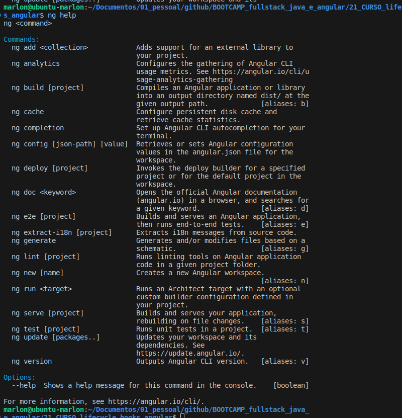

# LifeCycle Hooks Angular

## Índice

- [LifeCycle Hooks Angular](#lifecycle-hooks-angular)
  - [Índice](#índice)
  - [Antes de começar](#antes-de-começar)
  - [Vamos criar componentes de maneira local](#vamos-criar-componentes-de-maneira-local)
  - [Como instalar o Angular CLI](#como-instalar-o-angular-cli)
  - [E se já tiver versões mais atuais do Angular](#e-se-já-tiver-versões-mais-atuais-do-angular)
  - [Erro do NG PS1 para liberar execução de scripts](#erro-do-ng-ps1-para-liberar-execução-de-scripts)
  - [Seu novo brother chamado NG](#seu-novo-brother-chamado-ng)
  - [NG NEW: Criando um projeto Angular](#ng-new-criando-um-projeto-angular)
  - [Estrutura de arquivos Locais](#estrutura-de-arquivos-locais)
  - [NG Generate: Criando um novo componente](#ng-generate-criando-um-novo-componente)
  - [Entendendo o conceito de ciclo de vida](#entendendo-o-conceito-de-ciclo-de-vida)
  - [Entendendo o OnInit](#entendendo-o-oninit)
  - [Os 8 Hooks de LifeCycle Hooks](#os-8-hooks-de-lifecycle-hooks)
  - [OnChanges](#onchanges)
  - [DoCheck e sua ordem de execução](#docheck-e-sua-ordem-de-execução)
  - [Sub eventos do DoCheck](#sub-eventos-do-docheck)
  - [Ordem do doCheck, content e view](#ordem-do-docheck-content-e-view)
  - [OnDestroy](#ondestroy)
  - [Materiais de apoio e links](#materiais-de-apoio-e-links)

## Antes de começar

- [x]  Criar pasta referente ao curso
- [x]  Adicionar link da pasta nos atributos do curso
- [x]  Adicionar arquivos e links adicionais ao repositório (pdf, pptx, etc)

## Vamos criar componentes de maneira local

Os pré-requisitos desse curso são:

- Ter o node instalado
- Uma ide, sugerida o VSCode
- Extensões
  - Angular Language Service para autocompletar código
  - Auto Close Tag para fechar automaticamente as tags
  - Auto Rename Tag para renomear a tag dinamicamente
  - O tema utilizado é o Aura Theme na versão Dark
  - O material Icon Theme é útil para dar contexto aos ícones das páginas
  - ESLint permite criar regras para customizar os códigos para formatar ele
  - Prettier permite formatar o código
  - Editor Config for VS Code permite criar regras para quem for criar o código junto

## Como instalar o Angular CLI

Para instalar o Angular CLI (Command Line Interface) podemos usar a documentação.

Na documentação também conseguimos ver as versões do Angular, mas para esse curso vamos usar a mesma versão do professor para evitar possíveis erros, já que o Angular atualiza sua versão a cada 6 meses.

Para instalar o Angular na versão específica usamos o comando `npm install -g @angular/cli@<version>`  

Onde o parâmetro -g informa que a instalação será global.

## E se já tiver versões mais atuais do Angular

Se você já tiver alguma versão mais atualizada do Angular não precisa se preocupar, já que a partir da versão 2 tudo padroniza.

Os conhecimentos desse curso servirão para os demais.

Para se manter atualizado sobre o Angular podemos seguir as 3 dicas:

- Acompanhar o Twitter do Angular;
- Acompanhar o Angular via YouTube;
- Acompanhar a documentação

## Erro do NG PS1 para liberar execução de scripts

Caso o Angular tenha sido instalado corretamente será adicionado aos comandos do terminal um `ng`  e podemos verificar se deu certo usando `ng help` onde se sair uma lista em amarelo é porque deu um pequeno “erro” de configuração geralmente associado ao Firewall do Windows.

O professor deu exemplos de comandos para desinstalar o angular e reinstalar habilitando a função de scripts que foi impedida pelo firewall.

## Seu novo brother chamado NG

Ao usar um ng help no terminal ele fornece uma lista de comandos possíveis através do NG.



Dessa lista, existem algumas que serão mais utilizadas no dia a dia, sendo:

- ng add → para adicionar bibliotecas externas ao projeto
- ng new → cria um novo workspace angular
- ng serve → cria uma aplicação e gera um servidor para manter a aplicação atualizada de acordo com mudanças
- ng test → realiza teste unitários
- ng doc → abre a documentação oficial do angular e busca palavra chave
- ng generate → gera e modifica arquivos baseado em um esquema passado

## NG NEW: Criando um projeto Angular

Podemos criar um novo projeto Angular com o comando `ng new <nome_do_projeto>`

Após isso o CLI vai fazer algumas perguntas sobre o projeto, como o estilo de CSS usado e outros detalhes.

Após isso o ng cria uma pasta com toda a estrutura de configuração do projeto.

Nesse caso criamos um projeto chamado `life_cycle`:


## Estrutura de arquivos Locais

Dentro da pasta do projeto existem, fora da `src` os arquivos de configuração, que incluem o `tsconfig` e seus derivados.

Temos também o arquivo `package` e `package-lock` que são referentes ao Node.

O `karma.conf.js` é uma ferramenta de testes que o Angular sugere para uso.

O arquivo `.editorconfig` possui informações sobre as configurações de edição do projeto, por exemplo, a forma de identação sendo `tab` ou `space`

O arquivo `.browserslistrc` é referente configurações para os browsers.


## NG Generate: Criando um novo componente

Para iniciar o projeto nós modificamos o arquivo `.html` dentro da pasta `app`.

Removemos tudo exceto a tag `router-outlet` e adicionamos acima alguma tag para testar, podendo ser um `h1` com qualquer texto.

No terminal dentro da pasta root do projeto usamos o comando `ng serve` para que o Angular gere um servidor com a estrutura de código já criada.

Se reparar, a URL do [localhost](http://localhost) passada pelo Angular está determinada dentro da pasta `.vscode` na raiz do projeto, dentro do arquivo `launch.json`:

Terminal:


Launch.json:


Quando usarmos o `ng test` ele roda nesse local, mas quando usamos o `ng test` ele roda no local informado abaixo.

O comando `ng generate` serve para criar elementos do Angular.

Por exemplo, podemos usar o comando `ng generate component title` para que ele faça a criação de um component chamado title onde ele criará toda a estrutura de pasta, arquivos e menção (no module) necessária:


Podemos simplificar o código usando `ng g c title` que utiliza o apelido de cada função do NG e resulta na mesma coisa

## Entendendo o conceito de ciclo de vida

O conceito de ciclo de vida de componentes se baseia nos ciclos de vida biológicos.

Por exemplo:


Na estrutura de component ocorre a mesma coisa, a partir de certos eventos os components mudam de estágio de vida.

## Entendendo o OnInit

O ciclo de vida inicial de um component se inicia através do OnInit que é uma interface implementada na classe do component em seu arquivo TypeScript.

Por exemplo, no código abaixo estamos informando que no nascimento do componente queremos imprimir `hello hello` na tela:

```tsx
import { Component, OnInit } from '@angular/core';

@Component({
  selector: 'app-title',
  templateUrl: './title.component.html',
  styleUrls: ['./title.component.css']
})
export class TitleComponent implements OnInit{

  constructor() { }

 // Método OnInit que executa na criação do component
 ngOnInit(): void {
  console.log("hello hello")
 }

}
```

## Os 8 Hooks de LifeCycle Hooks

Os componentes possuem 8 ciclos de vida, sendo eles:

1. ngOnInit() → Ao iniciar
2. ngOnChanges() → Ao sofrer alterações
3. ngOnCheck() → Ao fazer uma checagem
    1. ngAfterContentInit() → Após conteúdo ser iniciado
    2. ngAfterContentChecked() → Após conteúdo ser verificado
    3. ngAfterViewInit() → Após renderização
    4. ngAfterViewChecked() → Após verificação da visualização
4. ngOnDestroy() → Quando componente está para ser destruído

Para mais detalhes checar a documentação [neste link](https://angular.io/guide/lifecycle-hooks).

## OnChanges

O OnChanges ocorre sempre que tem alguma mudança no componente.

Podemos ajustar o código para verificar a ordem que tudo é executado.

Adicionando um `console.log` no construtor, no `ngOnInit` e no `ngOnChange` e modificando o HTML em que chamamos este componente para imprimir uma variável passada pelo componente pai nós vemos que o construtor é executado sempre antes, depois ele executa o `onChange` pois essa mudança está sendo passada na chamada do componente e o `onInit` vem em seguida após valor passado ser chamado:

title.component.ts:

```tsx
import { Component, OnInit, OnChanges, Input} from '@angular/core';

@Component({
  selector: 'app-title',
  templateUrl: './title.component.html',
  styleUrls: ['./title.component.css']
})
export class TitleComponent implements OnInit, OnChanges{

 // Inputando valor do nome
 @Input() nome:string = "";

  constructor() {
  console.log(`Construtor ${this.nome}`);
 }

 // Método OnInit que executa na criação do component
 ngOnInit(): void {
  console.log(`OnInit ${this.nome}`);
 }

 // Método OnChanges qie executa nas mudanças
 // É uma interface sendo implementada na classe
 ngOnChanges(): void {
  console.log(`OnChange ${this.nome}`);
 }

}
```

title.component.html:

`<p>{{nome}}</p>`

app.component.html:

```html
<h1>My Application</h1>
<app-title nome="produto 1"></app-title>
<app-title nome="produto 2"></app-title>
<router-outlet></router-outlet>
```

O resultado é:


Mas essa operação ocorre somente se houver mudanças no valor.

Caso não haja mudança através do input do atributo na chamada da tag, o componente é executado somente com o OnInit.

## DoCheck e sua ordem de execução

O doCheck disponibiliza outras 4 implementações que ocorrem na sequência de:

- ContenInit
- ContentCheck
- ViewInit
- ViewCheck

Por exemplo, ao criar um novo componente chamado `check-sample` e adicionar ele no html principal:

check-sample.ts:

```tsx
import { Component,
 OnInit,
 DoCheck,
 AfterContentChecked,
 AfterContentInit,
 AfterViewChecked,
 AfterViewInit} from '@angular/core';

@Component({
  selector: 'app-check-sample',
  templateUrl: './check-sample.component.html',
  styleUrls: ['./check-sample.component.css']
})
export class CheckSampleComponent implements OnInit, DoCheck,
AfterContentChecked,
AfterContentInit,
AfterViewChecked,
AfterViewInit {

  constructor() { }
 ngDoCheck(): void {
  console.log(`ngDoCheck`)
 }
 ngAfterContentChecked(): void {
  console.log(`ngAfterContentChecked`)
 }
 ngAfterContentInit(): void {
  console.log(`ngAfterContentInit`)
 }
 ngAfterViewChecked(): void {
  console.log(`ngAfterViewChecked`)
 }
 ngAfterViewInit(): void {
  console.log(`ngAfterViewInit`)
 }

  ngOnInit(): void {
  console.log(`ngOnInit`)

  }

}
```

O resultado do console ocorre na ordem:


## Sub eventos do DoCheck

Para entender melhor as operações, podemos implementar no código do component `check-sample` uma variável de quantidade e um método para somar e subtrair.


No HTML do componente adicionamos essa variável e 2 botões onde cada botão chamará uma das funções criadas via event biding:


Dessa forma, ao clicar no botão para adicionar, a quantidade na tela aumenta e ao clicar para subtrair a quantidad diminui.

Quando clicamos nesse botões a ordem de execução muda:


Dessa forma fica claro que quando clicamos em um botão que altera o elemento, ele modifica e é feita uma `checagem` da informação. Após isso o elemento é atualizado e aí ele realiza a operação de `depois que o conteúdo foi checado` e após isso ele executa o `depois que o conteúdo foi renderizado`

Isso ocorre porque primeiro o conteúdo precisa ser checado e modificado para só depois ser visualizado.

## Ordem do doCheck, content e view

Em resumo, a ordem ocorre sempre:

- O check sempre verifica primeiro se o conteúdo foi alterado
- Depois ele alter ao conteúdo
- Depois ele renderiza

Então:

> Checked → content → view
>

O código em ordem:

```tsx
import {
 Component,
 OnInit,
 DoCheck,
 AfterContentChecked,
 AfterContentInit,
 AfterViewChecked,
 AfterViewInit
} from '@angular/core';

@Component({
 selector: 'app-check-sample',
 templateUrl: './check-sample.component.html',
 styleUrls: ['./check-sample.component.css']
})
export class CheckSampleComponent implements OnInit, DoCheck,
 AfterContentChecked,
 AfterContentInit,
 AfterViewChecked,
 AfterViewInit {

 quantidade: number = 0;

 constructor() { }

 adicionar() {
  this.quantidade += 1;
 }

 subtrair() {
  this.quantidade -= 1;
 }

 // checked -> content -> view

 // Faz a checagem
 ngDoCheck(): void {
  console.log(`ngDoCheck`)
 }

 // Inicia conteúdo
 ngAfterContentInit(): void {
  console.log(`ngAfterContentInit`)
 }

 // Inicia view após conteúdo
 ngAfterViewInit(): void {
  console.log(`ngAfterViewInit`)
 }

 // Após alteração, verifica o conteúdo
 ngAfterContentChecked(): void {
  console.log(`ngAfterContentChecked`)
 }

 // Após verificar conteúdo, verifica view
 ngAfterViewChecked(): void {
  console.log(`ngAfterViewChecked`)
 }

 ngOnInit(): void {
  console.log(`ngOnInit`)

 }

}
```

## OnDestroy

O OnDestroy ocorre quando o componente é destruído.

Por exemplo, se o HTML pai chama um componente filho, podemos usar na tag do component filho o atributo `*ngIf` que informa se o componente está vivo ou não.

Exemplo:

```html
<h1>My Application</h1>
<app-check-sample *ngIf="isAliveCheckSample"></app-check-sample>

<button (click)="disposeCheckSample()">Destruir</button>
<router-outlet></router-outlet>
```

No código acima criamos um botão com um event biding associado que muda o valor da proprieade do componente filho para false, o que faz com que o componente filho seja morto:

```tsx
import { Component } from '@angular/core';

@Component({
  selector: 'app-root',
  templateUrl: './app.component.html',
  styleUrls: ['./app.component.css']
})
export class AppComponent {
  title = 'life_cycle';

 // Propriedade para informar se componente filho está vivo ou não
 // Via atributo *ngIf do componente filho
 isAliveCheckSample:boolean = true;

 // Função para alterar variável que desabilita elemento
 // filho para false
 disposeCheckSample():void{
  this.isAliveCheckSample = false;
 }

}
```

Quando clicamos no botão o componente some da tela:


Isso é extremamente útil e importante, pois precisamos matar o component após a execução, caso contrário ele pode apenas não estar visível na página e ainda assim estar sendo renderizado nela, o que faz com que o app sofra problemas de performance.

## Materiais de apoio e links

O projeto deste curso no GitHub pode ser acessado [neste link](https://github.com/felipeAguiarCode/angular-playground/tree/main/C6%20-%20Life%20Cycle%20Hooks)
