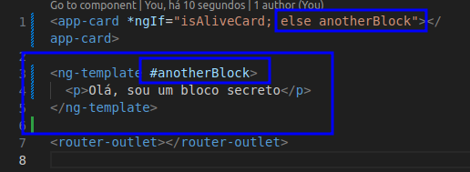

# Single Page Application com Angular

## Índice

- [Single Page Application com Angular](#single-page-application-com-angular)
  - [Índice](#índice)
  - [Antes de começar](#antes-de-começar)
  - [Introdução](#introdução)
    - [O que são diretivas?](#o-que-são-diretivas)
    - [Preparando o projeto](#preparando-o-projeto)
    - [Criando seu Componente](#criando-seu-componente)
  - [Diretivas Estruturais](#diretivas-estruturais)
    - [ngIf](#ngif)
    - [ngIf com Data Biding](#ngif-com-data-biding)
    - [ngIf com ngTemplate](#ngif-com-ngtemplate)
    - [ngFor laço de repetição em componentes](#ngfor-laço-de-repetição-em-componentes)
    - [Conceito de Reatividade](#conceito-de-reatividade)
    - [ngFor com index](#ngfor-com-index)
    - [Switch e Switch Case](#switch-e-switch-case)
  - [Diretivas de Atributo](#diretivas-de-atributo)
    - [ngClass](#ngclass)
    - [ngStyle](#ngstyle)
    - [ngModel](#ngmodel)
    - [ngTemplate](#ngtemplate)
    - [ngContent](#ngcontent)
  - [Conclusão](#conclusão)
  - [Materiais de apoio, links e referências](#materiais-de-apoio-links-e-referências)

## Antes de começar

- [x]  Criar pasta referente ao curso
- [x]  Adicionar link da pasta nos atributos do curso
- [x]  Adicionar arquivos e links adicionais ao repositório (pdf, pptx, etc)

## Introdução

### O que são diretivas?

Nesse curso vamos dar alguns passos a mais, dando inteligência pro layout deixando ele mais perto de um uso real.

Diretivas são comandos especiais que permitem manipular a DOM dinamicamente.

Existem 2 tipos de diretivas:

- Diretivas de atributo → alteram a aparencia ou comportamento de um elemento, componente ou outra diretiva
  - Exemplos:
    - ngClass → Adiciona ou remove CSS de um elemento (ex: modo dark / light)
    - ngModel → Adiciona vinculação de dados bidirecional a um elemento de um formulário
- Diretivas estruturais → Moldam ou remodelam a estrutura do DOM, adicionando ou removendo elementos na tela
  - Exemplos:
    - ngIf → Condicional que verifica se modelo deve ser visualizado ou não
    - nfFor → Repete um elemento para cada item em uma lista

### Preparando o projeto

Vamos criar um projeto chamado `diretivas_project` com o comando `ng new`

### Criando seu Componente

Dentro do projeto criamos um componente chamado `card` via comando `ng g c`

Depois importamos o componente no HTML pai do app.

## Diretivas Estruturais

### ngIf

Podemos alterar o atributo `p` dentro do componente card criado para que fique:

`
card works!
`

Dessa forma o componente não ficará visível quando chamado.

Quando chamamos um componente em um outro e passamos esse atributo como false, todo componente some. Então é importante saber a diferença de chamar isso para o componente do elemento e para alguma tag dentro do componente.

### ngIf com Data Biding

Podemos usar um Data Biding para passar a informação de valor ngIf dinamicamente.

Por exemplo, criando uma variável chamada `isAliveCard` na classe do `app.component.ts` e passar o valor dela como data Biding na hora de chamar algum componente.

Isso pode ser útil para criar uma lógica que oculta o componente de acordo com determinadas regras

### ngIf com ngTemplate

Outra coisa que podemos fazer com os ng é criar uma tag de template que pode ser habilitada de acordo com condições.

No exemplo abaixo criamos um bloco e de template e o apelidamos de anotherBlock com uma hashtag na frente. O bloco do card criado anteriormente serve de condição para decidir se esse bloco criado aparece ou não.

Se o bloco de card estiver com o `*ngIf` false então o bloco secreto aparece:

Um exemplo de uso é se tiver uma API que está buscando as informações do banco e enquanto elas não são carregadas no component pode ser apresentado um bloco alternativo no lugar.

### ngFor laço de repetição em componentes

Podemos utilizar o `ngFor` para criar um laço que percorre um vetor no código e cria dinamicamente elementos na tela.

Por exemplo, imaginando que no typescript existe um código que busca uma lista de produtos de uma api e armazena eles em uma variável.

Podemos usar o ngFor para criar um laço que varre esse vetor e coloca eles em um determinado elemento de lista:

Código TypeScript:

Código HTML:

Resultado em tela:

### Conceito de Reatividade

A ideia de reatividade consiste em o código do Angular ser reativo ao componente em que ele se encontrar

Por exemplo, se adicionarmos um botão dentro da lista criada anteriormente e colocarmos um event biding nele vinculado à uma função que executa um push, os elementos serão adicionados em tela também, de acordo com a mudança da lista:

Código TS:

Código HTML:

Exemplo em tela:

### ngFor com index

O for tem outros recursos que deixam ele mais rico, uma dessas outras coisas é a possibilidade de trabalhar com o index do for.

Por exemplo:

Resultado:

Isso pode ser útil se combinado com o event biding, por exemplo. Se associarmos o indice a uma função que quando clicar no indice exclui o elemento, podemos remover ele dinamicamente:

### Switch e Switch Case

Agora imaginemos que estamos trabalhando numa aplicação onde o menu muda dinamicamente com o nível de acesso do usuário, podendo ser um usuário normal, admin e superuser.

Tecnicamente o componente seria o mesmo, o que mudaria seria alguma informação do conteúdo.

O código em HTML do card:

No código TypeScript do card:

Resultado em tela:

## Diretivas de Atributo

### ngClass

Agora criamos um componente chamado comp-atributos para realizar outros testes.

Podemos usar o ngClass para modificar a classe do elemento através do typescript.

Por exemplo, podemos ter um CSS que modifica com o clique de um botão.

No HTML do comp-atributos:

No arquivo CSS:

No TypeScript:

Resultado em tela:

### ngStyle

Podemos usar o ngStyle para passar trechos de código CSS para os componentes e modificalor dinamicamente no arquivo ts:

Por exemplo:

Arquivo HTML:

Arquivo TypeScript:

Resultado em tela:

### ngModel

O ngModel permite uma comunicação bidirecional entre o arquivo HTML e o arquivo TypeScript.

Não a toa usamos uma notação diferente ao trabalhar com ele, usamos `[()]`

Para trabalhar com ngModel precisamos importar ele, pois ele não vem com o Angular por padrão.

Para importar, editamos o module em que estivermos agrupando os componentes:

Se reparar, o FormsModule é adicionado na seção de imports pois ela é destinada às bibliotecas e etc, enquanto a declarations é destinada às declarações de componentes e etc. Se deixarmos o mouse encima de cada uma o VSCode explica:

Agora que importamos, podemos modificar o HTML:

TypeScript:

Resultado em tela (tudo que for digitado no campo aparece no parágrafo criado no HTML):

Pode parecer inútil, mas imagine isso vinculado com o ngFor onde adicionamos os itens escritos em uma lista dinâmica no código.

Ao dar o clique em um botão podemos fazer com que o item escrito seja adicionado.

### ngTemplate

O ng-template é uma tag de template que funciona ao contrário das demais tags, ao invés dela vir com o ngIf como true, ela vem desabilitada.

Podemos usar ela como um template que aparece assim que alguma operação no código ocorre.

Por exemplo, um botão de adicionar ao carrinho de compras que aparece somente no caso de um item estar selecionado.

Exemplo de HTML:

Exemplo de TypeScript:

Resultado em tela:

### ngContent

Assim como temos o `ng-template` temos o ng-content que é um componente pronto do Angular.

Ele permite que um componente pai passe um conteúdo para um componente filho e isso seja rearanjado dinâmicamente.

Por exemplo, podemos voltar para o html do app-component e ver o trecho em que injetamos o `comp-atributos` se tentarmos adicionar alguma tag dentro do componente, não ele não é adicionado em página:

Para que possamos adicionar essas tags dentro do componente filho através do componente pai, nós adicionarmos dentro do componente filho uma tag chamada `ng-content` e passamos como atributo qual tag passada pelo elemento pai vamos utilizar. Isso permite trabalhar dinamicamente com as tags passadas pelo elemento pai, podendo colocar uma no inicio, outra no fim, etc…

Por exemplo…

Tag HTML do componente filho (passando o h2 antes do h1 e o p depois):

HTML do componente pai:

Resultado em tela:

## Conclusão

Durante o curso passamos por muitos conteúdos:

- Aprendemos a trabalhar com as diretivas do Angular
- Aprendemos sobre diretivas estruturais e diretivas de atributo

## Materiais de apoio, links e referências

O código criado ao longo do curso pelo Professor pode ser acessado [neste link do GitHub](https://github.com/felipeAguiarCode/angular-playground/tree/main/C7%20-%20Diretivas).
