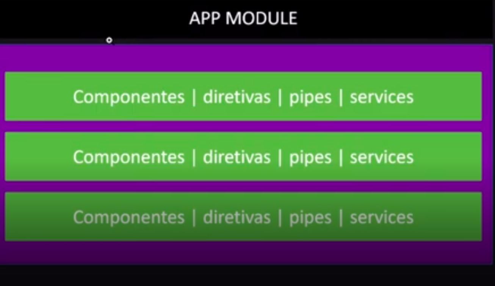

# Módulos Angular

## Índice

- [Módulos Angular](#módulos-angular)
  - [Índice](#índice)
  - [Antes de começar](#antes-de-começar)
  - [Definição de módulos](#definição-de-módulos)
    - [Introdução a módulos Angular](#introdução-a-módulos-angular)
    - [Anatomia de módulos Angular](#anatomia-de-módulos-angular)
  - [Criando Sub Módulos na Prática](#criando-sub-módulos-na-prática)
    - [Trabalhando com Sub Módulos na Prática](#trabalhando-com-sub-módulos-na-prática)
  - [Links, referências e materiais de apoio](#links-referências-e-materiais-de-apoio)

## Antes de começar

- [x]  Criar pasta referente ao curso
- [x]  Adicionar link da pasta nos atributos do curso
- [x]  Adicionar arquivos e links adicionais ao repositório (pdf, pptx, etc)

## Definição de módulos

### Introdução a módulos Angular

Já falamos de módulos diversas vezes, mas não nos aprofundamos.

Até agora vimos que toda aplicação nasce com um módulo principal e que ele serve como uma caixinha que armazena os componentes e algumas outras informações.

Conforme a aplicação vai crescendo, fica dificil dar manutenção nos módulos, já que eles armazenarão muitas informações.

Com isso, podemos criar sub módulos que adicionamos em módulos principais:

Isso ajuda a gerenciar mais facilmente a ferramenta, ajudando na manutenção.

### Anatomia de módulos Angular

A primeira coisa a se entender sobre um módulo é que ele é uma caixinha de coisas.

E em um módulo podemos importar outros módulos.

O que podemos armazenar em um módulo?

- Componentes
- Diretivas
- Pipes → servem para tratar fluxos de dados
- Services → quem provém os dados para os componentes

Lembrando que um módulo é composto pelas seguintes seções:

- Declarations
- Imports
- Exports
- Providers
- Bootstraps

- Onde as **declarations** servem para os componentes importados.
- Os **imports** servem para importar outros módulos do próprio Angular ou demais ferramentas.
- O **exports** serve para declarar tudo o que queremos fornecer para outros módulos quando esse módulo ser importado. **O módulo principal não costuma vir com essa seção, pois como não costumamos criar um 2º módulo principal, ele não é exportado.**
- O **providers** serve para armazenar as injeções de dependências dos services.
- O **bootstrap** define quais os componentes serão inicializados junto com a aplicação.

## Criando Sub Módulos na Prática

### Trabalhando com Sub Módulos na Prática

Para criar um submódulo podemos chamar o ng através do comando `ng g m lista`

Onde estamos passando o caminho do módulo a ser criado como sendo `lista`

Com isso o arquivo é adicionado dentro de uma pasta dentro do app:

Após isso podemos criar um componente dentro dessa pasta através do comando `ng g c lista/input`

Com isso o componente é automaticamente adicionado no módulo da pasta `lista`

Depois disso podemos adicionar um outro componente chamado `list-vew` também dentro da pasta `lista` através do comando `ng g c lista/list-view` que ele será adicionado no módulo.

Para adicionar esses componentes na lista de componentes exportados importar o módulo, precisamos adicionar a seção `exports` e incluir os componentes criados nela:

Após essa criação, podemos modificar o módulo principal para importar esse módulo:

Com essa importação já conseguimos usar o componente no HTML principal.

Isso é muito útil para organizar os projetos em seções compartimentadas e separadas.

Mas na prática real do mercado a abordagem mais utilizada é um pouco diferente. Ao invés de um módulo genérico, criamos um módulo chamado `shared` para armazenar os componentes compartilhados entre várias páginas.

E após ter uma pasta chamada `shared` outra chamada `pages` que armazena as páginas do site que terão os componentes e módulos importados da pasta `shared`.

Lembrando que essa estruturação obriga que a gente adicione e exporte os componentes nos módulos necessários.

## Links, referências e materiais de apoio

O código criado pelo professor neste curso pode ser encontrado [neste link do GitHub](https://github.com/felipeAguiarCode/angular-playground/tree/main/C8%20-%20Modulos/modulo-proj).
