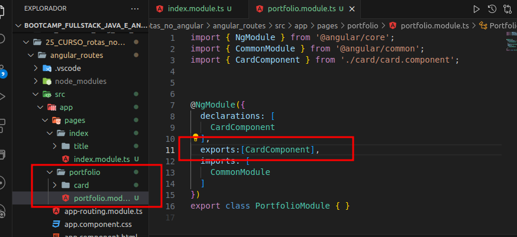

# Trabalhando com Rotas no Angular

## Índice

- [Trabalhando com Rotas no Angular](#trabalhando-com-rotas-no-angular)
  - [Índice](#índice)
  - [Antes de começar](#antes-de-começar)
  - [Introdução a Rotas](#introdução-a-rotas)
    - [Introdução](#introdução)
    - [Criando páginas Angular](#criando-páginas-angular)
  - [Trabalhando com Rotas](#trabalhando-com-rotas)
    - [Anatomia de rotas](#anatomia-de-rotas)
    - [Criando suas primeiras rotas](#criando-suas-primeiras-rotas)
    - [Rotas coringa](#rotas-coringa)
    - [Navegando entre páginas com RouterLink](#navegando-entre-páginas-com-routerlink)
    - [ActiveRouter](#activerouter)
    - [Recuperando parâmetros das rotas](#recuperando-parâmetros-das-rotas)
    - [Recuperando QueryParams de rotas](#recuperando-queryparams-de-rotas)
    - [Redirecionamento por componente](#redirecionamento-por-componente)
    - [Rotas chldren](#rotas-chldren)
    - [Parâmetros de rotas children](#parâmetros-de-rotas-children)
  - [Materiais e links de apoio](#materiais-e-links-de-apoio)

## Antes de começar

- [x]  Criar pasta referente ao curso
- [x]  Adicionar link da pasta nos atributos do curso
- [x]  Adicionar arquivos e links adicionais ao repositório (pdf, pptx, etc)

## Introdução a Rotas

### Introdução

Vamos iniciar um novo projeto via CLI do Angular.

Para isso, usamos o comando `ng new`.

Depois fazemos a limpa padrão do html principal e do arquivo .spec

### Criando páginas Angular

Agora criamos nossos módulos via `ng g m pages/index` e `ng g m pages/portfolio`  que serão as páginas da aplicação.

Agora criamos 2 componentes cada um dentro de uma pasta criada, via comandos `ng g c pages/index/title` e `ng g c pages/portfolio/card`

Depois de criados, precisamos adicionar os componentes criados na seção de exports dos módulos criados:

Com isso teremos a base do projeto para ser trabalhado.

## Trabalhando com Rotas

### Anatomia de rotas

Agora vamos entender a anatomia do arquivo de rotas.

Até o momento criamos projetos Angular e não modificamos o arquivo `app-routing.module.ts` mas agora vamos trabalhar com ele.

Ele nada mais é do que um arquivo de módulo, mas que armazena as rotas:

Repare que diferente de outros módulos existem algumas importações diferentes, como o RouterModule e Routes do `@angular/router` onde o RouterModule é uma classe e o Routes é um tipo para tipar variáveis.

Depois é criado uma const chamada `routes` do tipo `Routes`que é uma representação das configurações dos serviços de rota do Angular e ele é um `array de objetos de rotas`.

Na seção de imports do decorator o código está passando o array vazio de rotas (**`routes`**) para o método **`forRoot`** do RouterModule.

Depois estamos exportando o RouterModule caso queiramos importar em outro arquivo de módulo.

Agora para dar continuidade vamos no `app.module` e importamos os módulos de `index` e `portfólio` criados:

### Criando suas primeiras rotas

Para criar uma rota nós podemos editar o `app-routing.module.ts` e adicionar à variável `routes` o objeto com os atributos abaixo:

Onde:

- path → qual caminho para chamar determinada rota
- component → qual componente será chamado
- pathMatch → qual tipo de correspondência o caminho deve ter (no caso de full, o caminho precisa ser exatamente igual ao passado, no caso de prefix a correspondência não precisa ser exata para chamar o componente, podendo ter mais informações após ela)

Com essas adições podemos rodar o projeto com `ng serve` e dependendo da URL digitada a rota chama um componente ou outro.

### Rotas coringa

Uma rota coringa é uma rota que você configura para quando o usuário digita uma rota não existente, então você redireciona para alguma rota pré-estabelecida.

Para configurar uma rota coringa nós usamos a seguinte sintaxe:

Ao invés de passar um `path` , passamos 2 asteriscos e ao invés de passar um `component` nós usamos uma propriedade `redirectTo` que recebe uma string como atributo e essa string é o `path` de uma outra rota existente (que pode ser o index ou uma página de “não encontrado`configurada`.

### Navegando entre páginas com RouterLink

Agora imaginemos um menu que redireciona para determinada rota de forma dinâmica.

Podemos fazer isso criando um componente via `ng g c shared/menu` e adicionar nesse componente um menu com dois links que direcionem para o mesmo caminho que colocamos nas rotas dentro do `routing`:

O problema dessa abordagem é que ela tira toda a vantagem de um SPA, pois ao clicar em um desses links a aplicação recarrega por completo, e a vantagem de um SPA é que os elementos são carregados dinamicamente e isso faz com que o site seja muito mais rápido.

Para fazer bom uso desse redirecionamento de rotas podemos usar uma propriedade chamada `routerLink` e a sintaxe dela é utilizar colchetes para passar o biding e quais as rotas acessadas (dentro de aspas simples):

Dessa forma somos redirecionados para as páginas sem necessidade de recarregar toda a aplicação.

### ActiveRouter

Outra característica interessante é adicionar um comportamento de classe para uma rota criada.

Com o biding `routerLinkActive` podemos passar a classe dinamicamente para a rota que estiver ativa. Nesse exemplo, estamos passando uma classe que possui o css:

Quando clicamos no link que redireciona para a rota, o ng verifica a rota e atribui ao HTML essa classe:

Mas como criamos o pathMatch como full, ao acessar a rota do portfolio, ambos links ficam com essa classe.

Isso ocorre porque na rota do portfólio também está sendo acessada a rota do index, que é vazia.

Para contornar isso, podemos passar outro biding que é o `routerLinkActiveOption` onde informamos que o caminho precisa ser exatamente igual:

Assim a rota precisa ser exatamente igual à rota passada no routerLink.

### Recuperando parâmetros das rotas

Imaginando que temos um repositório cheio de projetos, podemos passar informações a partir das rotas acessadas mudando o arquivo de rotas e passando um `/:<nome_da_variavel>` ao fim do nome da rota.

Dessa forma, tudo que for passado depois da rota será armazenado na variável criada, por exemplo:

Para acessar essa informação, precisamos ir na classe do componente para onde a rota aponta e adicionar no construtor uma variável do tipo ActivateRoute como parâmetro.

Assim, ao construir esse componente, terá uma variável desse tipo vinculada.

Se tentarmos acessar essa rota através do link do menu criado não conseguimos.

Isso acontece porque agora é necessário passar alguma informação após a rota, pois o método construtor do componente criado ao acessar a rota exige.

Se digitarmos na url a rota + alguma informação, conseguimos acessar novamente a rota:

Agora podemos ir na classe do componente da rota para entender melhor do que se trata esse ActivatedRoute.

Se imprimirmos uma determinada informação da variável criada com o construtor:

Teremos como resultado a informação passada após a rota:

 Com essa importação do ActivatedRoute podemos resgatar qualquer informação do componente. Podemos ver isso através de um ponto:

Após precisamos usar o subscribe para recuperar o valor.

### Recuperando QueryParams de rotas

Em muitos projetos trabalhamos com `QueryParams` que são os parâmetros passados após a URL. Mas até o momento tudo o que o código retorna é o ID no console

Para recuperar essas informações usamos o `.queryParams` do ActivatedRoute:

Resultado:

### Redirecionamento por componente

Imagine que temos um componente que deve ser visualizado na tela por determinado tempo (uma tela de agradecimento ou mensagem aleatória) e após um tempo você queira que o usuário seja redirecionado para alguma outra rota.

Para isso podemos usar o `Router` que é uma importação do router assim como o ActivatedRoute.

Podemos incluir ele no nosso método construtor do `cardComponent` assim como incluímos o ActivatedRoute.

Depois disso podemos setar um intervalo via `setInterval` onde passamos uma função callback que após 5 segundos vai redirecionar para a rota de `index`

Ou seja, estamos acessando a rota de portfólio (cardComponent) e ao acessar o cardComponent ele aguarda 5 segundos e depois redireciona para a rota de index:

Outros usos são, por exemplo, ao invés de forçar a navegação até outra rota, podemos forçar uma navegação até uma rota de configuração de usuário ou de consulta no banco de dados e depois obrigar o usuário a voltar para uma determinada página no caso do login dar errado, por exemplo.

### Rotas chldren

Podemos criar rotas filhas a partir de outras rotas existentes, assim montando a estrutura da aplicação de acordo.

Por exemplo:

Podemos adicionar a propriedade `children` que recebe um vetor de rotas e dentro dele passar as rotas filhas do componente pai.

Assim, nossa aplicação permite acessar tanto a rota de `portfolio` quanto a `portfolio/id`

### Parâmetros de rotas children

Como criamos rotas children, pode ser que seja necessário utilizar um método diferente para acessar as informações dessa rota na classe do elemento que está sendo chamado.

Por exemplo:

Isso é necessário pois ao tentar acessar a rota do filho, as informações não estavam sendo impressas com o método acima:

## Materiais e links de apoio

Todo o código desenvolvido pelo professor durante a aula pode ser acessado através [deste link do repositório no GitHub.](https://github.com/felipeAguiarCode/angular-playground/tree/main/C9%20-%20Rotas/rotas)
