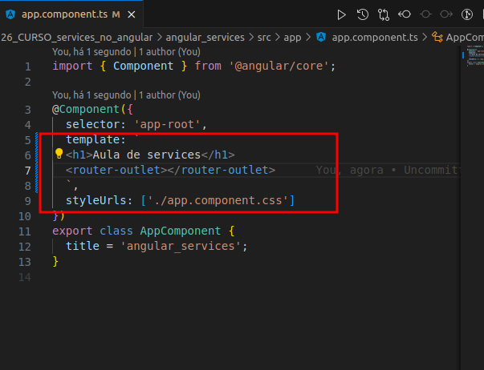

# Trabalhando com Services no Angular

## Índice

- [Trabalhando com Services no Angular](#trabalhando-com-services-no-angular)
  - [Índice](#índice)
  - [Antes de começar](#antes-de-começar)
  - [Introdução ao Services Angular](#introdução-ao-services-angular)
    - [Os 3 pilares de um service](#os-3-pilares-de-um-service)
    - [Preparando estrutura de pastas](#preparando-estrutura-de-pastas)
    - [Preparando o componente de Pokemon](#preparando-o-componente-de-pokemon)
    - [Estilizando um componente de Pokemon](#estilizando-um-componente-de-pokemon)
    - [Desacoplando seu componente e deixando-o inteligente](#desacoplando-seu-componente-e-deixando-o-inteligente)
  - [Services na Prática](#services-na-prática)
    - [Entendendo o papel do service](#entendendo-o-papel-do-service)
    - [A anatomia de um service](#a-anatomia-de-um-service)
    - [Como injetar um service](#como-injetar-um-service)
    - [Service conversando com environment](#service-conversando-com-environment)
    - [Trabalhando com módulo HTTP](#trabalhando-com-módulo-http)
    - [Observables](#observables)
    - [Trabalhando com subscribe](#trabalhando-com-subscribe)
    - [Terminando de tipar os dados](#terminando-de-tipar-os-dados)
    - [Concluindo](#concluindo)
  - [Materiais de apoio e links](#materiais-de-apoio-e-links)

## Antes de começar

- [x]  Criar pasta referente ao curso
- [x]  Adicionar link da pasta nos atributos do curso
- [x]  Adicionar arquivos e links adicionais ao repositório (pdf, pptx, etc)

## Introdução ao Services Angular

### Os 3 pilares de um service

Muitas pessoas se perdem na função dos services, mas é bem simples.

Os services são arquivos TypeScript que servem para gerenciar as regras de negócio separadamente.

Por exemplo, ao invés de acessar uma api, montar um factory, etc… Dentro das classes dos componentes, podemos montar isso dentro do service.

Isso impede o componente de misturar a lógica que o torna visual com as regras de negócio.

Algumas informações referentes ao service:

- É um arquivo TypeScript
- Serve para separar as regras de negócio da lógica visual do componente
- Pode servir mais de um componente (que compartilham uma mesma regra de negócio)
- Não tem um certo ou errado no uso dele

Nada impede a criação de um service para um componente, mas a ideia é que ele seja usado para compartilhar regras de negócio comuns entre os componentes.

Por exemplo, uma ideia é criar um service especialista em consultar cadastros de uma API e outro especialista em manipular cadastros, isso pode ser mais escalável.

### Preparando estrutura de pastas

Inicialmente só preparamos o ambiente, removendo a sujeira dos arquivos e criando 2 pastas dentro do app chamada `components` e `services`.

Além disso, mudamos o `app.component.ts` para receber um template no corpo ao invés de URL:



Depois criamos um componente chamado `card` e incluímos ele no html principal:


### Preparando o componente de Pokemon

Agora vamos criar a estrutura para montar um componente que servirá para o card do pokemon:


O card component ficou:

HTML:

```html
<div class="card__container">
  <div class="card__title">
    <h3>Charmander</h3>
  </div>

  <div class="card__body">
    
  </div>

  <div class="card__stats">
    <span class="card__stats__type">FIRE</span>
  </div>
</div>
```

CSS:

```css
.card__container{
  border: 1px black solid;

  width: 200px;
  height: 350px;

  display: flex;
  flex-direction: column;
}
```

Resultado:


### Estilizando um componente de Pokemon

Fizemos alguns ajustes para que o HTML e CSS ficassem:

HTML:

```html
<div class="card__container">
  <div class="card__title">
    <h3>Charmander</h3>
  </div>

  <div class="card__body">
    
  </div>

  <div class="card__stats">
    <span class="card__stats__type">FIRE</span>
    <span class="card__stats__type">FIRE</span>
    <span class="card__stats__type">FIRE</span>

  </div>
</div>
```

CSS:

```css
.card__container{
  border: 1px black solid;

  width: 250px;
  height: 350px;

  display: flex;
  flex-direction: column;

  background-color: #232323;
  border-radius: 10px;
}

.card__title{
  margin-left: auto;
  margin-right: auto;
}

.card__title > h3 {
  color: white;
}

.card__body{
  background-color: #616161;

  width: 90%;
  height: 70%;

  margin-left: auto;
  margin-right: auto;

}

.card__stats{
  padding-top: 10px;
  display: flex;
  flex-direction: row;
  justify-content: center;
}

.card__stats__type{
  color: white;

  background-color: coral;
  border-radius: 5px;

  padding: 5px;
  margin-right: 4px;
}
```

Resultado:


### Desacoplando seu componente e deixando-o inteligente

Agora a gente cria as variáveis que vão armazenar as informações do Pokemon e a implementamos no HTML, de forma que ele fique dinâmica:

HTML:

```html
<div class="card__container">
  <div class="card__title">
    <h3>{{name}}</h3>
  </div>

  <div class="card__body">
    
  </div>

  <div class="card__stats">
    <span class="card__stats__type" *ngFor="let type of attributesTypes">{{type}}</span>
  </div>
</div>
```

CSS:

```css
.card__container{
  border: 1px black solid;

  width: 250px;
  height: 350px;

  display: flex;
  flex-direction: column;

  background-color: #232323;
  border-radius: 10px;
}

.card__title{
  margin-left: auto;
  margin-right: auto;
}

.card__title > h3 {
  color: white;
}

.card__body{
  background-color: #616161;

  width: 90%;
  height: 70%;

  margin-left: auto;
  margin-right: auto;

}

.card__stats{
  padding-top: 10px;
  display: flex;
  flex-direction: row;
  justify-content: center;
}

.card__stats__type{
  color: rgb(34, 32, 32);
  font-weight: bold;

  background-color: coral;
  border-radius: 5px;

  padding: 5px;
  margin-right: 4px;
}
```

TypeScript:

```tsx
import { Component, OnInit } from '@angular/core';

@Component({
  selector: 'app-card',
  templateUrl: './card.component.html',
  styleUrls: ['./card.component.css']
})
export class CardComponent implements OnInit {

  // Criando propriedades do pokemon
  name: string = "CHARIZARD"
  attributesTypes: string[] = ['Fire', 'Wing']

  constructor() { }

  ngOnInit(): void {
  }

}
```

Resultado:


## Services na Prática

### Entendendo o papel do service

Para essa parte vamos conhecer a api de pokemons através do site [https://pokeapi.co/](https://pokeapi.co/)

Vamos usar a URL básica para extrair informações da api que é a: [https://pokeapi.co/api/v2/pokemon/ditto](https://pokeapi.co/api/v2/pokemon/ditto)

Nessa URL passamos o nome / id do pokemon e ela retorna diversas informações.

Além disso vamos usar um arquivo que não usamos até então que é o `environment.ts` que fica na pasta `environments` na raiz do projeto.

Esse arquivo serve para armazenar valores de variáveis gerais para usar no projeto e podemos usar a versão de produção ou desenvolvimento:


Nesse caso usamos a versão de desenvolvimento.

Agora podemos criar o service que fará a consulta da API via `ng g s services/pokemon`.

### A anatomia de um service

Um arquivo service é composto pela importação do `angular/core` mas ele importa o `Injectable` do angular/core que serve para fazer injeção do que o service fornece dentro dos componentes.

O decorator `@Injectable` recebe como parâmetro que informa a partir de onde esse service provém informações, no nosso caso root.

Depois temos o export da classe do service:


É importante notar que ao gerar um service ele não modifica outros arquivos, diferente da criação de módulos e componentes que preenchem informações automaticamente ao serem criados.

### Como injetar um service

Para injetar um service podemos criar uma variável em um componente e passar o tipo dela como sendo o nome do service:


Como o service é uma classe TS, podemos criar métodos nele que podem ser acessados por quem fazer o import:


Dessa forma ao iniciar o componente de card o console printa o nome do pokemon que foi passado para o service.

### Service conversando com environment

Como o service conversa com outros arquivos, podemos fazer com que ele pegue a informação da URL da pokeApi que foi armazenada anteriormente no `environment` e podemos pedir para ele armazenar essa informação em uma variável própria.

Pra isso temos que importar o `environment` , criar uma variável dentro do service e passar a informação da URL do environment para a variável do service dentro do método construtor:


### Trabalhando com módulo HTTP

Para conseguirmos trabalhar com requisições HTTP precisamos importar dentro do módulo principal o `HttpClientModule`

Para isso incluimos as linhas:


Basicamente estamos falando para nosso APP também trabalhar com protocolo HTTP.

Depois nós podemos ir no service e adicionar como parâmetro do método construtor uma variável do tipo `HttpClient`:


Essa classe também faz parte do módulo `http` do angular.

Mas é importante não confundir:

- No módulo principal importamos um pacote do Angular que possui diversas classes, atributos e etc…
- No arquivo de services importamos apenas uma classe desse pacote importado no projeto.

Com isso pronto, podemos modificar o método `getPokemon` para que ele use o http para fazer um `get` da url do pokemon.

Depois podemos criar uma variável global no services para armazenar as informações extraídas do pokemon, a `pokeData`.

Com isso temos o código:


A função **`getPokemon`** tem as seguintes características:

1. Ela recebe um parâmetro **`pokemonName`** (que, neste caso, deve ser uma string vazia).
2. Em seguida, ela utiliza a variável **`pokeData`** para armazenar o resultado de uma requisição **`HTTP GET`**.
3. Essa requisição é feita usando o serviço **`HttpClient`** do Angular para buscar dados de um Pokémon.
4. A URL da requisição é construída concatenando a URL base (obtida do arquivo de configuração **`environment`**) com o nome do Pokémon passado como argumento.
5. Após a conclusão da requisição, o resultado é armazenado na variável **`pokeData`**.
6. Por fim, um **`console.log`** exibe o valor atual de **`pokeData`**.

Mas esse console resulta em um observable, ou seja, ainda precisamos tratar as informações para que saiam como desejamos.


### Observables

Os observables são parecidos com promises, por conta disso vamos especificar o tipo de saída da função criada:


Ao fazer isso o Angular importa ele de uma biblioteca específica, a  `rxjs` que compõe diversas importações para permitir que o paradigma funcional em TypeScript, mesmo esse sendo POO.

O `observable` é como se fosse um canal e precisamos “nos inscrever” nele para trabalhar com suas informações.

Na nossa função, precisamos passar o tipo de dado que o `Observable` vai receber ao retorno dela, pra isso temos que criar um modelo de dados do pokemon dentro de uma pasta chamada `models`.


Depois disso feito, importamos esse modelo no service criado para que o observable possa trabalhar com ele.

Agora precisamos mudar o tipo de dados da variável pokeData dentro do service e do retorno da requisição, além de informar que o observable receberá um modelo de pokemon ao fim da função:


Com essas alterações o console não aponta mais nada, afinal de contas, mudamos a função para ao invés de imprimir no console dar um `return`.

Mas se formos no nosso componente que está chamando esse método, podemos usar o `subscribe` para acessar os dados do observable:


Da mesma forma que o `fetch` do JS possui o `then` e o `catch`, no caso do observable existe o `subscribe`  que tem o `next` e `error`

Ao observar o retorno no console:


### Trabalhando com subscribe

Vamos refatorar o código para que ele retorne somente as informações que precisamos para nossa aplicação.

Para isso precisamos adicionar ao modelo de pokemon o `sprite` e depois modificamos dentro do componente as operações dentro do `next`


Assim estamos imprimindo na tela as informações acessadas dentro através do modelo de pokemon.

Podemos modificar o modelo para contemplar exatamente o sprite que desejamos, caso contrário ele armazena todos os sprites dentro de uma variável.

O modelo fica dessa forma, armazenando em si um objeto que contém exatamente o sprite que desejamos:


Depois, refatoramos o componente para imprimir esse elemento no console:


Com isso o resultado no console será:


Podemos seguir esta mesma lógica para armazenar o `types` do pokemon como um array de tipos.

Depois de isso, refatoramos novamente o componente, mas dessa vez incluímos uma variável do tipo `pokemonData` que servirá para representar o pokemon acessado pela API.

Dentro do subscribe na etapa de `next` passamos para essa variável do componente as informações extraídas da API:


Agora nós modificamos o HTML para pegar as informações do pokemon dinamicamente.


Para isso foi necessário modificar a variável pokemon do componente para ser do tipo `pokemonData` ou `any` .

### Terminando de tipar os dados

Mesmo que o código esteja funcionando agora, o console aponta erro.

Isso se dá porque a variável pokemon está sendo declarada como tipo `pokemonData` ou `any`, mas o any é genérico, e dependendo da consulta com a requisição pode dar problema.


Para não dar erro, precisamos mudar o tipo da variável para somente `pokemonData` e para que o resto do código não dê erro precisamos inicializar os valores dessa variável.


Podemos inicializar esses valores na criação da variável ou no construtor da classe, que foi a minha escolha.

Mas é necessário que o `types` armazene um array de objetos do tipo `type` que contém uma estrutura diferente.

Sendo assim, modificamos nosso modelo para comportar essa estrutura:


Com essa alteração conseguimos acessar o nome do typo percorrendo pela lista:


E o resultado na tela fica:


### Concluindo

Agora vamos adicionar na tela um campo de input que quando o usuário digitar vai trazer dinamicamente as informações do pokemon.

Pra isso precisamos adicionar ao módulo em que o componente se encontra a importação do `FormsModule`para trabalhar com elementos de formulário.

Depois adicionamos a seguinte linha no HTML do componente:


E após adicionamos a função que está sendo chamada ao digitar o nome do pokemon no campo de input:


Com isso, durante a digitação do nome do pokemon a aplicação verifica na API e traz suas informações dinamicamente.

## Materiais de apoio e links

O código desenvolvido pelo professor durante a aula pode ser acessado através [deste link](https://github.com/felipeAguiarCode/angular-playground/tree/main/C10%20-%20Services%20e%20Pipes)
