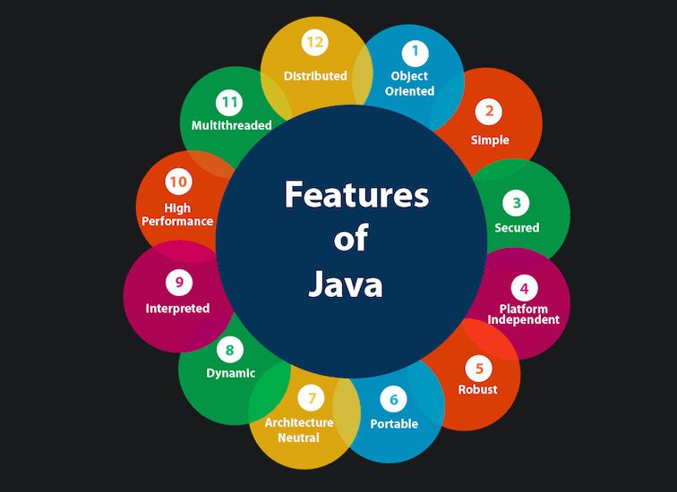

# Introdução à Plataforma Java

## Índice

- [Introdução à Plataforma Java](#introdução-à-plataforma-java)
  - [Índice](#índice)
  - [Antes de começar](#antes-de-começar)
  - [Introdução](#introdução)
    - [Introdução e objetivos](#introdução-e-objetivos)
    - [O que é Java](#o-que-é-java)
  - [Java e sua história](#java-e-sua-história)

## Antes de começar

- [x]  Criar pasta referente ao curso
- [x]  Adicionar link da pasta nos atributos do curso
- [x]  Adicionar arquivos e links adicionais ao repositório (pdf, pptx, etc)

## Introdução

### Introdução e objetivos

Durante o curso vamos explorar os principais fundamentos do Java.

O professor se chama Gleyson Sampaio e tem mais de 10 anos de experiência no varejo, bancos, seguradoras, etc…

Durante as aulas teremos os fundamentos de Java apresentados, já que para ser um conhecedor avançado da linguagem precisamos ter pleno conhecimento do básico.

Os objetivos são:

- Apresentar a história da linguagem Java
- Explorar recursos de cada plataforma
- Configurar o ambiente para desenvolvimento
- Definir uma IDE e aumentar nossa produtividade

Para saber mais, todo conteúdo do curso estará disponível no gitbook do professor e pode ser acessado através [desse link](https://glysns.gitbook.io/java-basico)

### O que é Java

Java é composta por muitas funcionalidades.

- Simples

    Java é uma linguagem **simples** de entender, desde que mantenhamos uma consistência de estudo e desenvolvimento. Ela precisa funcionar em diversos dispositivos, desde microondas até sistemas complexos.

- Orientada a objetos

    Java é **orientada a objetos.** Para trabalhar com ela é necessário conhecer os pilares de POO:

    1. Classe e Objeto;
    2. Encapsulamento;
    3. Abstração;
    4. Herança;
    5. Polimorfismo.
- Plataforma independente

    Java permite funcionar em qualquer plataforma. Uma plataforma é um ambiente de hardware ou software onde o programa é executado.

    Java permite isso porque o código criado em Java é convertido para um bytecode, e esse bytecode não está vinculado a nenhuma plataforma

- Portátil

    O mesmo código desenvolvido em um local pode ser reproduzido em outro, independentemente de alguns recursos.

    A razão por trás disso é a JVM (Java Virtual Machine) e o bytecode que fazem a conversão automaticamente.

- Robusta

    Por mais que seja simples e portátil, ela é uma linguagem robusta.

  - Ela não “fraqueja” por conta de interrupções repentinas e etc.
  - Java fornece coleta de lixo automática, fazendo com que os recurso não sejam usados em excesso (sem necessidade de gestão de memória)
  - Há tratamento de exceções e verificação de tipos
- Segura

    Java possui recursos para aumentar a segurança, permitindo fazer verificações para impedir ameaças como vírus, adulteração e espionagem.

    Também temos recursos de criptografia para proteger os dados na interne

- Interpretada e compilada

    A Java é uma linguagem que usa ambos os métodos.

    Ela faz a compilação do código ao tornar ele em bytecode e depois isso é interpretado pela JVM ou pelo sistema operacional.

- Multi-thread

    Ela preza pelo multi processamento, ou seja, ela permite execução de multiplas tarefas simultâneas, fazendo com que a performance da linguagem seja alta.

## Java e sua história

A Sun Microsystems financiou uma pesquisa interna com o codinome Green em 1991.

O projeto resultou no desenvolvimento da linguagem baseada em C e C++, que o criador James Gosling chamou de Oak em homenagem a uma arvore que ficava na frente do seu escritório.

Descobriram depois mais tarde que já existia uma linguagem chamada Oak. Quando uma equipe da Sun visitou uma cafetaria local, o nome Java (cidade de origem de um tipo de café importado) foi sugerido, aí foi incorporado.

O projeto Green teve dificuldades, pois o projeto não estava crescendo tão rápido quando previsto. Em 1993 e a Sun explodiu em popularidade por surfar na onda do World Wide Web.

Em maio de 1995 a Sun criou uma conferência que chamou muita atenção para o uso em páginas dinâmicas.

Hoje em dia Java é utilizada praticamente em todo lugar.

Java hoje tem mais de 20 anos de idade, e ao longo de suas versões, algumas se destacam:

- Versão J2SE 5.0 de 2004→ trouxe muitos recursos que são usados até hoje, como generics, enum, autoboxing entre outros
- Versão Java SE 8 de 2014 → expressoes lambdas, foreach, interfaces, java.util.functions, entre outros.
- Versão Java SE 11 de 2018 → métodos para escrever strings em arquivos, uso de variáveis via inferências

Hoje em dia o Java é propriedade da Oracle.
