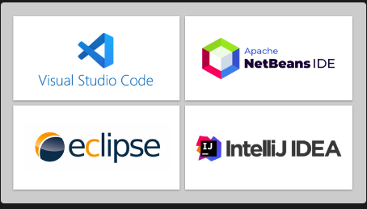

# Ambiente de Desenvolvimento Java

## Índice

- [Ambiente de Desenvolvimento Java](#ambiente-de-desenvolvimento-java)
  - [Índice](#índice)
  - [Antes de começar](#antes-de-começar)
  - [Plataformas e configuração do ambiente](#plataformas-e-configuração-do-ambiente)
    - [Introdução a IDEs](#introdução-a-ides)
    - [Configuração do Ambiente](#configuração-do-ambiente)
  - [Escolha sua IDE](#escolha-sua-ide)
    - [Instalando o VSCode](#instalando-o-vscode)
    - [Instalando o Eclipse](#instalando-o-eclipse)
    - [Instalando o IntelliJ](#instalando-o-intellij)
    - [Integrando o VSCode com o Github](#integrando-o-vscode-com-o-github)

## Antes de começar

- [x]  Criar pasta referente ao curso
- [x]  Adicionar link da pasta nos atributos do curso
- [x]  Adicionar arquivos e links adicionais ao repositório (pdf, pptx, etc)

## Plataformas e configuração do ambiente

### Introdução a IDEs

Arquivos Java são arquivos de edição de texto com a extensão `.java`.

Qualquer editor de texto pode editar eles, mas arquivos nesse caso não temos acesso a recursos mais avançados.

Para isso, podemos usar IDEs que são ambientes de desenvolvimento com recursos adicionais.

O que uma IDE oferece:

- Auto-complete ou IntelliSense que permitem auto completar o texto e identificar o que está sendo escrito de forma mais visivel
- Formatação de palavras e blocos de código
- Análise de erros de sintaxe
- Compilação de programa
- Depuração (acompanhamento) de execução do programa

Cada IDE dispõe de alguns recursos comuns, plugins, etc… Para agilizar o desenvolvimento.

Java possui algumas IDEs, podendo ser:

Cada uma delas possui suas particularidades que vamos discutir ainda.

- IDE Eclipse

    Eclipse é uma alternativa muito comum no desenvolvimento

- IDE IntelliJ

    É uma ferramenta poderosa com muitos recursos, por ser uma plataforma de código aberto para a criação de IDEs.

    Ela possui alguns recursos pagos, mas podemos baixar a versão community.

- IDE Visual Studio Code

    Desenvolvido pela Microsoft, um editor de texto bem simples com recurso e suporte a diversas linguagens

- IDE NetBeans

    Muito utilizada em ambiente acadêmico e com versão de menu e assistentes em português.

A mais utilizada no ambiente corporativo costuma ser o Eclipse e possui uma interface bem interativa.

Ao testar IDEs precisamos conhecer bem as funcionalidades dela antes mesmo de pensar em codar.

Por exemplo:

- O que são workspaces (para quem trabalha com Eclipse, por exemplo)
- Definir a JDK na IDE
- Criar e abrir um projeto Java
- Criar e importar um projeto Maeven
- Conhecer os principais atalhos
- Code Snippet
- Executar e depurar o programa

Exemplos de atalhos em cada IDE:

- Como sugestão fica esse vídeo com a instrução de como configurar o VSCode para usar com Java

    [https://www.youtube.com/watch?v=vim1bTa-Bkc&feature=youtu.be&ab_channel=LoianeGroner](https://www.youtube.com/watch?v=vim1bTa-Bkc&feature=youtu.be&ab_channel=LoianeGroner)

### Configuração do Ambiente

O Java é composto pelo JDK e o JRE.

Para começar a desenvolver em Java precisamos ter configurado o JDK.

É extremamente importante determinar a versão do Java que precisamos utilizar, devido alguns requisitos do projeto.

Para instalar o JDK podemos ir no google e buscar por JDK + versão desejada e seguir as instruções da Oracle, mas no caso de instalar uma das IDEs, essa instalação já é feita automaticamente.

Para verificar se o Java teve as variáveis de ambiente devidamente configuradas podemos ir no prompt de comando e digitar `Java —version`

Mas no caso de configurarmos uma IDE não precisamos nos preocupar com isso.

## Escolha sua IDE

### Instalando o VSCode

Para instalar o VSCode com suporte para Java podemos pesquisar na internet por VSCode e baixar / instalar.

Depois de instalado podemos configurar os plugins para ter suporte ao Java:

Para criar um projeto java podemos usar o comando `CTRL + SHIFT + P` para abrir o palete de comandos e pesquisar por `Create java project`:

Depois disso ele vai pedir para informar o tipo de projeto, onde podemos informar que não terá uma estrutura complexa.

Depois passamos a pasta onde o projeto será criado e o nome do projeto.

Com isso, teremos o primeiro projeto Java criado.

Com isso teremos nosso primeiro programa Java que imprime no console `hello world`

### Instalando o Eclipse

Antes de instalar o Eclipse é necessário instalar o JDK em alguma versão, basta pesquisar na internet `Java JDK <versao>` para achar o site e realizar a instalação conforme instruções.

Depois podemos pesquisar `Eclipse IDE Download` . Eclipse possui 2 versões, a IDE For Java Developers e a IDE for Java and Web Developers.

A Primeira versão acaba sendo bem útil e funcional, mas para projetos mais avançados a segunda versão é mais indicada, principalmente para quem tem projetos com web.

Depois basta instalar conforme instruções do próprio programa.

Depois de instalar podemos pesquisar `Eclipse IDE Shortcuts` para ampliar a produtividade.

Com o Eclipse instalado, ao inicializar a IDE ele pede para informar qual o caminho da Workspace, que é onde os projetos ficam alocados

### Instalando o IntelliJ

Para instalar o IntelliJ IDEA acessamos o site da JetBeans que é quem mantém essa IDE.

A IntelliJ possui mais recursos via plugins que podem ser vistos no site de instalação da IDE.

Após baixar a IDE precisamos instalar e em princípio apenas damos next next.

Depois de instalada, podemos inicializar a IDE.

Na tela inicial informamos que desejamos criar um novo projeto e depois informamos qual a versão do Java (caso tenhamos mais de uma instalada).

Precisamos depois informar onde o projeto Java ficará localizado.

### Integrando o VSCode com o Github

Para fazer a integração do VSCode precisamos criar um repositório no GitHub, depois copiamos a URL do repositório para clonar.

Dentro do VSCode precisamos configurar a conta do GitHub no canto esquerdo:

Depois de configurar o login com o GitHub, podemos usar o atalho de paleta e pesquisar por `git clonar` , assim a paleta vai trazer todos os repositórios disponíveis naquele perfil do GitHub.

Depois de selecionar o VSCode sugere abrir a pasta do repositório.

Pronto, tudo certo para começar a criar um projeto em Java.
