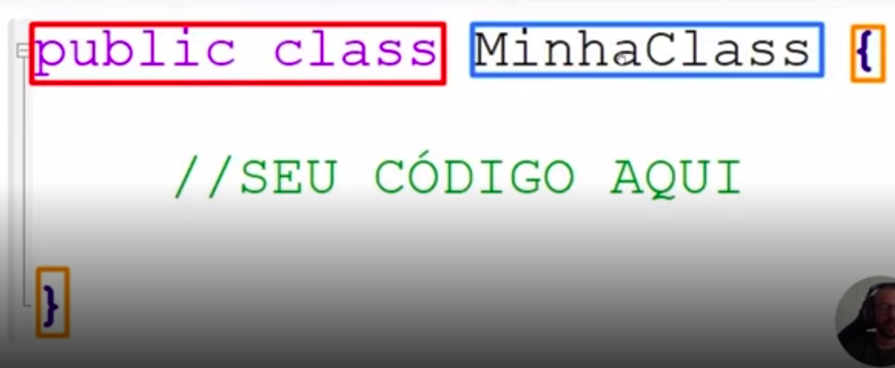

# Aprendendo a Sintaxe Java

## Índice

- [Aprendendo a Sintaxe Java](#aprendendo-a-sintaxe-java)
  - [Índice](#índice)
  - [Antes de começar](#antes-de-começar)
  - [Introdução](#introdução)
  - [Anatomia das Classes](#anatomia-das-classes)
    - [Anatomia das Classes - 1 (apresentação)](#anatomia-das-classes---1-apresentação)
    - [Anatomia das Classes - 2 (nomenclatura)](#anatomia-das-classes---2-nomenclatura)
    - [Anatomia das Classes - 3 (variáveis)](#anatomia-das-classes---3-variáveis)
    - [Anatomia das Classes - 4 (indentação)](#anatomia-das-classes---4-indentação)
    - [Anatomia das Classes - 5 (packages)](#anatomia-das-classes---5-packages)
    - [Anatomia das Classes - 6 (Java Beans)](#anatomia-das-classes---6-java-beans)
  - [Tipos e Variáveis](#tipos-e-variáveis)
    - [Tipos e Variáveis - 1 (apresentação)](#tipos-e-variáveis---1-apresentação)
    - [Tipos e Variáveis - 2 (preparando o ambiente)](#tipos-e-variáveis---2-preparando-o-ambiente)
    - [Tipos e Variáveis - 3 (tipos, comportamento e atribuição)](#tipos-e-variáveis---3-tipos-comportamento-e-atribuição)
    - [Tipos e Variáveis - 4 (constantes)](#tipos-e-variáveis---4-constantes)
  - [Operadores](#operadores)
    - [Operadores - 1 (apresentação)](#operadores---1-apresentação)
    - [Operadores - 2 (de atribuição e aritméticos)](#operadores---2-de-atribuição-e-aritméticos)
    - [Operadores - 3 (unários)](#operadores---3-unários)
    - [Operadores - 4 (incremento e decremento)](#operadores---4-incremento-e-decremento)
    - [Operadores - 5 (operador ternário)](#operadores---5-operador-ternário)
    - [Operadores - 6 (relacionais)](#operadores---6-relacionais)
    - [Operadores - 7 (lógicos)](#operadores---7-lógicos)
  - [Métodos](#métodos)
    - [Métodos - 1 (apresentação)](#métodos---1-apresentação)
    - [Métodos - 2 (boas práticas)](#métodos---2-boas-práticas)
    - [Métodos - 3 (exercícios práticos)](#métodos---3-exercícios-práticos)
  - [Escopo](#escopo)
    - [Escopo - 1 (apresentação)](#escopo---1-apresentação)
    - [Escopo - 2 (explicação e exemplo)](#escopo---2-explicação-e-exemplo)
  - [Palavras reservadas](#palavras-reservadas)
    - [Palavras reservadas - 1 (apresentação)](#palavras-reservadas---1-apresentação)
    - [Palavras reservadas - 2 (explicação)](#palavras-reservadas---2-explicação)
  - [Java Doc](#java-doc)
    - [Java Doc - 1 (apresentação)](#java-doc---1-apresentação)
    - [Java Doc - 2 (exemplos)](#java-doc---2-exemplos)
  - [Terminal e Argumentos](#terminal-e-argumentos)
    - [Terminal e Argumentos - 1 (apresentação)](#terminal-e-argumentos---1-apresentação)
    - [Terminal e Argumentos - 2 (executando)](#terminal-e-argumentos---2-executando)
    - [Terminal e Argumentos - 3 (argumentos)](#terminal-e-argumentos---3-argumentos)
    - [Terminal e Argumentos - 4 (configurações launch)](#terminal-e-argumentos---4-configurações-launch)
    - [Terminal e Argumentos - 5 (scanner)](#terminal-e-argumentos---5-scanner)
  - [Links, materiais e referências](#links-materiais-e-referências)

## Antes de começar

- [x]  Criar pasta referente ao curso
- [x]  Adicionar link da pasta nos atributos do curso
- [x]  Adicionar arquivos e links adicionais ao repositório (pdf, pptx, etc)

## Introdução

Nessa etapa vamos falar da Sintaxe Java.

Vamos conhecer regras, estruturas e aprender a analisar códigos Java.

- Objetivo do curso

    É apresentar as regras para construção de códigos em Java.

- Pré-requisitos
  - JDK instalado
  - IDE escolhida
  - Diretório do projeto definido

Nos primeiros momentos vamos falar de anatomia da classe, sendo a estrutura dela.

Vamos entender a estrutura de indentação, chaves e encadeamento.

- Assuntos abordados
  - Estrutura inicial
  - Padrão de nomenclatura
  - Declarar variáveis e métodos
  - Indentação
  - Organizar arquivos
  - Java Beans

Todo o conteúdo apresentado nesse curso está disponível no GitBook do professor e pode ser acessado [nesse link](https://glysns.gitbook.io/java-basico/)

## Anatomia das Classes

### Anatomia das Classes - 1 (apresentação)

> Uma classe bem estruturada não quer guerra com ninguém
>

Essa frase representa bem a importância de ter classes bem estruturadas e definidas.

A escrita de códigos são feitos a partir de palavras pré-definidas que determinam o nome dos arquivos, classes, atributos e métodos.

A maior parte das palavras pré-definidas possui o padrão de ser na língua inglesa.

No Java, boa parte das classes começarão com:



Vamos criar uma classe inicial para entender a estrutura.

Para isso podemos criar um projeto novo no VSCode via paleta de comandos passando o nome do projeto como `anatomia_das_classes`

Dessa forma o projeto será criado:


Todo código ficará dentro da pasta `src` , nesse caso o VSCode traz uma classe pré-definida, mas podemos apagar e adicionar uma classe nossa chamada `[MinhaClasse.java](http://MinhaClasse.java)` .

Repare que a primeira letra de cada palavra é maiúscula, o que é uma convenção em java.


Dentro da classe criada podemos escrever diversas coisas.

No caso da classe ser executável, ou seja, se ela realizar a inicialização do código, precisamos adicionar um método chamado `main`.

Dessa forma o código fica:

- MinhaClasse.java

    ```java
    public class MinhaClasse {
      public static void main(String[] args) {
    
      }
    }
    ```

Tudo que formos criar ficará dentro do método `main`. Todas as funções, variáveis, etc…

Para imprimir uma mensagem de exemplo podemos usar um método do `System` que é o `out`(abreviação de output) e passar o `print` como método também.

Dessa forma:

```java
public class MinhaClasse {
  public static void main(String[] args) {
    System.out.print("Olá mundo!");
  }
}
```

O que aprendemos até aqui:

- Todas as classes precisam estar dentro da pasta `src`
- Todas as classes devem respeitar o padrão de nomenclatura em maiúscula para cada palavra
- Dentro do bloco geral de código da classe podemos criar uma estrutura de métodos para uso

### Anatomia das Classes - 2 (nomenclatura)

Agora que entendemos um pouco da estrutura de classes vamos avançar um pouco para entender a estrutura de escrita, valores e etc.

Quando se trata de código em Java é de suma importância respeitar as convenções de nomenclatura:

- Arquivo `.java`

    Todo arquivo Java deve começar com letra maiúscula e palavras compostas também.

    Exemplo: `[Calculadora.java](http://Calculadora.java)` e `CalculadoraCientifica.java`

- Nome da classe no arquivo .java

    O nome da classe deve ser exatamente igual ao nome do arquivo .java

    Exemplo:

    

- Variáveis
  - Nomenclatura camelCase

        Toda variável deve ser em escrita em minúsculo.

        No caso de nome composto, a primeira letra da segunda palavra deve ser maiúscula e assim por diante. O nome dessa prática é `camelCase`

        Exemplo:

        `varivavel`

        `minhaVariavel`

        `minhaTerceiraVariavel`

  - Maiúscula e snakeCase

        Existe uma regra adicional que variáveis com todas as letras maiúsculas não podem ter seus valores alterados depois de inicializadas. O programador deve presumir que variáveis com todas as letras maiúsculas são do tipo `final` e não podem ter os valores reatribuidos.

        Variáveis desse tipo recebem outra estrutura de nomenclatura, a `snake_case` , pois ter as palavras separadas por underline.

        Exemplo:

        ```java
        String BR = "Brasil"
        double PI = 3.14
        int ESTADOS_BRASILEIRO = 27
        int ANO_2000 = 2000
        ```

  - Para declarar variáveis (nomes válidos)
    - Deve conter apenas letras, _ (underline), $ ou os números de 0 a 9;
    - Deve obrigatoriamente se iniciar por uma letra (preferencialmente), _ ou $, jamais com número;
    - Deve iniciar com uma letra minúscula (boa prática – ver abaixo);
    - Não pode conter espaços;
    - Não podemos usar palavras-chave da linguagem;
    - O nome deve ser único dentro de um escopo.

        Exemplo errado:

        ```java
        // Declação inválida de variáveis
        
        int numero&um = 1; //Os únicos símbolos permitidos são _ e $
        int 1numero = 1;    //Uma variável não pode começar com númerico
        int numero um = 1; //Não pode ter espaço no nome da variável
        int long = 1; //long faz parte das palavras reservadas da linguagem
         
         // Declaração válida de veriáveis
        int numero$um = 1;
        int numero1 = 1;
        int numeroum = 1;
        int longo = 1;
        
        ```

### Anatomia das Classes - 3 (variáveis)

Quando estamos falando de variáveis elas `sempre` devem conter essa estrutura em sua declaração:

```java
// Estrutura

Tipo NomeBemDefinido = Atribuicao (opcional em alguns casos)

// Exemplo

int idade = 23;
double altura = 1.62;
Dog spike; //observe que aqui a variável spike não tem valor, é normal
```

Para declarar métodos em Java a estrutura é a seguinte:

```java
// Estrutura

TipoRetorno NomeObjetivoNoInfinitivo Parametro(s)

//Exemplo

int somar (int numeroUm, int numero2)

String formatarCep (long cep)
```

Abaixo um exemplo do nosso código:

```java
public class MinhaClasse {
  public static void main(String[] args) {
    // Chamando método para juntar nomes e atribuindo à variável nome
    String nome = nomeCompleto("Marlon", "Prado");

    // Imprimindo variável nome
    System.out.println(nome);
  }

  // Método para juntar nomes
  public static String nomeCompleto(String primeiroNome, String segundoNome) {
    return primeiroNome.concat(" ").concat(segundoNome);
  }
}
```

### Anatomia das Classes - 4 (indentação)

Agora vamos falar da `indentação`

A indentação ajuda a tabular o código para facilitar o entendimento e interpretação do código.

Lembrando que isso não muda o funcionamento do código, apenas nos ajuda a entender melhor o código.

Repare, por exemplo, os dois códigos abaixo e o quanto o segundo é muito mais fácil de interpretar:

- Código 1

    ```java
    // arquivo BoletimEstudantil.java
    
    public class BoletimEstudantil {
    public static void main(String[] args) {
    int mediaFinal = 6;
    if(mediaFinal<6) 
    System.out.println("REPROVADO"); 
    else if(mediaFinal==6)
    System.out.println("PROVA MINERVA"); 
    else
    System.out.println("APROVADO");   
    }
    }
    ```

- Código 2

    ```java
    public class BoletimEstudantil {
     public static void main(String[] args) {
      int mediaFinal = 6;
      if (mediaFinal < 6)
       System.out.println("REPROVADO");
      else if (mediaFinal == 6)
       System.out.println("PROVA MINERVA");
      else
       System.out.println("APROVADO");
     }
    }
    ```

### Anatomia das Classes - 5 (packages)

Agora vamos falar da `organização de arquivos .java`

Com o aumento da complexidade do projeto e criação de diversos arquivos `.java` podemos precisar agrupar os arquivos de uma forma lógica e estruturada.

Uma convenção na organização de arquivos `.java` é seguir uma estrutura parecida com:


Pensando em uma empresa, ela pode possuir diversos seguimentos, como o governamental, comercial, etc… Sendo assim, os pacotes em Java buscam seguir esse padrão já existente no mundo.

Por exemplo, se temos uma empresa chamada `HyperTech` o pacote principal pode se chamar `com.hypertech` e esse pacote pode ter subpacotes com funcionalidades diferentes, como um sistema de consulta de ceps, aí seria `com.hypertech.adress`

Por exemplo, se quisermos criar um projeto java para armazenar nossos estudos e cursos, podemos agrupar por `edu.estudos.tema` onde cada tema seria um tema de estudos.

Podemos testar isso no VSCode ao criar uma estrutura de pastas dentro do `src` e mover nossa classe para última pasta que representará o pacote:


Mas dessa forma a classe aponta um erro, pois não informamos que essa classe se encontra no pacote.

Toda classe precisa ter em sua primeira linha a informação de qual pacote ela se encontra:


Dessa forma o código volta a funcionar.

### Anatomia das Classes - 6 (Java Beans)

Agora vamos falar de `Java Beans` que é uma iniciativa da comunidade para melhorar a estruturação conceitual da escrita.

A partir de agora os códigos precisam ser escritos da forma mais legível possível. Para isso, Java sugere formas de escrita universal para nossas classes, atributos, métodos e pacotes.

 Abaixo algumas definições sobre **variáveis:**

- Uma variável deve ser clara, sem abreviações ou definições sem sentido
- Uma variável é sempre no singular, **exceto quando se referir a um array ou coleção**
- Defina um idioma **********único********** para as variáveis. Se for em inglês, todas devem estar em inglês, em português e espanhol a mesma coisa

Exemplo de variáveis não recomendadas:

```java
double salMedio = 1500.23  //variável abreviada, o que dificulta a compreensão
String emails = "aluno@escola.com" //confuso se a variável seria um array ou único e-mail
String myName = "JOSEPH" //se idioma pt-BR, o valor poder ser de outro idioma mas o nome da variável não
```

Exemplo de variáveis corrigidas:

```java
double salarioMedio=1500.23;
String email ="aluno@escola.com";
String [] emails = {"aluno@escola.com","professor@escola.com"}
String meuNome = "JOSEPH"
```

Abaixo as definições para **métodos:**

- Métodos devem ser nomeados como verbos com uma mistura de letras minúsculas e maiúsculas, onde a primeira letra a partir da segunda palavra deve ser maiúscula
- Sempre escritos com verbos no infinitivo
- Sempre executar apenas uma ação (apenas um verbo representando-o)

Exemplos :

```java
somar(int n1, int n2){}

abrirConexao(){}

concluirProcessamento() {}

findById(int id){} // não se assuste, você verá muito método em inglês em sua jornada

calcularImprimir(){} // há algo de errado neste método, ele deveria ter uma única finalidade
```

## Tipos e Variáveis

### Tipos e Variáveis - 1 (apresentação)

Durante esse etapa vamos abordar a sintaxe mais voltada aos tipos de dados dentro de Java.

Vamos falar de tipos inteiros, numéricos decimais, lógicos, caracteres.

Também vamos explicar as diferenças entre variáveis e constantes durante a execução.

- Os pré requisitos são
  - JDK instalado
  - IDE escolhida
  - Diretório do projeto definido
  - Integração com o GitHub para manter o código em backup
- Os assuntos serão
  - Tipos numéricos inteiros e decimais
  - Tipos lógicos
  - Caracteres
  - Objetos
  - Diferença entre variável e constante

### Tipos e Variáveis - 2 (preparando o ambiente)

Para manter o projeto sincronizado com o GitHub precisamos criar um repositório no GitHub com uma nomenclatura fácil de identificar.

No meu caso, estou mantendo todos os cursos do Bootcamp dentro de uma pasta maior, então vou seguir usando assim:


Mas se formos criar um repositório, precisaríamos copiar o código do repositório e no VSCode usar a paleta de comandos pesquisando `git clonar` e selecionar / colar o repositório.

Dessa forma teremos o VSCode clonando o repositório e a partir daí poderemos dar início.

Poderíamos estruturar o curso a nível de pacotes ou a nível de projetos, eu optei por estruturar em vários projetos separados.

Nesse caso vamos criar um projeto chamado `tipos_e_variaveis` via paleta de comandos para criar um projeto java.

### Tipos e Variáveis - 3 (tipos, comportamento e atribuição)

Agora que temos o ambiente preparado vamos falar dos tipos de dados em Java.

No Java existem palavras reservadas para cada tipo de dado e existem 8 tipos, sendo eles:

int, byte, short, long, float, double, boolean e char

Esses tipos não são considerados objetos e portanto representam valores brutos. Eles são armazenados diretamente na pilha de memória. (Memory stack).

Abaixo uma tabela que resume cada tipo primitivo numérico:


Por mais que existam 4 tipos numéricos de tamanhos diversos, a maioria das vezes usamos o `int` por uma questão de compatibilidade da JVM. Geralmente a JVM converte os `bytes` e `shorts` para `int`na hora de interpretar, então por isso acabamos usando ela.

> Atualmente, com os computadores modernos, se tornou desnecessário utilizar os tipos `short` e `byte`, pois não precisamos nos preocupar tanto assim com o espaço de memória reduzido.
>

Quanto aos tipos primitivos que podem ser fracionados:


Assim como `int` para numéricos inteiros, geralmente usamos `double` nos projetos, por questão de precisão nos dados e número de casas decimais.

> Apesar de o tipo **float,** ocupar metade da memória consumida do que um tipo double, ele é menos utilizado. Ele sofre de uma limitação que compromete seu uso em determinadas situações: somente mantém uma precisão decimal entre 6 e 7 dígitos.
>

O ponto mais relevante é compreender a proposta da variável. Por exemplo, qual tipo de dados utilizar para determinar a idade de uma pessoa ou salário de um funcionário? Respectivamente, o mais comum seria usar `int` e `double` para estes valores.

**Para a declaração de variáveis:**

Para declarar variáveis precisamos seguir a estrutura de: tipo - nome atribuitos - valor armazenado.

```java
int idade; //Tipo "int", nome "idade", com nenhum valor atribuído.
int anoFabricacao = 2021; //tipo "int", nome "anoFabricacao", com valor 2021.
double salarioMinimo = 2.500; //tipo "double", nome "salarioMinimo", valor 2.500.
```

Cada tipo de variável possui um valor padrão quando não atribuímos nada a ela, no caso de `int` o valor é zero.

Outro ponto de atenção é que em Java separamos casas decimais por `.` e não utilizamos virgula, por exemplo, para um salário de 2500,50 utilizaríamos `double`  e passaríamos o valor como `2500.50` .

Existem alguns pontos de atenção ao trabalhar com alguns tipos de variável, por exemplo:

```java
public class TipoDados {
 public static void main(String[] args) {
  byte idade = 123;
  short ano = 2021;
  int cep = 21070333; // se começar com zero, talvez tenha que ser outro tipo
  long cpf = 98765432109L; // se começar com zero, talvez tenha que ser outro tipo
  float pi = 3.14F;
  double salario = 1275.33;
 }
}
```

 No exemplo acima temos o cep e cpf sendo de tipo `int`  e `long` respectivamente, mas se essas informações começarem com o número 0, elas não vão reconhecer esse número. Talvez seja melhor usar `string` nesses casos.

Outro ponto importante é que ao usar o tipo `float` precisamos colocar um `f` ao final do valor da variável, pois se não fizermos isso o programa pode interpretar a variável como `double` .

Da mesma forma precisamos colocar um `l` ao final de variáveis do tipo `long` para que ela não seja interpretada como `int`.

Temos que ter cuidado por Java ser `fortemente tipada` , ou seja, até conseguimos converter um tipo primitivo “menor” para um tipo primitivo “maior”, mas não conseguimos fazer o inverso.

Repare no código abaixo:

```java
// TiposEVariaveis.java

short numeroCurto = 1;
int numeroNormal = numeroCurto;
short numeroCurto2 = numeroNormal;
```

Se colocarmos isso no nosso código obtemos um aviso de erro:


As sugestões do VSCode:


Podemos fazer `casting` de variável, forçando um valor maior a caber em um menor, mas isso não é recomendável, pois em alguns momentos a variável pode ter mais informação e com isso pode se perder.

Para fazer casting seguimos essa lógica:


Colocamos antes do valor a ser atribuído o tipo de dado que queremos fazer casting (a conversão).

### Tipos e Variáveis - 4 (constantes)

Até o momento vimos o que são variáveis que permitem que seus valores sejam modificados, desde que o tipo atribuído a elas comportem as mudanças.

Mas em Java existe um suporte para `constantes` que são “variáveis” que os valores não mudam depois de declarados.

Para isso, declaramos elas como `final` e seu nome deve seguir o padrão `snake_case` com todas as letras em maiúsculo.

Exemplo:

```java
public class ExemploVariavel {
 public static void main(String[] args) {
  /*
   * esta linha é considerada como declaração de variável iniciamos a existência
   * variavel numero com valor 5 regra: tipo + nome + valor
   */
  int numero = 5;

  /*
   * na linha abaixo iremos alterar o valor do varíavel para 10 observe que o tipo
   * não é mais necessário, pois a variável já foi declarada anteriormente
   */
  numero = 10;

  System.out.print(numero);
  
  /*
   * ao usar a palavra reservada final, você determina que jamais
   * esta variavel poderá obter outro valor;
   * logo a linha 25 vai apresentar um erro de compilação
   * isso é considerado uma CONSTANTE na linguagem Java
   */
  final double VALOR_DE_PI = 3.14;
  
  VALOR_DE_PI=3.15; //Esta linha vai apresentar erro de compilação!
 }
}
```

> Compreendemos que, para declarar uma variável como uma constante, utilizamos a palavra `final`, mas por convenção, esta variável deverá ser escrita toda em caixa alta.
>

## Operadores

### Operadores - 1 (apresentação)

- Objetivo

    Este curso terá como objetivo apresentar os significado dos símbolos especiais de acordo com Java.

- Pré-requisitos
  - Diretório do projeto definido
  - Integração com GitHub
  - Noções em declaração de variáveis

- Assuntos
  - Operadores aritméticos
  - Operadores unários
  - Operadores relacionais
  - Operadores lógicos
  - Operador ternário

### Operadores - 2 (de atribuição e aritméticos)

> Operadores são símbolos especiais que tem um significado e função própria pra linguagem
>

Operadores servem para realizar operações que ao final da operação geram algum resultado.

Abaixo a lista de operadores em Java:

- **Operadores de atribuição**
  - São utilizados para sobre escrever ou atribuir o valor de uma variável;
  - Cada variável tem uma regra para receber seus valores.
  - Por exemplo

        ```java
        //classe Operadores.java
        // String precisa estar entre aspas
        String nome = "GLEYSON";
        
        // Int precisa ser numerico
        int idade = 22;
        
        // Double precisa estar com um .
        double peso = 68.5;
        
        // Char precisa estar entre aspas simples
        char sexo = 'M';
        
        // Boolean precisa ser true ou false
        boolean doadorOrgao = false;
        
        Date dataNascimento = new Date();
        ```

- **Operadores aritméticos**
  - Operadores aritméticos são utilizados para operações matemáticas, podendo ou não se tornar algo mais complexo;
  - Exemplo

        ```java
        //classe Operadores.java
        double soma = 10.5 + 15.7;
        int subtração = 113 - 25;
        int multiplicacao = 20 * 7;
        int divisao = 15 / 3;
        
        // Módulo representa o resto de uma divisão
        int modulo = 18 % 3;
        
        // Um mix de operadores
        double resultado = (10 * 7) + (20/4);
        ```

  - Observação: operador de + em string concatena

        > Um ponto importante: operadores de adição em strings resultam na concatenação e não na soma das variáveis
        >

    - Exemplo de concatenação

            ```java
            //classe Operadores.java
            String nomeCompleto = "LINGUAGEM" + "JAVA";
              
            //qual o resultado das expressoes abaixo?
            String concatenacao ="?"; 
            
            concatenacao = 1+1+1+"1";
            
            concatenacao = 1+"1"+1+1;
            
            concatenacao = 1+"1"+1+"1";
            
            concatenacao = "1"+1+1+1;
            
            concatenacao = "1"+(1+1+1);
            ```

### Operadores - 3 (unários)

Operadores unários são operadores aplicados junto de outro operador aritmético.

Eles servem para: incrementar, decrementar ou inverter valores numéricos e booleanos.

- Operador unário de valor positivo (+)

    Ele torna o valor positivo

- Operador unário de valor negativo (-)

    Nega um número ou expressão aritmética

- Operador unário de incremento de valor (++)

    Ele incrementa o valor em uma unidade

- Operador unário de decremento de valor (--)

    Decrementa o valor em uma unidade

- Operador unário lógico de negação (!)

    Nega uma expressão booleana, invertendo sua lógica

- Exemplo

    ```java
    public class Operadores {
    
      public static void main (String[] args){
    
        int numero = 5;
    
        // Número fica negativo na impressão
        System.out.println(- numero); 
    
        // Número volta ao seu valor original
        System.out.println(numero); 
    
        // Mudando o valor para o valor dele mesmo, negativo
        numero = - numero; 
        
        // Número passou a ser negativo definitivamente
        System.out.println(numero);
    
        // Isso não faz o número ficar positivo, pois esse símbolo significa soma
        numero = + numero;
        System.out.println(numero);
    
        // Para mudar o número para positivo, precisamos multiplicar por -1
    
        numero = numero * -1;
        System.out.println(numero);
      }
      
    }
    ```

### Operadores - 4 (incremento e decremento)

Incremento é a repetição de soma.

- Por exemplo

    ```java
    // Incremento
        int numero = 5; 
        System.out.println(numero); // 5
        numero++; //6
        System.out.println(numero); //6
    
        // Decremento
        System.out.println(numero); //6
        numero--; //5
        System.out.println(numero);//5
    ```

Podemos usar o simbolo de negação para inverter um boolean.

- Por exemplo

    ```java
    // Inversão / negação de boleano
        boolean boleana = true;
        System.out.println(boleana); // true
        System.out.println(!boleana); // false
    ```

### Operadores - 5 (operador ternário)

O operador ternário deve ser visto como uma operação de `if` onde toda a expressão fica em apenas uma linha.

- Por exemplo

    ```java
    //----------------------
        
        // Exemplo de operador ternário
        
        // Variáveis
        int a, b;
        a = 5;
        b = 6;
        String resultado = "";
    
        // Se o a for igual ao b
        if(a==b){
          resultado = "verdadeiro";
        }else{
          resultado = "falso";
        }
        // Resultado
        System.out.println(resultado);
    
        // Ao invés disso, podemos 
        resultado = a==b ? "verdadeiro" : "falso";
        System.out.println(resultado);
    ```

### Operadores - 6 (relacionais)

Eles avaliam relações e condições entre operações.

Para isso, sempre se refere do item da esquerda para a direita.

Os operadores incluem:

- `==` Quando desejamos verificar se uma variável é IGUAL A outra.
- `!=` Quando desejamos verificar se uma variável é DIFERENTE da outra.
- `>` Quando desejamos verificar se uma variável é MAIOR QUE a outra.
- `>=` Quando desejamos verificar se uma variável é MAIOR OU IGUAL a outra.
- `<` Quando desejamos verificar se uma variável é MENOR QUE outra.
- `<=` Quando desejamos verificar se uma variável é MENOR OU IGUAL a outra.

- Exemplo

    ```java
    // ---------------------------
    
        // Operadores de comparação
    
        int numero1 = 1;
        int numero2 = 2;
    
        // Igual
        boolean simNao = numero1 == numero2;
    
        System.out.println("Os números são iguais? " + simNao); // false
    
        // Maior ou igual
        simNao = numero1 >= numero2;
    
        System.out.println("Os números são iguais? " + simNao); // false
    
        // Menor ou igual
        simNao = numero1 <= numero2;
    
        System.out.println("Os números são iguais? " + simNao); // true
    
        // Diferente
        simNao = numero1 != numero2;
    
        System.out.println("Os números são iguais? " + simNao); // true
    ```

No caso de valores numéricos funciona perfeitamente, mas é importante notar que também podemos comparar textos:

- Exemplo

    ```java
    // Comparação de string
    
        String nome1 = "Marlon";
        String nome2 = "Marlon";
    
        System.out.println(nome1 == nome2);
    ```

No caso de objetos utilizamos o método `.equals` .

- Exemplo

    ```java
    // Comparação de objeto
        
        String nome3 = new String("Marlon");
        System.out.println(nome1 == nome3); // false
        System.out.println(nome1.equals(nome3)); // true
    ```

### Operadores - 7 (lógicos)

Operadores lógicos permitem que a gente crie expressões lógicas maiores com o uso da tabela verdade.

Eles incluem

- `&&` Operador Lógico "E"
- `||` Operador Lógico "OU"

- Por exemplo

    ```java
    // Exemplo de operadores lógicos
    
        boolean condicao1 = true;
        boolean condicao2 = false;
    
        // Comparando se as duas condições são verdadeiras
    
        // Retorna falso, pois as duas precisam ser verdadeiras
        if(condicao1 && condicao2){
          System.out.println(true);
        }else{
          System.out.println(false);
        }
    
        // Retorna true, pois as apenas uma precisa ser verdadeira
        if(condicao1 || condicao2){
          System.out.println(true);
        }else{
          System.out.println(false);
        }
    ```

## Métodos

### Métodos - 1 (apresentação)

Durante essa etapa vamos entender sobre os métodos em Java.

- Objetivo

    Apresentar critérios para criação de métodos, parâmetros e visibilidade

- Pré-requisitos
  - Diretório bem definido para projeto
  - Integração com o GitHub
  - IDE configurada para Java

- Assuntos abordados
  - Qual a proposta principal de um método?
  - Quais retornos esperados após execução de um método?
  - Quais parâmetros necessários para execução de um método?
  - O método possui o risco de apresentar alguma exceção?
  - Qual a visibilidade do método?

### Métodos - 2 (boas práticas)

Uma classe é definida por atributos e métodos.

Os atributos são variáveis que consistem em diferentes tipos e valores.

Enquanto os métodos correspondem a funções e sub-rotinas da classe.

Sendo assim, abaixo alguns pontos necessários de ser entendidos sobre os métodos:

- Critérios de nomeação
  - Deve ser nomeado como verbo
  - Seguir o padrão camelCase
  - Exemplo

        ```java
        somar(int n1, int n2){}
        
        abrirConexao(){}
        
        concluirProcessamento() {}
        
        findById(int id){} // não se assuste, você verá muito método em inglês em sua jornada
        
        calcularImprimir(){} // há algo de errado neste método, ele deveria ter uma única finalidade
        ```

- Critérios de definição de métodos

    Antes de se criar um método em Java é necessário se fazer as seguintes perguntas:

  - Qual a proposta principal do método? Deve se perguntar constantemente até compreender a finalidade real do método.
  - Qual tipo de retorno esperado do método? Você deve analisar se o método será responsável por retornar algum valor ou não.

Outros aspectos importantes são:

- **Quais os parâmetros serão necessários para execução do método?**
  - Os métodos às vezes precisarão de argumentos como critérios para a execução.
- **O método possui o risco de apresentar alguma exceção?**
  - Exceções são comuns na execução de métodos, as vezes é necessário prever e tratar a possível existência de uma exceção.
- **Qual a visibilidade do método?**
  - Avaliar se será necessário que o método seja visível a toda aplicação, somente em pacotes, através de herança ou somente a nível a própria classe.

- Exemplo

    ```java
    public class MyClass {
     
     public double somar(int num1, int num2){
      //LOGICA - FINALIDADE DO MÉTODO
      return ... ;
     }
     
     public void imprimir(String texto){
      //LOGICA - FINALIDADE DO MÉTODO
      //AQUI NÃO PRECISA DO RETURN
      //POIS NÃO SERÁ RETORNADO NENHUM RESULTADO
     }
     // throws Exception : indica que o método ao ser utilizado
     // poderá gerar uma exceção
     public double dividir(int dividendo, int divisor) throws Exception{}
     
     // este método não pode ser visto por outras classes no projeto
     private void metodoPrivado(){}
     
     //alguns equívocos estruturais
     public void validar(){
      //este método deveria retornar algum valor
      //no caso boolean (true ou false)
     }
     public void calcularEnviar(){
      //um método deve representar uma única responsabilidade
     }
     public void gravarCliente(String nome, String cpf, Integer telefone, ....){
      //este método tem a finalidade de gravar
      //informações de um cliente, por que não criar
      //um objeto cliente e passar como parâmetro ?
      //veja abaixo
     }
     public void gravarCliente(Cliente cliente){}
     //ou
     public void gravar(Cliente cliente){}
    }
    ```

### Métodos - 3 (exercícios práticos)

Vamos criar um exemplo de uma classe para representar uma SmartTV onde:

1. Ela tenha as características: ligada (boolean), canal (int) e volume (int);
2. Nossa TV poderá ligar e desligar e assim mudar o estado ligada;
3. Nossa TV aumentará e diminuirá o volume sempre em +1 ou -1;
4. Nossa TV poderá mudar de canal de 1 em 1 ou definindo o número correspondente.

Para esse desafio, nós precisamos criar um novo projeto Java no VSCode.

No projeto adicionamos 2 classes, uma chamada `Usuario` e outra `SmartTv`

A usuário representa a interação do Usuário e a SmartTV representa os atributos e funções que uma TV possui.

Dessa forma, os arquivos ficam:

- SmartTv

    ```java
    public class SmartTv {
    
      // Declarando propriedades
      boolean ligada = false;
      int canal = 10;
      int volume = 25;
    
      // Métodos
      public void ligar(){
        ligada = true;
      }
    
      public void desligar(){
        ligada = false;
      }
    
      public void aumentarVolume(){
        volume++;
      }
    
      public void diminuirVolume(){
        volume--;
      }
    
      public void aumentarCanal(){
        canal--;
      }
    
      public void diminuirCanal(){
        canal--;
      }
    
      public void mudarCanal (int novoCanal){
        canal = novoCanal;
      }
    }
    ```

- Usuario

    ```java
    public class Usuario {
      public static void main(String[] args) {
    
        // Criando nova smarttv
        SmartTv smartTv = new SmartTv();
    
        System.out.println("A TV está ligada? " + smartTv.ligada);
        System.out.println("Qual canal atual? " + smartTv.canal);
        System.out.println("Qual volume atual? " + smartTv.volume);
    
        // -----------------------------------
    
        smartTv.ligar();
    
        System.out.println("TV ligada (depois de ligar)? " + smartTv.ligada);
    
        // ----------------------------------
    
        smartTv.aumentarVolume();
        smartTv.aumentarVolume();
        smartTv.aumentarVolume();
    
        System.out.println("Novo volume (mais alto): " + smartTv.volume);
    
        // -------------------------------------
    
        smartTv.diminuirVolume();
        smartTv.diminuirVolume();
        smartTv.diminuirVolume();
        smartTv.diminuirVolume();
        smartTv.diminuirVolume();
    
        System.out.println("Novo volume (mais baixo): " + smartTv.volume);
    
        // ------------------------------------
    
        smartTv.aumentarCanal();
        smartTv.aumentarCanal();
    
        System.out.println("Canal aumentado para: " + smartTv.canal);
    
        // -----------------------------
    
        smartTv.diminuirCanal();
        smartTv.diminuirCanal();
        smartTv.diminuirCanal();
        smartTv.diminuirCanal();
    
        System.out.println("Canal diminuido para: " + smartTv.canal);
    
        // ------------------------
    
        smartTv.mudarCanal(50);
        System.out.println("Canal mudado para: " + smartTv.canal);
    
      }
    }
    ```

## Escopo

### Escopo - 1 (apresentação)

- Objetivo

    Identificar a localização mais conveniente para escrita de algorítmos

- Pré-requisitos
  - Diretório de projeto definido
  - Sincronia com GitHub
  - IDE configurada

- Assuntos abordados
  - Escopo de classe
  - Escopo de método
  - Escopo de fluxo

### Escopo - 2 (explicação e exemplo)

Escopo é o ambiente em que uma variável pode ser acessada.

Precisamos saber onde declarar as variáveis para poder utiliza-las de acordo. Em uma classe podemos declarar as diferenças de escopos. Por exemplo, os atributos são declarados no corpo da classe.

Se criarmos variáveis dentro de um método elas só poderão ser utilizadas dentro do escopo desse método.

- Exemplo

    ```java
    public class Conta {
     //variavel da classe conta
     double saldo=10.0;
     
     public void sacar(Double valor) {
      //variavel local de método
      double novoSaldo = saldo - valor;
     }
     public void imprimirSaldo(){
      //disponível em toda classe
      System.out.println(saldo);
      //somente o método sacar conhece esta variavel
      System.out.println(novoSaldo);
     
     }
     public double calcularDividaExponencial(){
      //variável local de método
      double valorParcela = 50.0;
      double valorMontante = 0.0; // começando a variável com valor zero
      for(int x=1; x<=5; x++) {//x variável de escopo de fluxo
       //esta variável será reiniciada a cada execução for
       double valorCalculado = valorParcela * x;
       valorMontante = valorMontante + valorCalculado;
      }
      //escopo de fluxo
      //x e valorCalculado nunca estarão disponíveis fora do for
      
      return valorMontante;
     }
    }
    ```

## Palavras reservadas

### Palavras reservadas - 1 (apresentação)

- Objetivos

    O objetivo é apresentar as 52 palavras reservadas organizadas por classificação de usabilidade e considerando as regras da linguag

- Pré-requisitos
  - Integração com GitHub
  - Diretório de projeto definido
  - IDE configurada

- Assuntos abordados
  - Tipos primitivos
  - Classificações
  - Escopo de uso
  - Palavras “opostas”

### Palavras reservadas - 2 (explicação)

Palavras reservadas são identificadores de uma linguagem que não podem ser reutilizadas em nomes de variáveis, métodos, classes e atributos.

Java possui 52 palavras reservadas e abaixo elas estarão agrupadas por finalidade.


- **Controles de pacotes**

    **import:** importa pacotes ou classes para dentro do código;

    **package:** especifica a que pacote, todas as classes de um arquivo pertencem.

- **Modificadores de acesso**

    **public:** acesso de qualquer classe;

    **private:** acesso apenas dentro da classe;

    **protected:** acesso por classes no mesmo pacote e subclasses.

- **Tipos primitivos**
  - **boolean:** um valor indicando verdadeiro ou falso;
  - **byte:** um inteiro de 8 bits (signed);
  - **char:** um character unicode (16-bit unsigned);
  - **double:** um número de ponto flutuante de 64 bits (signed);
  - **float:** um número de ponto flutuante de 32 bits (signed);
  - **int:** um inteiro de 32 bits (signed);
  - **long:** um inteiro de 64 bits (signed);
  - **short:** um inteiro de 32 bits (signed);
  - **void:** indica que o método não tem retorno **de valor.**
- **Modificadores de classes, variáveis ou métodos**
  - **abstract:** classe que não pode ser instanciada ou método que precisa ser implementado, por uma subclasse não abstrata;**class:** especifica uma classe;
  - **extends:** indica a superclasse que a subclasse está estendendo;
  - **implements:** indica as interfaces que uma classe irá implementar;
  - **final:** impossibilita que uma classe seja estendida, que um método seja sobrescrito ou que uma variável seja reinicializada;
  - **interface:** especifica uma interface;
  - **native:** indica que um método está escrito em uma linguagem dependente de plataforma, como o C;
  - **new:** instancia um novo objeto, chamando seu construtor;
  - **static:** faz um método ou variável pertencer à classe ao invés de às instâncias;
  - **strictfp:** usado em frente a um método ou classe para indicar que os números de ponto flutuante seguirão as regras de ponto flutuante, em todas as expressões;
  - **synchronized:** indica que um método só pode ser acessado por uma thread de cada vez
  - **transient:** impede a serialização de campos;
  - **volatile:** indica que uma variável pode ser alterada durante o uso de threads.;
- **Controle de fluxo dentro de um bloco de código**
  - **break:** sai do bloco de código em que ele está;
  - **case:** executa um bloco de código dependendo do teste do switch;
  - **continue:** pula a execução do código que viria, após essa linha e vai para a próxima passagem do loop;
  - **default:** executa esse bloco de código caso nenhum dos teste de switch-case seja verdadeiro;
  - **do:** executa um bloco de código uma vez, e então realiza um teste em conjunto com o while para determinar se o bloco deverá ser executado novamente;
  - **else:** executa um bloco de código alternativo caso o teste "**if**" seja falso;
  - **for:** usado para realizar um loop condicional de um bloco de código;
  - **if:** usado para realizar um teste lógico de verdadeiro ou falso;
  - **instanceof:** determina se um objeto é uma instância de determinada classe, superclasse ou interface;**return:** retorna um método sem executar qualquer código, que venha depois desta linha (também pode retornar uma variável);
  - **switch:** indica a variável a ser comparada nas expressões case;
  - **while:** executa um bloco de código repetidamente enquanto a condição for verdadeira.
- **Tratamento de erros**
  - **assert:** testa uma expressão condicional, para verificar uma suposição do programador;
  - **catch:** declara o bloco de código usado para tratar uma exceção;
  - **finally:** bloco de código, após um try-catch, que é executado independentemente do fluxo de programa seguido ao lidar com uma exceção;
  - **throw:** usado para passar uma exceção para o método que o chamou;
  - **throws:** indica que um método pode passar uma exceção para o método que o chamou;
  - **try:** bloco de código que tentará ser executado, mas que pode causar uma exceção.
- **Variáveis de referência**

    **super:** refere-se a superclasse imediata;

    **this:** refere-se a instância atual do objeto.

- **Palavras reservadas não utilizadas**

    **const:** Não utilize para declarar constantes; use public static final;

    **goto:** não implementada na linguagem Java, por ser considerada prejudicial.

- **Literais reservados**

    De acordo com a Java Language Specification, **null**, **true** e **false** são tecnicamente chamados de valores literais, e não keywords. Se você tentar criar algum identificador com estes valores, você também terá um erro de compilação.

- Exemplos de usos incluem

    

- Exemplos de palavras opostas

    

## Java Doc

### Java Doc - 1 (apresentação)

- Objetivo

    Apresentar a ferramenta de documentação da linguagem e explorar como inserir comentários nos arquivos

- Assuntos
  - Documentação Oficial
  - Tags
  - Tipos de documentos
  - Java Docs

### Java Doc - 2 (exemplos)

Uma diferença da linguagem em relação a outras é que desde as primeiras versões Java já possuía uma documentação rica.

Por exemplo, a documentação da classe String é rica em detalhes, com todos os métodos, atributos e recursos que essa classe fornece.

Um exercício essencial é ler as documentações da linguagem.

 Podemos criar Tags que representam dados relevantes para a compreensão das classes.

- Tags de exemplo

    

- Classe de exemplo

    ```java
    /**
    * <h1>Calculadora</h1>
    * A Calculadora realiza operações matemáticas entre números inteiros
    * <p>
    * <b>Note:</b> Leia atentamente a documentação desta classes
    * para desfrutar dos recursos oferecidos pelo autor
    *
    * @author  Gleyson Sampaio
    * @version 1.0
    * @since   01/01/2022
    */
    public class Calculadora {
        /**
       * Este método é utilizado para somar dois números inteiros
       * @param numeroUm este é o primeiro parâmetro do método
       * @param numeroDois este é o segundo parâmetro do método
       * @return int o resultado deste método é a soma dos dois números.
       */
        public int somar(int numeroUm, int numeroDois) {
            return  numeroUm + numeroDois;
        }
    }
    ```

No código de exemplo acima a documentação pode ser vista quando deixamos o mouse encima da classe ou do método que utiliza os atributos documentados.

Dessa forma, o código fornece um resumo das informações.

Existem 3 tipos de comentários:

- Comentário de uma linha

    ```java
    // Olá, eu sou um comentário em uma única linha
    ```

- Comentário de várias linhas

    ```java
    /* Olá,
     * Eu sou um comentario
     * que posso ser mais detalhadod
     * quando necessário
     */
    ```

- Documentação

    ```java
    /** 
     * Estas duas estrelinhas acima
     * é para identificar que você
     * pretende elaborar um comentário
     * a nível de documentação.
     * Que incrível !!!
     */
    ```

Por fim, existe um recurso de Java Doc.

Conseguimos gerar a documentação do Java via linha de comando no terminal:

- Exemplo

    ```java
    // No terminal execute o comando abaixo
    
    javadoc -encoding UTF-8 -docencoding ISO-8859-1  -d ../docs  src/*.java
    ```

Ao executar o comando acima o Java fornece uma documentação completa do projeto.

## Terminal e Argumentos

### Terminal e Argumentos - 1 (apresentação)

- Objetivo

    Vamos explorar as opções de entrada e saídas de dados de uma aplicação Java.

- Assuntos abordados
  - main args
  - Scanner
  - Execução via IDE
  - Execução via prompt

### Terminal e Argumentos - 2 (executando)

Com a JVM devidamente configurada nós podemos gerar um executável para que usuários consigam executar nosso programa.

Para isso, podemos pegar um código de exemplo.

- Projeto

    ```java
    public class MinhaClasse {
        public static void main(String[] args) {
            System.out.println("Oi, fui executado pelo Terminal");
        }
    }
    ```

Para executar esse projeto a gente pode acessar esse diretório via terminal e apenas colocar um `java MinhaClasse` para executar (sem o .java do arquivo).

No caso, não conseguimos, deu erro de compilador. Vamos ver o que houve na próxima aula.

### Terminal e Argumentos - 3 (argumentos)

Quando executamos um método main, podemos passar vários argumentos do tipo String (um array) que podem ser trabalhados em outros métodos da classe.

- Código de exemplo

    ```java
    public class AboutMe {
      public static void main(String[] args) {
        // os argumentos começam com indice 0
        String nome = args[0];
        String sobrenome = args[1];
        int idade = Integer.valueOf(args[2]); // vamos falar sobre Wrappers
        double altura = Double.valueOf(args[3]);
    
        System.out.println("Ola, me chamo " + nome + " " + sobrenome);
        System.out.println("Tenho " + idade + " anos ");
        System.out.println("Minha altura é " + altura + "cm ");
      }
    }
    ```

- Resultado

    

### Terminal e Argumentos - 4 (configurações launch)

A IDE permite realizar algumas configurações para poupar tempo de execução do projeto.

No caso do VSCode é necessário estar com ele aberto dentro do projeto Java e ir na aba de “Executar” do VSCode para adicionar uma configuração.

- Exemplo

    

Dessa forma será adicionado um arquivo chamado `launch.config` na pasta vscode do projeto.

- Arquivo

    ```json
    {
      // Use o IntelliSense para saber mais sobre os atributos possíveis.
      // Focalizar para exibir as descrições dos atributos existentes.
      // Para obter mais informações, acesse: https://go.microsoft.com/fwlink/?linkid=830387
      "version": "0.2.0",
      "configurations": [
        {
          "type": "java",
          "name": "Current File",
          "request": "launch",
          "mainClass": "${file}"
        },
        {
          "type": "java",
          "name": "AboutMe",
          "request": "launch",
          "mainClass": "AboutMe",
          "projectName": "terminal_e_argumentos_9f477f9e"
        },
        {
          "type": "java",
          "name": "MinhaClasse",
          "request": "launch",
          "mainClass": "MinhaClasse",
          "projectName": "terminal_e_argumentos_9f477f9e"
        }
      ]
    }
    ```

Podemos adicionar os argumentos do arquivo AboutMe no launch:

- Resultado

    ```json
    {
      // Use o IntelliSense para saber mais sobre os atributos possíveis.
      // Focalizar para exibir as descrições dos atributos existentes.
      // Para obter mais informações, acesse: https://go.microsoft.com/fwlink/?linkid=830387
      "version": "0.2.0",
      "configurations": [
        {
          "type": "java",
          "name": "Current File",
          "request": "launch",
          "mainClass": "${file}"
        },
        {
          "type": "java",
          "name": "AboutMe",
          "request": "launch",
          "mainClass": "AboutMe",
          "args": [
            "Marlon",
            "Prado",
            "23",
            "1.65"
          ],
          "projectName": "terminal_e_argumentos_9f477f9e"
        },
        {
          "type": "java",
          "name": "MinhaClasse",
          "request": "launch",
          "mainClass": "MinhaClasse",
          "projectName": "terminal_e_argumentos_9f477f9e"
        }
      ]
    }
    ```

Dessa forma podemos rodar o código a partir do projeto que não precisará dea rgumentos

### Terminal e Argumentos - 5 (scanner)

Podemos usar a classe Scanner do Java para poder deixar o código mais efetivo ao passar os valores via terminal.

- Código de exemplo

    ```java
    import java.util.Locale;
    import java.util.Scanner;
    
    public class AboutMe {
        public static void main(String[] args) {
            //criando o objeto scanner
            Scanner scanner = new Scanner(System.in).useLocale(Locale.US);
            
            System.out.println("Digite seu nome");
            String nome = scanner.next();
            
            System.out.println("Digite seu sobrenome");
            String sobrenome = scanner.next();
    
            System.out.println("Digite sua idade");
            int idade = scanner.nextInt();
            
            System.out.println("Digite sua altura");
            double altura = scanner.nextDouble();
    
            
            //imprimindo os dados obtidos pelo usuario
            System.out.println("Ola, me chamo " + nome + " " + sobrenome);
            System.out.println("Tenho " + idade + " anos ");
            System.out.println("Minha altura é " + altura + "cm ");
            
            
        }
    }
    ```

Agora ao executar a aplicação ela me retorna os pedidos de inserção separados:

- Resultado

    

## Links, materiais e referências

Todo o código desenvolvido em aula pelo professor está disponível [neste link](https://github.com/digitalinnovationone/trilha-java-basico)

O material de estudos do GitBook está [neste link](https://glysns.gitbook.io/java-basico/sintaxe/terminal-e-argumentos)
