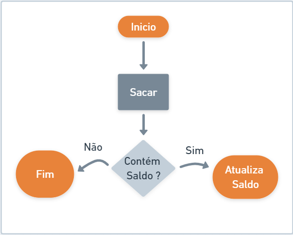

# Introdução e Estruturas condicionais com Java

## Índice

- [Introdução e Estruturas condicionais com Java](#introdução-e-estruturas-condicionais-com-java)
  - [Índice](#índice)
  - [Antes de começar](#antes-de-começar)
  - [Introdução](#introdução)
    - [Visão geral](#visão-geral)
    - [Tipos de Estruturas de repetição](#tipos-de-estruturas-de-repetição)
  - [Estruturas condicionais](#estruturas-condicionais)
    - [Condicional simples](#condicional-simples)
    - [Condicional composta](#condicional-composta)
    - [Condicional encadeada](#condicional-encadeada)
    - [Condição ternária](#condição-ternária)
    - [Switch case](#switch-case)
  - [Referências, links e materiais e apoio](#referências-links-e-materiais-e-apoio)

## Antes de começar

- [x]  Criar pasta referente ao curso
- [x]  Adicionar link da pasta nos atributos do curso
- [x]  Adicionar arquivos e links adicionais ao repositório (pdf, pptx, etc)

## Introdução

### Visão geral

Durante esse curso vamos abordar a concepção de controle de fluxos da aplicação, que pode ser adotada em qualquer linguagem.

    Apresentar os conceitos e explorar os tipos de fluxos condicionais, exepcionais e de repetição em uma aplicação Java

- Assuntos
  - Estruturas condicionais
  - Estruturas de repetição
  - Estruturas de exceção

Lembrando que todo o material de apoio está disponível no GitBook e pode ser acessado [neste link](https://glysns.gitbook.io/java-basico/controle-de-fluxo/conceito)

### Tipos de Estruturas de repetição

Controle de fluxo, é a habilidade de ajustar a maneira como um programa realiza suas tarefas. Por meio de instruções especiais, chamadas de comandos, essas tarefas podem ser executadas seletivamente, repetidamente ou excepcionalmente.

Quais as estruturas existentes?

- **Estruturas condicionais:** if-else, switch-case.
- **Estruturas de repetição:** for, while, do-while.
- **Estruturas de exceções:** try-catch-finally, throw.

## Estruturas condicionais

### Condicional simples

Quando ocorre uma validação de execução de fluxo, somente quando a condição for positiva, consideramos como uma estrutura **Simples**, exemplo:



- Exemplo

    ```java
    // CaixaEletronico.java
    public class CaixaEletronico {
        public static void main(String[] args) {
    
           double saldo = 25.0;
           double valorSolicitado = 17.0;
    
           if(valorSolicitado < saldo)
            saldo = saldo - valorSolicitado;
    
            System.out.println(saldo);
    
        }
    }
    ```

### Condicional composta

Algumas vezes, o nosso programa deverá seguir mais de uma jornada de execução, condionado a uma regra de negócio, este cenário é demoninado **Estrutura Condicional Composta**. Vejamos o exemplo abaixo:


- Exemplo

    ```java
    // ResultadoEscolar.java
    public class ResultadoEscolar {
        public static void main(String[] args) {
    
           int nota = 6;
           
           if(nota >= 7)
            System.out.println("Aprovado");
    
           else
            System.out.println("Reprovado");
        }
    }
    ```

### Condicional encadeada

Em um controle de fluxo condicional, nem sempre nos limitamos ao **se** (`if`) e **senão** (`else`), poderemos ter uma terceira, quarta e ou inúmeras condições.


- Exemplo

    ```java
    // ResultadoEscolar.java
    public class ResultadoEscolar {
        public static void main(String[] args) {
            int nota = 6;
    
     if (nota >= 7)
      System.out.println("Aprovado");
     else if (nota >= 5 && nota < 7)
      System.out.println("Recuperação");
     else
      System.out.println("Reprovado");
        }
    }
    ```

### Condição ternária

Como vimos em operadores, podemos abreviar nosso algoritmo condicional, refatorando com o conceito de operador ternário. Vamos refatorar os exemplos acima, para ilustrar o poder deste recurso:

- Cenário 1

    ```java
    // Cenário 1
    public class ResultadoEscolar {
     public static void main(String[] args) {
      int nota = 7;
      String resultado = nota >=7 ? "Aprovado" : "Reprovado";
      System.out.println(resultado);
     }
    }
    ```

- Cenário 2

    ```java
    // Cenário 2
    public class ResultadoEscolar {
     public static void main(String[] args) {
      int nota = 6;
      String resultado = nota >=7 ? "Aprovado" : nota >=5 && nota <7 ? "Recuperação" : "Reprovado";
      System.out.println(resultado);
     }
    }
    ```

### Switch case

A estrutura **switch,** compara o valor de cada caso, com o da variável sequencialmente e sempre que encontra um valor correspondente, executa o código associado ao caso. Para evitar que as comparações continuem a ser executadas, após um caso correspondente ter sido encontrado, acrescentamos o comando ***break*** no final de cada bloco de códigos. O comando **break**, quando executado, encerra a execução da estrutura onde ele se encontra.

Vamos imaginar que precisaremos imprimir uma medida, com base em mapa de valores, exemplo:


- Exemplo com if

    ```java
    // SistemaMedida.java
    
    // Modo condicional if/else
    public class SistemaMedida {
     public static void main(String[] args) {
      String sigla = "M";
    
      if(sigla == "P")
       System.out.println("PEQUENO");
      else if(sigla == "M")
       System.out.println("MÉDIO");
      else if(sigla == "G")
       System.out.println("GRANDE");
      else
       System.out.println("INDEFINIDO");
       
      
     }
    }
    ```

- Exemplo com switch case

    ```java
    // SistemaMedida.java
    
    // Modo condicional switch / case
    public class SistemaMedida {
     public static void main(String[] args) {
      String sigla = "M";
    
      switch (sigla) {
      case "P":{
       System.out.println("PEQUENO");
       break;
      }
      case "M":{
       System.out.println("MÉDIO");
       break;
      }
      case "G":{
       System.out.println("GRANDE");
       break;
      }
      default:
       System.out.println("INDEFINIDO");
      }
       
      
     }
    }
    ```

## Referências, links e materiais e apoio

Todo código utilizado em aula está disponível [neste link](https://github.com/digitalinnovationone/trilha-java-basico)

A apresentação em PPT está disponível em:

[04 - DIO - Trilha - Java Básico - Controle de Fluxo - Introdução.pptx](./for_readme/04_-_DIO_-_Trilha_-_Java_Bsico_-_Controle_de_Fluxo_-_Introduo.pptx)
