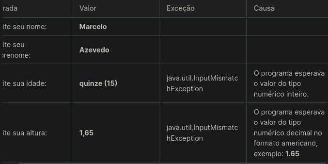

# Java e Tratamento de Exceções

## Índice

- [Java e Tratamento de Exceções](#java-e-tratamento-de-exceções)
  - [Índice](#índice)
  - [Antes de começar](#antes-de-começar)
  - [Estruturas Excepcionais](#estruturas-excepcionais)
    - [Try/Catch](#trycatch)
    - [Hierarquia das exceções e exceções customizadas](#hierarquia-das-exceções-e-exceções-customizadas)
  - [Referências](#referências)

## Antes de começar

- [x]  Criar pasta referente ao curso
- [x]  Adicionar link da pasta nos atributos do curso
- [x]  Adicionar arquivos e links adicionais ao repositório (pdf, pptx, etc)

## Estruturas Excepcionais

### Try/Catch

Tratamentos de exceção são diferentes de erros, já que visam contornar equívocos para manter a aplicação ativa.

Quando ocorre um erro, o Java normalmente para e gera uma mensagem de erro. O termo técnico para isso é: Java lançará uma **exceção** (jogará um erro).

De forma interpretativa em Java, um erro é algo irreparável, a aplicação trava ou é encerrada drásticamente. Já exceções é um fluxo inesperado da nossa aplicação, exemplo: Querer dividir um valor por zero, querer abrir um arquivo que não existe, abrir uma conexão de banco, com usuário ou senha inválida. Todos estes cenários e os demais, não são erros mas sim fluxos, não previstos pela aplicação.

É ai que entra mais uma responsabilidade do desenvolvedor, prever situações iguais a estas e realizar o que denominamos de ***Tratamento de Exceções***.

- Exemplo

    ```java
    import java.util.Locale;
    import java.util.Scanner;
    
    public class AboutMe {
    public static void main(String[] args) {
    //criando o objeto scanner
    Scanner scanner = new Scanner([System.in](http://system.in/)).useLocale([Locale.US](http://locale.us/));
    
    ```java

        System.out.println("Digite seu nome");
        String nome = scanner.next();
    
        System.out.println("Digite seu sobrenome");
        String sobrenome = scanner.next();
    
        System.out.println("Digite sua idade");
        int idade = scanner.nextInt();
    
        System.out.println("Digite sua altura");
        double altura = scanner.nextDouble();
    
        //imprimindo os dados obtidos pelo usuario
        System.out.println("Olá, me chamo " + nome.toUpperCase() + " " + sobrenome.toUpperCase());
        System.out.println("Tenho " + idade + " anos ");
        System.out.println("Minha altura é " + altura + "cm ");
        scanner.close();
    }

    ```

Aparentemente é um programa simples, mas vamos listar algumas possíveis exceções, que podem acontecer.

- Não informar o nome e sobrenome;
- O valor da idade ter um caractere NÃO numérico;
- O valor da altura ter uma vírgula ao invés de ser um ponto ***(conforme padrão americano);***



Dessa forma, podemos criar um tratamento de exceção com a estrutura abaixo:

```java
  try {
    //  bloco de código conforme esperado
  }
  catch(Exception e) {// precisamos saber qual exceção
    // bloco de código que captura as exceções que podem acontecer
    // em caso de um fluxo não previsto
  }
```

- A instrução **`try`**, permite que você defina um bloco de código, para ser testado quanto a erros enquanto está sendo executado.
- A instrução **`catch`**, permite definir um bloco de código a ser executado, caso ocorra um erro no bloco try.
- A instrução **`finally`**, permite definir um bloco de código a ser executado, independente de ocorrer um erro ou não. As palavras-chave `try` e `catch` vem em pares.

### Hierarquia das exceções e exceções customizadas

A linguagem Java, dispõe de uma variedade de classes, que representam exceções e estas classes, são organizadas em uma hierarquia denominadas **Checked and Unchecked Exceptions** ou *Exceções Checadas e Não Checadas*.


> O que determina uma exceção ser classificada como **checada** ou **não checada** ?
É o risco dela ser disparada, logo, você precisa tratá-la, exemplo:
>

Vamos imaginar que precisamos realizar de duas maneiras, a conversão de uma String para um número, porém o texto contém Alfanuméricos.

```java
public class ExemploExcecao {
    public static void main(String[] args) {
        Number valor = Double.valueOf("a1.75");

        valor = NumberFormat.getInstance().parse("a1.75");
        
        System.out.println(valor);
       
    }
}
```

> As linhas 3 e 5, apresentarão uma exceção ao serem executadas, e a linha 5 contém um método que pode disparar uma exceção checada, logo, nós programadores que iremos usar este método, teremos que tratá-la explicitamente com **`try \ catch`**.
>

Nós podemos criar nossas próprias exceções, baseadas em regras de negócio e assim melhor direcionar quem for utilizar os recursos desenvolvidos no projeto, exemplo:

- Imagina que como regra de negócio, para formatar um cep, necessita sempre de ter 8 dígitos, caso contrário, lançará uma exceção que denominamos de **CepInvalidoException**.
- Primeiro criamos nossa exceção: `public class CepInvalidoException extends Exception {}`

- Em seguida, criamos nosso método de formatação de cep:

```java
static String formatarCep(String cep) throws CepInvalidoException{
        if(cep.length() != 8)
          throw new CepInvalidoException();
        
          //simulando um cep formatado
          return "23.765-064";
    }
```

## Referências

Código desenvolvido em aula [neste link](https://github.com/digitalinnovationone/trilha-java-basico)
