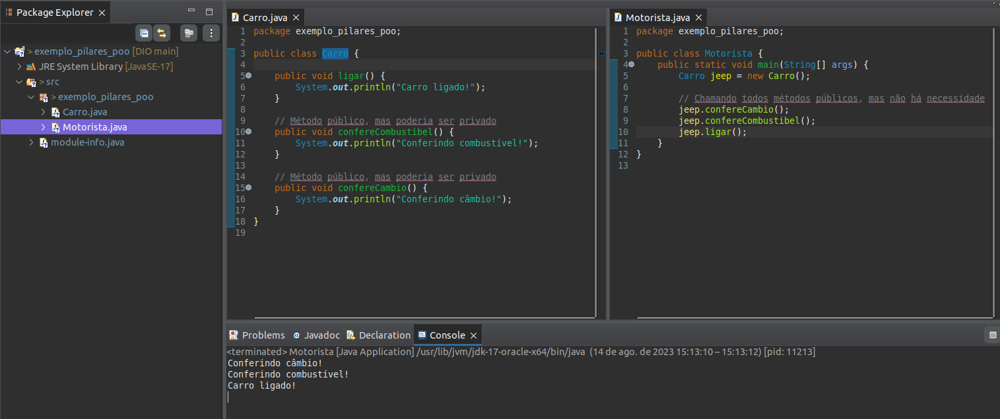

# Pilares da Programação Orientada a Objetos em Java

---

## Antes de começar

---

- [x]  Criar pasta referente ao curso
- [x]  Adicionar link da pasta nos atributos do curso

## Sumário

- [Pilares da Programação Orientada a Objetos em Java](#pilares-da-programação-orientada-a-objetos-em-java)
	- [Antes de começar](#antes-de-começar)
	- [Sumário](#sumário)
	- [Pilares de POO](#pilares-de-poo)
		- [Encapsulamento](#encapsulamento)
		- [Herança](#herança)
		- [Abstração](#abstração)
		- [Polimorfismo](#polimorfismo)
		- [Na prática](#na-prática)
		- [Link da referência da aula completa](#link-da-referência-da-aula-completa)
	- [Encapsulamento](#encapsulamento-1)
		- [Link da referência da aula completa](#link-da-referência-da-aula-completa-1)
	- [Herança](#herança-1)
		- [Link da referência da aula completa](#link-da-referência-da-aula-completa-2)
	- [Abstração](#abstração-1)
		- [Link da referência da aula completa](#link-da-referência-da-aula-completa-3)
	- [Polimorfismo](#polimorfismo-1)
		- [Modificador protected](#modificador-protected)
		- [Link da referência da aula completa](#link-da-referência-da-aula-completa-4)
	- [Interface](#interface)
		- [Link da referência da aula completa](#link-da-referência-da-aula-completa-5)
	- [Links e materiais adicionais](#links-e-materiais-adicionais)
	- [Tarefas adicionais](#tarefas-adicionais)

---

## Pilares de POO

---

POO é um **paradigma de programação** baseado no conceito de objetos.

Como se trata de um contexto análogo ao mundo real tudo acaba sendo um objeto, por exemplo, conta bancária, aluno, instituição, etc.

A programação orientada a objetos é bem requisitada no mercado devido a possibilidade de reutilizar os códigos e a capacidade de representação do sistema com exemplos muito próximos do mundo real.

Para uma linguagem ser considerada orienta a objeto, ela deve seguir os **quatro pilares da orientação a objetos**, sendo eles:

### Encapsulamento

Nem tudo precisa estar visível, boa parte do algoritmo pode ser distribuído em métodos com finalidades específicas que complementam a aplicação.

Exemplo: *Ligar um veículo, exige muitas etapas para a engenharia, mas o condutor só visualiza a ignição, dar a partida e a “magia” acontece. Tudo que acontece entre dar a partida e a ignição se iniciar pode ser encapsulado.*

Exemplo prático: No código abaixo, ao invés de todos os métodos da classe **Carro** estarem públicos, podemos deixar alguns métodos privados (encapsulados) para que somente a classe **Carro** execute.

Código antes:



Código depois:


### Herança

Características e comportamentos comuns podem ser elevados e compartilhados através de uma hierarquia de objetos.

Exemplo: *Um Carro e uma Motocicleta possuem propriedades como placa, chassi, ano de fabricação e métodos como acelerar e frear. Logo, para não ser um processo de codificação redundante, podemos desfrutar da herança criando uma classe **Veículo** para que seja herdada por **Carro** e **Motocicleta**.*

Exemplo prático: **Carros** e **Motos** podem ser duas classes que **possuem atributos similares**, então ao invés de declarar eles em cada classe, **podemos ter uma “classe pai” chamada Veiculo que fará a classe Carro e Moto herdar seus atributos ao adicionar `extends Veiculo`**

Código antes:


Código depois:


### Abstração

É o processo de simplificar complexidade ao focar nos aspectos relevantes e ignorar os detalhes menos importantes. A abstração envolve ocultar os detalhes internos e complexos, permitindo aos usuários interagir com ele de maneira mais simples e compreensível.

Exemplo: **V*eículo*** determina duas ações como acelerar e frear, logo, estes comportamentos deverão ser *abstratos,* pois existem mais de uma maneira de se realizar a mesma operação.

Exemplo prático: Uma **moto** e um **carro** possuem funções semelhantes mas que podem ter diferenças, por exemplo, **ao ligar uma moto e um carro alguns passos diferentes precisam ser executados**. Dessa forma, ao podemos atribuir um **método ligar** à classe genérica **Veículo** e informar que esse essa classe possui um método **abstrato** que pode mudar de acordo com o tipo de veículo.

Código com abstração:


### Polimorfismo

São as inúmeras maneiras de se realizar uma mesma ação.

Exemplo: **Veículo** determina duas ações como acelerar e frear, primeiramente, precisamos identificar se estaremos nos referindo a **Carro** ou **Motocicleta*,*** para determinar a lógica de aceleração e frenagem dos respectivos veículos.

Exemplo prático: Ao criar um **objeto Veículo** precisamos identificar o tipo de Veículo para poder saber qual a forma que ele liga, já que motos e carros ligam de formas diferentes.

Código:


### Na prática

---

Para ilustrar a proposta dos Princípios de POO, no nosso cotidiano, vamos simular algumas funcionalidades dos aplicativos de mensagens instantâneas pela internet.

**MSN Messenger** foi um programa de mensagens instantâneas criado pela Microsoft Corporation. O serviço nasceu a 22 de julho de 1999, anunciando-se como um serviço que, permitia falar com uma pessoa através de conversas instantâneas pela internet. Ao longo dos anos, surgiram novos serviços de mensagens pela internet, como **Facebook Messenger** e o **VKontakte Telegram**.

Vamos descrever em UML e depois em código, algumas das principais funcionalidades de qualquer serviço de comunicação instantânea pela internet, inicialmente pelo MSN Messenger e depois inserindo os demais, considerando os princípios de POO.

Diagrama UML:


Pontos de atenção:

- Todos os métodos da classe são public (tudo realmente precisa estar visível ?);
- Só existe uma única forma de se comunicar via internet (como ter novas formas de se comunicar mantendo a proposta central ?).

Código base:

```java
public class MSNMessenger {
	public void enviarMensagem() {
		System.out.println("Enviando mensagem");
	}
	public void receberMensagem() {
		System.out.println("Recebendo mensagem");
	}
	public void validarConectadoInternet() {
		System.out.println("Validando se está conectado a internet");
	}
	public void salvarHistoricoMensagem() {
		System.out.println("Salvando o histórico da mensagem");
	}
}
```

### Link da referência da aula completa

---

[Pilares do POO](https://glysns.gitbook.io/java-basico/programacao-orientada-a-objetos/pilares-do-poo)

## Encapsulamento

---

> Nem tudo precisa estar disponível para todos
>

Já imaginou, você instalar o MSN Messenger e ao querer enviar uma mensagem, fosse solicitado a você verificar se o computador está conectado a internet e depois, pedir para você salvar a mensagem no histórico? ou, se ao tentar enviar um SMS pelo celular, primeiro você precisasse consultar manualmente o seu saldo?

Quanto ao MSN Messenger, para nós, só é relevante saber que podemos enviar e receber a mensagem, logo, as demais funcionalidades poderão ser consideradas privadas (private). E é ai que se caracteriza a necessidade do pilar de Encapsulamento. O que esconder?

- UML

    

- Código modificado

    ```java
    public class MSNMessenger {
    	public void enviarMensagem() {
    		//primeiro confirmar se esta conectado a internet
    		validarConectadoInternet();
    		
    		System.out.println("Enviando mensagem");
    		
    		//depois de enviada, salva o histórico da mensagem
    		salvarHistoricoMensagem();
    		
    		
    	}
    	public void receberMensagem() {
    		System.out.println("Recebendo mensagem");
    	}
    	
    	//métodos privadas, visíveis somente na classe
    	private void validarConectadoInternet() {
    		System.out.println("Validando se está conectado a internet");
    	}
    	private void salvarHistoricoMensagem() {
    		System.out.println("Salvando o histórico da mensagem");
    	}
    }
    ```

### Link da referência da aula completa

---

[Encapsulamento](https://glysns.gitbook.io/java-basico/programacao-orientada-a-objetos/pilares-do-poo/encapsulamento)

## Herança

---

> Nem tudo se copia, as vezes se herda
>

Imagine ter que criar vários serviços de mensagem instantânea que utilizam os mesmos métodos.


A melhor abordagem para isso seria utilizar o conceito de herança de POO.


Dessa forma, todos os serviços herdam o método da classe pai, como nos códigos abaixo:

- Classe ServicoMensagemInstantanea

    ```java
    //a classe MSNMessenger é ou representa
    public class ServicoMensagemInstantanea {
    	public void enviarMensagem() {
    		//primeiro confirmar se esta conectado a internet
    		validarConectadoInternet();
    		System.out.println("Enviando mensagem");
    		//depois de enviada, salva o histórico da mensagem
    		salvarHistoricoMensagem();
    	}
    	public void receberMensagem() {
    		System.out.println("Recebendo mensagem");
    	}
    	
    	//métodos privadas, visíveis somente na classe
    	private void validarConectadoInternet() {
    		System.out.println("Validando se está conectado a internet");
    	}
    	private void salvarHistoricoMensagem() {
    		System.out.println("Salvando o histórico da mensagem");
    	}
    }
    ```

- Classe MSNMessenger

    ```java
    public class MSNMessenger extends ServicoMensagemInstantanea{
    
    }
    ```

- Classe FacebookMessenger

    ```java
    public class FacebookMessenger extends ServicoMensagemInstantanea {
    
    }
    ```

- Classe Telegram

    ```java
    public class Telegram extends ServicoMensagemInstantanea {
    
    }
    ```

- Classe ComputadorPedrinho

    ```java
    public class ComputadorPedrinho {
    	public static void main(String[] args) {
    		
    		MSNMessenger msn = new MSNMessenger();
    		msn.enviarMensagem();
    		msn.receberMensagem();
    		
    		FacebookMessenger fbm = new FacebookMessenger();
    		fbm.enviarMensagem();
    		fbm.receberMensagem();
    		
    		Telegram tlg = new Telegram();
    		tlg.enviarMensagem();
    		tlg.receberMensagem();
    		
    	}
    }
    ```

> Será que todos os sistemas de mensagens, realizam as suas operações de uma mesma maneira? e agora ? este é um trabalho para os pilares **Abstração** e **Polimorfismo**.
>

### Link da referência da aula completa

---

[Herança](https://glysns.gitbook.io/java-basico/programacao-orientada-a-objetos/pilares-do-poo/heranca)

## Abstração

---

> Para você ser, é preciso você fazer.
>

Sabemos que qualquer sistema de mensagens instantâneas realiza as mesmas operações de Enviar e Receber Mensagem, dentre outras operações comuns ou exclusivas de cada aplicativo disponível no mercado.

Mas será que as ações realizadas, contém o mesmo comportamento ? Acreditamos que não.

> Já imaginou a **Microsoft** falar para o **Facebook**: ***"Ei, toma meu código do MSN!"***.
>

Observem a nova estruturação dos códigos abaixo, com base na implementação apresentada no pilar Herança.

- Classe ServicoMensagemInstantanea

    ```java
    public abstract class ServicoMensagemInstantanea {
    	public abstract void enviarMensagem();
    	public abstract void receberMensagem();	
    }
    ```

- Classe MSNMessenger

    ```java
    public class MSNMessenger extends ServicoMensagemInstantanea{
    	public void enviarMensagem() {
    		System.out.println("Enviando mensagem pelo MSN Messenger");
    	}
    	public void receberMensagem() {
    		System.out.println("Recebendo mensagem pelo MSN Messenger");
    	}
    }
    ```

- Classe FacebookMessenger

    ```java
    public class FacebookMessenger extends ServicoMensagemInstantanea {
    	public void enviarMensagem() {
    		System.out.println("Enviando mensagem pelo Facebook Messenger");
    	}
    	public void receberMensagem() {
    		System.out.println("Recebendo mensagem pelo Facebook Messenger");
    	}
    }
    ```

- Classe Telegram

    ```java
    public class Telegram extends ServicoMensagemInstantanea {
    	public void enviarMensagem() {
    		System.out.println("Enviando mensagem pelo Telegram");
    	}
    	public void receberMensagem() {
    		System.out.println("Recebendo mensagem pelo Telegram");
    	}
    }
    ```

Antes, com a herança, havia uma única forma de realizar o envio e recebimento de mensagens. Agora cada sistema deve informar sua lógica de envio e recebimento de mensagem.

**A abstração em POO determinar que todos precisam fazer, mas cada um deve informar a sua maneira.**

<aside>
💡 Em Java, o conceito de abstração é representado pela palavra reservada **`abstract`**e métodos que **NÃO** possuem corpo na classe abstrata (pai).

</aside>

### Link da referência da aula completa

---

[Abstração](https://glysns.gitbook.io/java-basico/programacao-orientada-a-objetos/pilares-do-poo/abstracao)

## Polimorfismo

---

> Um mesmo comportamento, de várias maneiras.
>

Qualquer classe que deseja representar um serviço de mensagens, basta estender a classe **`ServicoMensagemInstantanea`** e implementar, os respectivos métodos *abstratos*.

O que vale reforçar é que cada classe terá a mesma ação, executando procedimentos de maneira especializada.


Vejamos o código abaixo:

```java
public class ComputadorPedrinho {
	public static void main(String[] args) {
		
		ServicoMensagemInstantanea smi = null;
		
		/*
		    NÃO SE SABE QUAL APP 
		    MAS QUALQUER UM DEVERÁ ENVIAR E RECEBER MENSAGEM
		 */
		String appEscolhido="???"; 
		
		if(appEscolhido.equals("msn"))
			smi = new MSNMessenger();
		else if(appEscolhido.equals("fbm"))
			smi = new FacebookMessenger();
		else if(appEscolhido.equals("tlg"))
			smi = new Telegram();
		
			
		smi.enviarMensagem();
		smi.receberMensagem();
	}
}
```

### Modificador protected

---

O modificador **protected** está muito **associado à herança** que é um dos pilares de POO.

Sabemos que cada aplicativo, costuma salvar as mensagens em seus respectivos servidores cloud, mas e quanto validar se está conectado a internet? Não poderia ser um mecanismo comum a todos ? Logo, qualquer classe filha, de **ServicoMensagemInstantanea** poderia desfrutar através de herança, esta funcionalidade.

<aside>
💡 Mas fica a reflexão do que já aprendemos sobre visibilidade de recursos: Com o modificador `privat` somente a classe conhece a implementação, quanto que o modificador `public` todos passarão a conhecer. Mas gostaríamos que, somente as classes filhas soubessem. Bem, é ai que entra o modificador **`protected`**.

</aside>

O código do serviço pai ficaria:

```java
public abstract class ServicoMensagemInstantanea {
	
	public abstract void enviarMensagem();
	public abstract void receberMensagem();
	
	//mais um método que todos os filhos deverão implementar
	public abstract void salvarHistoricoMensagem();
	
	//somente os filhos conhecem este método
	protected void validarConectadoInternet() {
		System.out.println("Validando se está conectado a internet");
	}	
}
```

### Link da referência da aula completa

---

[Polimorfismo](https://glysns.gitbook.io/java-basico/programacao-orientada-a-objetos/pilares-do-poo/polimorfismo)

## Interface

---

> Antes de tudo, **NÃO** estamos nos referindo a interface gráfica.
>

Como vimos anteriormente, **Herança** é um dos pilares de POO, mas uma curiosidade que se deve ser esclarecida, na linguagem Java, é que a mesma **não permite o que conhecemos como Herança Múltipla.**

A medida que vão surgindo novas necessidades, novos equipamentos (objetos), que nascem para atender as expectativas de oferecer ferramentas com finalidades bem específicas, como por exemplo: Impressoras, Digitalizadoras, Copiadoras e etc.

Observem que não há uma especificação de marca, modelo e ou capacidades de execução das classes citadas acima, isto é o que consideramos o nível mais abstrato da orientação a objetos, que denominamos como **interfaces**.

Ilustração de interfaces dos equipamentos citados acima:


> Então, o que você está dizendo é que **interfaces,** é o mesmo que **classes**? Um molde para representação dos objetos reais?
>

Como citado acima, **Java não permite herança múltipla**, logo, vamos imaginar que, **recebemos o desafio de projetar uma nova classe, para criar objetos que representam as três características citadas acima e que iremos denominar de *EquipamentoMultifunional***.


Vamos visualizar o diagrama:

Cenário 1:


Cenário 2:


Abaixo um exemplo de como ficaria a implementação:


E para encerrar, uma das mais importantes ilustrações, quanto ao uso de interfaces para, desenvolvimento de componentes revolucionários, é apresentado em 2007 por nada mais nada menos que Steve Jobs ao lançar o primeiro **iPhone** da história.


### Link da referência da aula completa

---

[Interface](https://glysns.gitbook.io/java-basico/programacao-orientada-a-objetos/interface)

## Links e materiais adicionais

---

## Tarefas adicionais

---

- [ ]  Salvar arquivos adicionais na pasta referente dentro do GitHub
